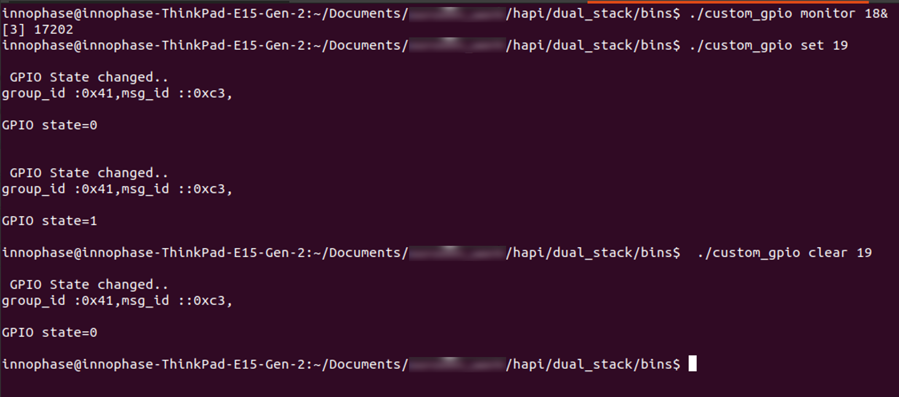

.. _3201 custom gpio:

Custom GPIO Application
-----------------------

Description
~~~~~~~~~~~

Custom GPIO (custom_gpio_mon) application can be used to control and
monitor a GPIO. Host can change the GPIO state by set/clear method. The
GPIO state can be monitored using this application. When in monitor
mode, this will receive an indication whenever there is a change in GPIO
state and hence demonstrates indication handling in a user application.

Prerequisites
~~~~~~~~~~~~~

GTKTerm or similar application.

Command Description with Procedure
~~~~~~~~~~~~~~~~~~~~~~~~~~~~~~~~~~

Open a serial terminal and navigate to the directory where custom
applications are placed and issue the commands in the following sequence
to set/clear/monitor GPIO pins in Talaria TWO.

For this application, the allowed GPIOs are GPIO17, GPIO18 and GPIO19.

.. code:: shell

    # ./custom_gpio set <GPIO num>

To clear the GPIO state, Talaria TWO will clear the GPIO output.

.. code:: shell

    # ./custom_gpio clear <GPIO num>

To monitor GPIO state changes, Talaria TWO will send GPIO state change
indications to the Host.

.. code:: shell

    # ./custom_gpio monitor <GPIO num>

Procedure
~~~~~~~~~

Execute the following operations on the Talaria TWO:

Step 1: Short GPIO_19 and GPIO_18

Step 2: Set GPIO_18 to control the PIN

Step 3: Set GPIO_19 to monitor and send indication to Host

Step 4: Reset the state of GPIO_18

Step 5: Observe the indication received at custom_gpio monitor

Expected Output
~~~~~~~~~~~~~~~

Host Console Logs
^^^^^^^^^^^^^^^^^

|image3|

Figure 1: custom_gpio – host serial log

Host console log – text output:

.. code:: shell

    innophase@innophase-ThinkPad-E15-Gen-2:~/Documents/xxxxxxxxx/hapi/dual_stack/bins$ ./custom_gpio monitor 18& [3] 17202
    innophase@innophase-ThinkPad-E15-Gen-2:~/Documents/xxxxxxxxx/hapi/dual_stack/bins$ ./custom_gpio set 19

    GPIO State changed..
    Group_id :0x41,msg_id ::0xc3,
    GPIO state=0

    GPIO State changed..
    Group_id :0x41,msg_id ::0xc3,
    GPIO state=1

    innophase@innophase-ThinkPad-E15-Gen-2:~/Documents/xxxxxxxxx/hapi/dual_stack/bins$ ./custom_gpio clear 19

    GPIO State changed..
    Group_id :0x41,msg_id ::0xc3,
    GPIO state=0

List of Message IDs Used
~~~~~~~~~~~~~~~~~~~~~~~~

This application uses three message IDs and Group number 65:

1. GPIO_CUSTOM_SET_REQ

This message will be sent to Talaria TWO when the application is invoked
with “set” command. When Talaria TWO receives this command, it will
enable the GPIO and replies with status code to Host. If the GPIO is
enabled successfully, it will return 0, otherwise non-zero.

2. GPIO_CUSTOM_CLEAR_REQ

This message will be sent to Talaria TWO when the application is invoked
with “clear” command. When Talaria TWO receives this command, it will
disable the GPIO and replies with status code to Host. If the GPIO is
disabled successfully, it will return 0, otherwise non-zero.

3. GPIO_CUSTOM_MONITOR_REQ

This message will be sent to Talaria TWO when the application is invoked
with “monitor” command. When Talaria TWO receives this command, it will
start monitoring the GPIO and replies with a status code to Host. If the
GPIO monitor is started successfully, it will return 0 otherwise
non-zero.

4. GPIO_CUSTOM_VAL_IND

When GPIO monitor is issued, Talaria TWO starts monitoring the GPIO
state changes. Whenever the state changes, it sends a state change
indication message to Host.

