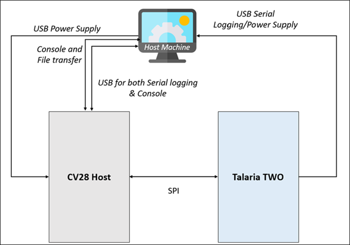
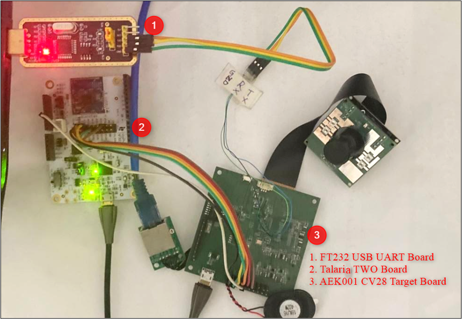

.. _cv28 hw setup:

Hardware Set-up and PIN Configuration
=====================================

Topology
--------

|image4|

.. rst-class:: imagefiguesclass
Figure 1: Block diagram

|image5|

.. rst-class:: imagefiguesclass
Figure 2: Topology

PIN Configuration
-----------------

.. table:: Table 1: PIN Configuration

    +----------------------+-----------------------+-----------------------+
    | **AEK001 cv28 (J13   | **Talaria TWO (J1     | **Pin Details**       |
    | Header)**            | Header)**             |                       |
    +======================+=======================+=======================+
    | Pin 12               | GPIO1                 | MOSI                  |
    +----------------------+-----------------------+-----------------------+
    | Pin 16               | GPIO2                 | MISO                  |
    +----------------------+-----------------------+-----------------------+
    | Pin 14               | GPIO0                 | SCK                   |
    +----------------------+-----------------------+-----------------------+
    | Pin 17               | GPIO5                 | CS0                   |
    +----------------------+-----------------------+-----------------------+
    | Pin 10               | GPIO4                 | SPI_IRQ               |
    +----------------------+-----------------------+-----------------------+
    | Pin 19               | GND                   | GND                   |
    +----------------------+-----------------------+-----------------------+

**Note**: For pin-outs details on INP3000 programmer board, refer UG_Programming_using_INP3000.pdf  (*freertos_sdk_x.y\\doc\\user_guides\\ug_programming_using_INP3000*).

