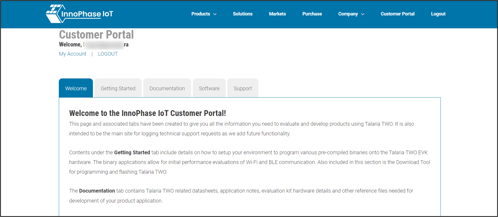
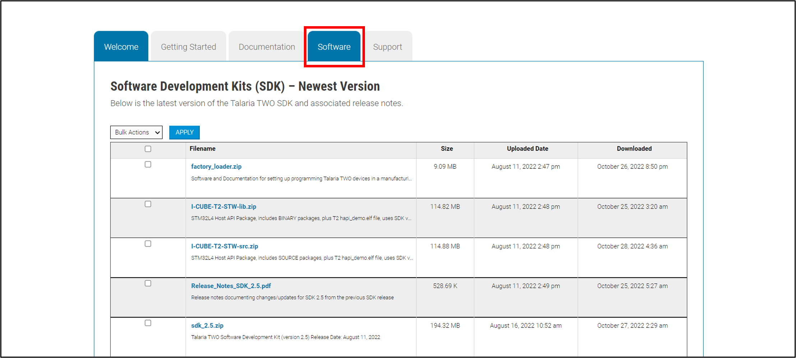

Hardware Set-up and PIN Configuration
=====================================

Topology
--------

|Diagram Description automatically generated|\ |A diagram of a computer
Description automatically generated|

Figure 4: Block diagram

|image1|

Figure 5: Topology

PIN Configuration
-----------------

+----------------------+-----------------------+-----------------------+
| **AEK001 cv28 (J13   | **Talaria TWO (J1     | **Pin Details**       |
| Header)**            | Header)**             |                       |
+======================+=======================+=======================+
| Pin 12               | GPIO1                 | MOSI                  |
+----------------------+-----------------------+-----------------------+
| Pin 16               | GPIO2                 | MISO                  |
+----------------------+-----------------------+-----------------------+
| Pin 14               | GPIO0                 | SCK                   |
+----------------------+-----------------------+-----------------------+
| Pin 17               | GPIO5                 | CS0                   |
+----------------------+-----------------------+-----------------------+
| Pin 10               | GPIO4                 | SPI_IRQ               |
+----------------------+-----------------------+-----------------------+
| Pin 19               | GND                   | GND                   |
+----------------------+-----------------------+-----------------------+

Table 1: PIN Configuration

**Note**: For pin-outs details on INP3000 programmer board, refer
UG_Programming_using_INP3000.pdf
(*freertos_sdk_x.y\\doc\\user_guides\\ug_programming_using_INP3000*).

