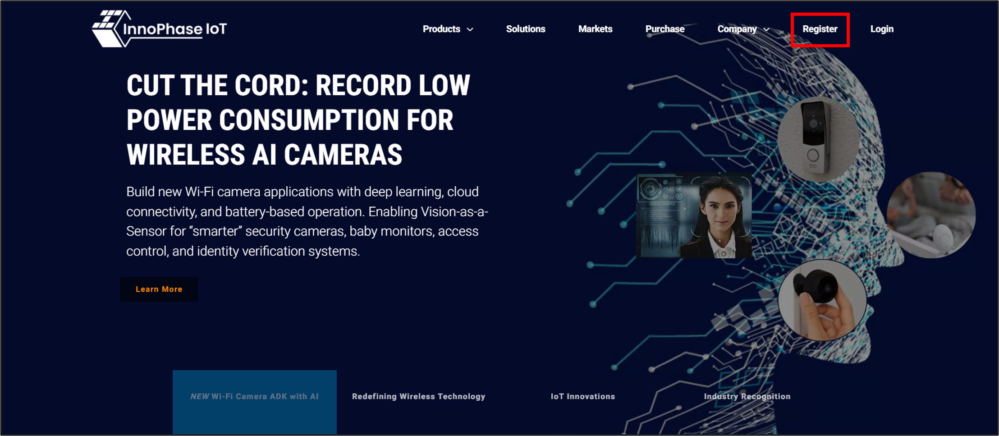
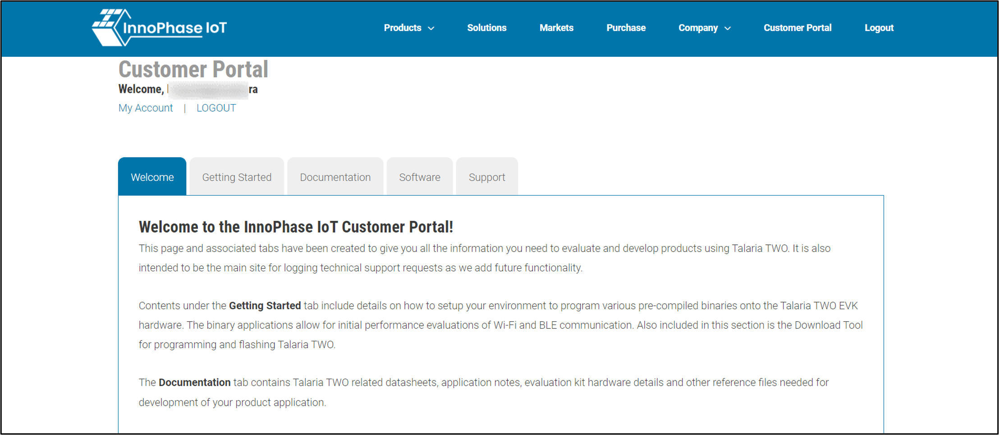
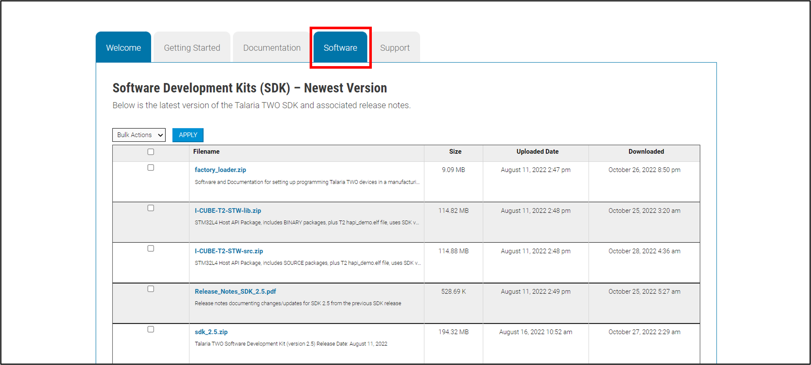
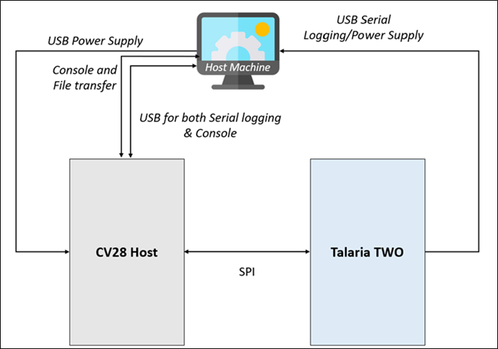

Package and Contents
====================

Talaria TWO SDK Package 
------------------------

Download the SDK package from the InnoPhase IoT website by following the
below steps

1. Go to the InnoPhase IoT website (https://innophaseiot.com/) and click
   on Register.

|A screenshot of a computer Description automatically generated|

Figure 1: InnoPhase IoT website

2. Provide the appropriate details to register onto the InnoPhase
   Customer Portal.

**Note**: InnoPhase IoT requires a signed MNDA and Development Tool
License Agreement (DTLA) to be signed prior to granting access to the
Customer Portal.

3. On successfully registering to the Customer Portal, the following
   screen will appear:

|image1|\ |image2|

Figure 2: Customer portal registration

4. Navigate to the Software Tab and download the appropriate software
   package(s):

|image3|

Figure 3: Software tab

**Package Contents**:

The package includes dual_stack folder (Path:
*freertos*\ \_\ *sdk_x.y\\solutions\\dual_stack*).

**Note**: x and y in freertos_sdk_x.y refers to the SDK release version.

The dual_stack folder contains the following:

1. doc:

Readme which includes details of files and folders of Talaria TWO
Dual-Stack solution.

2. bin:

Pre-built binaries (dualstack.elf and dual_stack_sdio.elf).

3. src:

Source code of Dual-Stack and custom applications.

4. lib:

Dual-Stack library.

5. fs:

Contains json files

6. firmware_upgrade_images:

Root files

Host Package 
-------------

Download talaria_two_dual_stack host package provided by InnoPhase IoT.

**Package Contents:**

The package includes talaria_two_dual_stack_vx.y folder (Path:
*talaria_two_dual_stack\\talaria_two_dual_stack_vx.y)*.

**Note**: x and y in *vx.y* refers to the package release version.

The talaria_two_dual_stack_vx.y folder contains the following:

1. Quick Start Guide: This document.

2. apps

Contains the optional binary images of common applications like bt,
iPerf and video. These applications can be executed once the Dual-Stack
solution is up and running.

3. doc

Contains documents which can be referred to for evaluating and working
with the Dual-Stack solution:

a. firmware-upgrade-via-serial: Contains the Readme to flash the
   firmware upgrade related files to Talaria TWO

b. Release notes

c. Talaria TWO Host API Reference Guide

d. Dual-Stack User Guide

e. Example applications for Dual-Stack

4. dual-stack

Contains the Dual-Stack solutions’ software components. It also includes
an example code to demonstrate custom logic on top of Dual-Stack
solution to communicate with the Talaria TWO Wi-Fi module.

5. readme: Refer the Readme file for talaria_two_dual_stack_vx.y package
   folder structure. Follow individual readme files present in the
   sub-folders for more information.

