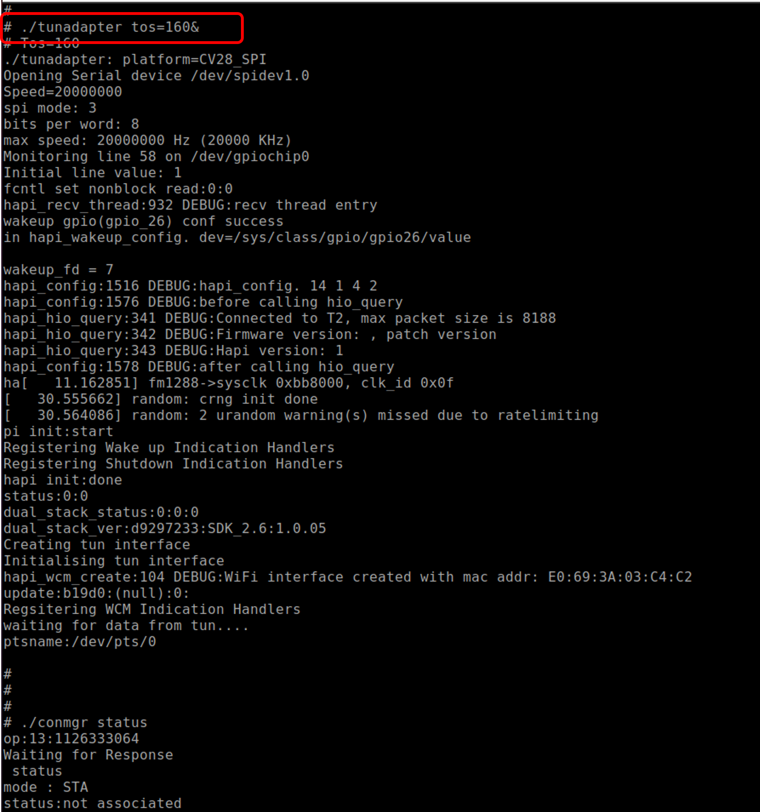
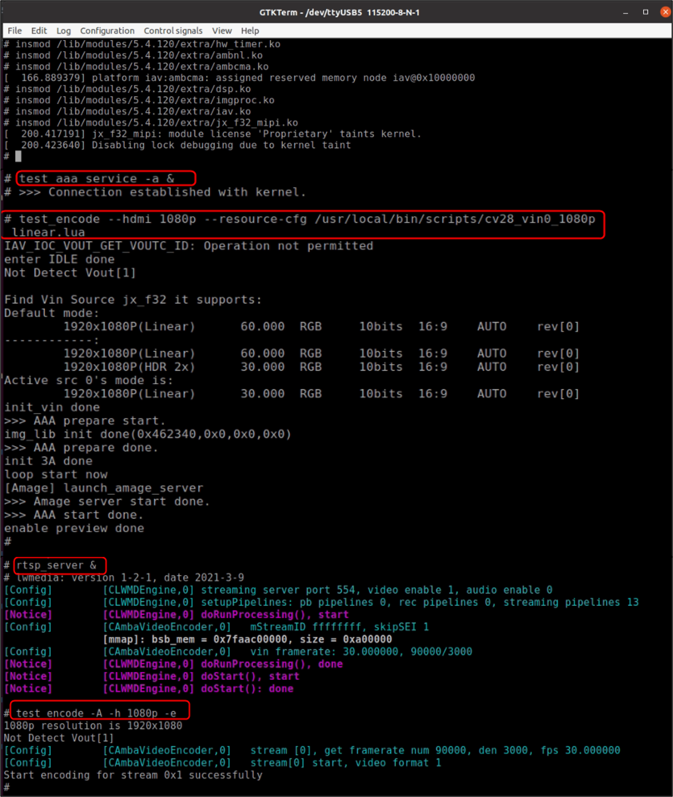
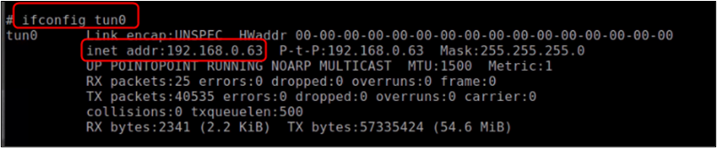
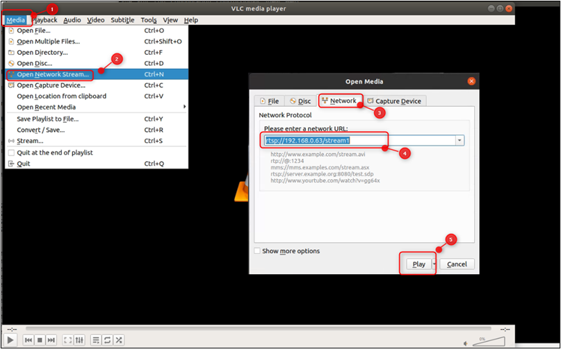

.. _cv28 vs:

Video Streaming – AEK001 CV28 Host
==================================

This document describes the steps to setup and run the video streaming
using Talaria TWO Dual-Stack solution with FreeRTOS support on AEK001
CV28 Host.

Getting Started
===============

To get started with the Dual-Stack solution, refer *Prerequisites*,
*Hardware Set-up* and *Programming Talaria TWO Application* sections of
QSG_Talaria_TWO_Dual-Stack_cv28.pdf
(*\\talaria_two_dual_stack\\talaria_two_dual_stack_vx.y*).

**Note**: x and y in *vx.y* refers to the package release version.

Prerequisites
=============

1. VLC player

2. GTKTerm or similar application

AEK001 CV28 Host - Talaria TWO end-to-end Video Setup
=====================================================

After the hardware setup (refer section: *Getting Started*), follow the
subsequent steps to run the video application. Use any serial port
terminal application such as GTKTerm to issue the commands on AEK001
CV28.

1. Configure GPIO on the AEK001 CV28 host to wake up Talaria TWO.

.. code:: shell

      echo "26" > /sys/class/gpio/export
      echo "out" > /sys/class/gpio/gpio26/direction
      echo "0" > /sys/class/gpio/gpio26/value

2. Start tunadapter in the background.

.. code:: shell

      ./tunadapter tos=160&  

|image1|

.. rst-class:: imagefiguesclass
Figure 1: Start tunadapter

3. Connect Talaria TWO to an Access Point.

|image2|

.. rst-class:: imagefiguesclass
Figure 2: Connect to AP

4. To following kernel modules need to be inserted for enabling video
   streaming:

.. code:: shell

      insmod /lib/modules/5.4.120/extra/hw_timer.ko
      insmod /lib/modules/5.4.120/extra/ambnl.ko
      insmod /lib/modules/5.4.120/extra/ambcma.ko
      insmod /lib/modules/5.4.120/extra/dsp.ko
      insmod /lib/modules/5.4.120/extra/imgproc.ko
      insmod /lib/modules/5.4.120/extra/iav.ko
      insmod /lib/modules/5.4.120/extra/jx_f32_mipi.ko
      
      sleep 1
      test_aaa_service -a &
      test_encode –hdmi 1080p –resource-cfg /usr/local/bin/scripts/cv28 vin0 1080p linear.lua
      rtsp_server &
      test_encode -A -H 1080p -e

|image3|

.. rst-class:: imagefiguesclass
Figure 3: Insert ko modules and start RTSP server - console logs

5. Get the IP address of tun interface using ifconfig command:

|image4|

.. rst-class:: imagefiguesclass
Figure 4: ifconfig -output

6. Open VLC application and enter the RTSP URL in the network settings
   using the following command and click on Play. Video starts streaming
   after this.

.. code:: shell

      rtsp://<TUN IP ADDR>/stream” 

|image5|

.. rst-class:: imagefiguesclass
Figure 5: VLC player

.. |image2| image:: media/image2.png
   :width: 8in

