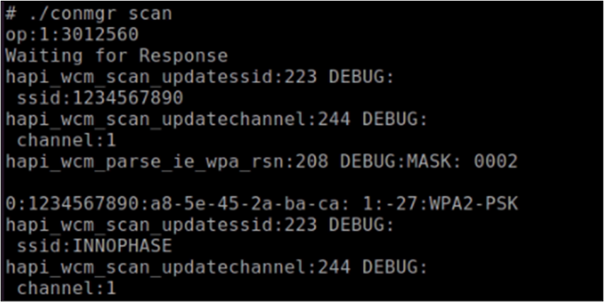
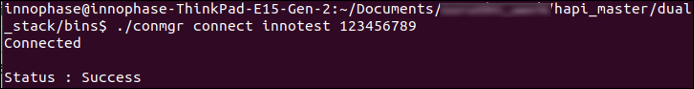
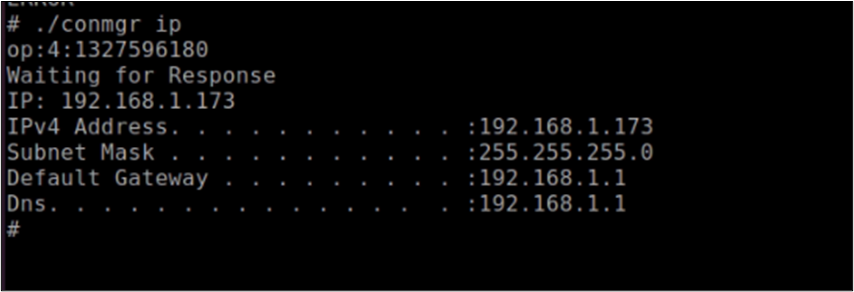
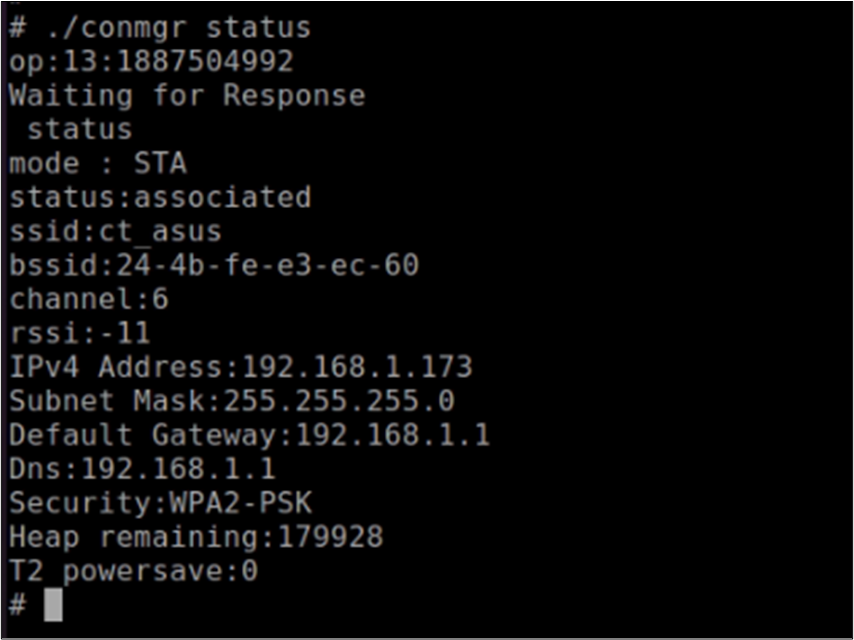
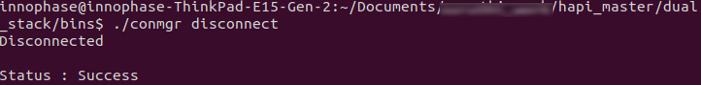
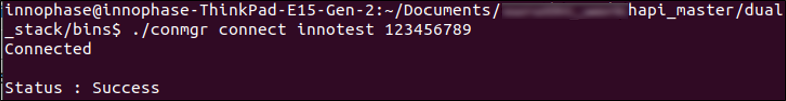
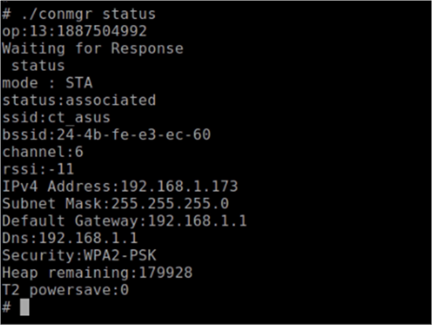
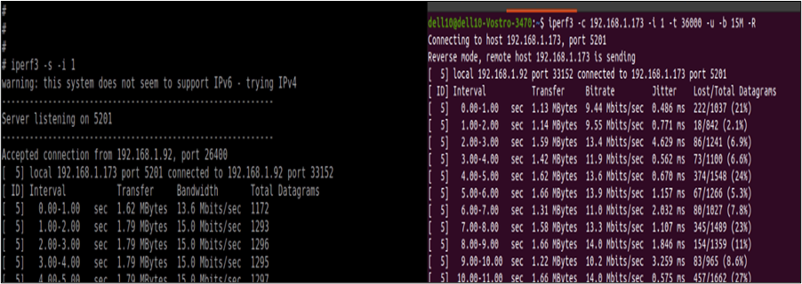

.. _cv28 testing basic ops:

Testing for Basic Operations 
-----------------------------

Use Case 1: Station Mode Wi-Fi Connection
..................

This use case is to demonstrate the station mode configuration and
connecting to the Wi-Fi Access Point.

Execute the following operations on the Talaria TWO:

**Step 1**: Scan the network.

**Step 2**: Connect to the desired network by providing SSID and
passphrase

**Step 3**: Get the IP address of the Talaria TWO module

**Step 4**: Get the WLAN status of the Talaria TWO module

**Step 5**: Disconnect from the connected network

.. table:: Table 1: Station Mode Wi-Fi Connection – Commands

    +----------------------------------+-----------------------------------+
    | **Command**                      | **Description**                   |
    +==================================+===================================+
    | *./conmgr scan*                  | Scan                              |
    +----------------------------------+-----------------------------------+
    | *./conmgr connect <SSID><AP PWD>*| Connect                           |
    +----------------------------------+-----------------------------------+
    | *./conmgr ip*                    | Get IP address                    |
    +----------------------------------+-----------------------------------+
    | *./conmgr status*                | Get WLAN status                   |
    +----------------------------------+-----------------------------------+
    | *./conmgr disconnect*            | Disconnect                        |
    +----------------------------------+-----------------------------------+

Console outputs:

1. ./conmgr scan

|image1|

.. rst-class:: imagefiguesclass
Figure 1: ./conmgr scan – output

2. ./conmgr connect innotest 123456789

|image2|

.. rst-class:: imagefiguesclass
Figure 2: ./conmgr connect - output

3. ./conmgr ip

|image3|

.. rst-class:: imagefiguesclass
Figure 3: ./conmgr ip – output

4. ./conmgr status

|image4|

.. rst-class:: imagefiguesclass
Figure 4: ./conmgr status – output

5. ./conmgr disconnect

|image5|

.. rst-class:: imagefiguesclass
Figure 5: ./conmgr disconnect – output

Use Case 2: Performance Test using iPerf Application
..................

This use case is to test the performance using iPerf application.
Execute the following steps:

**Step 1**:

1. Scan the network

2. Connect to the network of SSID ct_asus and passphrase 12345678

3. Get the IP address of the Talaria TWO module

4. Get the WLAN status of the Talaria TWO module

5. Start the UDP server and send data once the client connects

.. table:: Table 2: Performance Test using iPerf Application – Commands

    +----------------------------------+-----------------------------------+
    | **Command**                      | **Description**                   |
    +==================================+===================================+
    | *./conmgr scan*                  | Scan                              |
    +----------------------------------+-----------------------------------+
    | *./conmgr connect <SSID><AP      | Connect                           |
    | PWD>*                            |                                   |
    +----------------------------------+-----------------------------------+
    | *./conmgr ip*                    | Get IP address                    |
    +----------------------------------+-----------------------------------+
    | *./conmgr status*                | Status                            |
    +----------------------------------+-----------------------------------+
    | *iperf3 -s -i 1*                 | Iperf traffic for UDP UL          |
    +----------------------------------+-----------------------------------+

Console outputs:

1. ./conmgr connect innotest 123456789

|image6|

.. rst-class:: imagefiguesclass
Figure 6: ./conmgr connect - output

2. ./conmgr status

|image7|

.. rst-class:: imagefiguesclass
Figure 7: ./conmgr status – output

**Step 2**: From the Linux host machine, start the UDP client using the
following command, connect to the Talaria TWO UDP server of IP address
192.168.1.173 and port 5201. Once the client connects, Talaria TWO will
start sending the data over UDP socket:

.. code-block::

    iperf3 -c <Ipaddress> -i 1 -t 36000 -u -b 15M -R

Output:

|image8|

.. rst-class:: imagefiguesclass
Figure 8: Starting UDP Client

