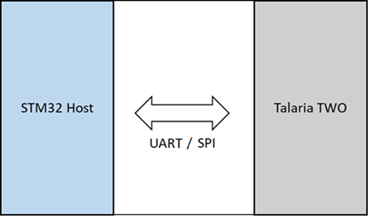

Hardware Setup and PIN Configuration
====================================

Topology
--------

The topology of the setup used to test the application is as shown in
Figure 2.

|A diagram of different types of signals Description automatically
generated with medium confidence|

Figure 2: Setup topology

Connection Setup for L433RC-P
-----------------------------

Host processor communicates with Talaria TWO via a SPI or UART
interface.

Arduino Compatible PIN Connections for SPI Interface
~~~~~~~~~~~~~~~~~~~~~~~~~~~~~~~~~~~~~~~~~~~~~~~~~~~~

Figure 3 shows the hardware setup for testing the application using SPI
interface. Mount Talaria TWO EVB on the STM32 board on Arduino
connector. Connect GPIO4 of Talaria TWO (J1 Connector) to PIN2 of CN6
connector.

Talaria TWO uses GPIO4 to interrupt ST when Talaria TWO wants to send
data/notification to ST.

|A close-up of a circuit board Description automatically generated|

Figure 3: Hardware setup for testing Talaria TWO with STM32L433RC-P
using SPI

Generic PIN Connections (Non-Arduino) for SPI Interface
~~~~~~~~~~~~~~~~~~~~~~~~~~~~~~~~~~~~~~~~~~~~~~~~~~~~~~~

+-------------------+-----------------+-------------------------------+
| **PIN             |                 |                               |
| Configuration**   |                 |                               |
+===================+=================+===============================+
| **Talaria TWO**   | **              | **Description**               |
|                   | STM32L433RC-P** |                               |
+-------------------+-----------------+-------------------------------+
| J1_PIN14_GPIO1    | CN7             | SPI MOSI                      |
|                   | _PIN14_MOSI/D11 |                               |
+-------------------+-----------------+-------------------------------+
| J1_PIN13_GPIO2    | CN7\_           | SPI MISO                      |
|                   | PIN12_MISO/D12  |                               |
+-------------------+-----------------+-------------------------------+
| J1_PI             | CN7_PIN8_GND    | GND                           |
| N4_GND/PIN18_GND  |                 |                               |
|                   |                 |                               |
+-------------------+-----------------+-------------------------------+
| JP3_PIN17_EN_CHIP | CN8_PIN5_NRST   | Talaria TWO RESET             |
+-------------------+-----------------+-------------------------------+
| J1_PIN12_GPIO3    | CN6-PIN16       | Talaria TWO WAKEUP            |
|                   | (PB11)          |                               |
+-------------------+-----------------+-------------------------------+
| J1_PIN15_GPIO0    | CN              | SPI CLOCK                     |
|                   | 7_PIN10_SCK/D13 |                               |
+-------------------+-----------------+-------------------------------+
| J1_PIN10_GPIO5    | C               | SPI CHIP_SELECT               |
|                   | N7_PIN16_CS/D10 |                               |
+-------------------+-----------------+-------------------------------+
| J1_PIN11_GPIO4    | CN6_PIN2 (PC8)  | SPI_INTERRUPT                 |
+-------------------+-----------------+-------------------------------+
| JP3_PIN4_V33      | CN8_PIN4_3V3    | 3.3V SUPPLY                   |
+-------------------+-----------------+-------------------------------+

Table 1: SPI Interface – Generic PIN Connections

UART Interface
~~~~~~~~~~~~~~

Figure 4 shows the hardware setup for UART and Table 2 provides the PIN
configuration for testing the application using UART interface.

+-----------------+--------------+-------------------------------------+
| **PIN           |              |                                     |
| Configuration** |              |                                     |
+=================+==============+=====================================+
| **Talaria TWO - | **STM        | **Description**                     |
| J1 Header**     | 32L433RC-P** |                                     |
+-----------------+--------------+-------------------------------------+
| PIN14_GPIO1     | CN9          | TALARIA TWO UART TRANSMIT AND MCU   |
|                 | _PIN1_Rx/D0  | UART RECEIVE                        |
+-----------------+--------------+-------------------------------------+
| PIN13_GPIO2     | CN           | TALARIA TWO UART RECEIVE AND MCU    |
|                 | 9_PIN2_Tx/D1 | UART TRANSMIT                       |
+-----------------+--------------+-------------------------------------+
| PIN4            | CN7_PIN7_GND | COMMON GND                          |
| _GND/PIN18_GND  |              |                                     |
|                 |              |                                     |
+-----------------+--------------+-------------------------------------+
| PIN17_EN_CHIP   | C            | TALARIA TWO RESET (EN_CHIP)         |
|                 | N10_PIN2_A1  |                                     |
+-----------------+--------------+-------------------------------------+
| J1_PIN12_GPIO3  | CN6          | Talaria TWO WAKEUP                  |
|                 | -PIN16(PB11) |                                     |
+-----------------+--------------+-------------------------------------+
| PIN15_GPIO0     | CN9          | SCLK (Clock)                        |
|                 | _PIN7_PWM/D6 |                                     |
+-----------------+--------------+-------------------------------------+
| PIN10_GPIO5     | CN5_PIN23    | Chip Select (CS)                    |
+-----------------+--------------+-------------------------------------+

Table 2: UART Interface - PIN Connections

|A circuit board with wires connected to it Description automatically
generated|

Figure 4: Hardware setup for testing Talaria TWO with STM32L433RC-P
using UART

Connection Setup for L4A6ZG
---------------------------

Host processor communicates with Talaria TWO via a SPI or UART
interface.

SPI Interface
~~~~~~~~~~~~~

Figure 2 below shows the hardware setup for testing the application
using SPI interface.

Mount the Talaria TWO EVB on the STM32 board on Arduino connector.
Connect GPIO4 of Talaria TWO (J1 Connector) to Pin4 of CN12 connector.
Talaria TWO uses this GPIO4 pin to interrupt ST when Talaria TWO wants
to send data/notification to ST.

|Graphical user interface, application, PowerPoint Description
automatically generated|

Figure 2: Hardware setup for testing Talaria TWO with STM32L4A6ZG using
SPI

.. _uart-interface-1:

UART Interface
~~~~~~~~~~~~~~

Figure 3 shows the hardware setup for UART and Table 1 provides the PIN
configuration for testing the application using UART interface.

+----------------------------------+-----------------------------------+
| **PIN Configuration**            |                                   |
+==================================+===================================+
| **Talaria TWO - J1 Header**      | **STM32L4A6ZG**                   |
+----------------------------------+-----------------------------------+
| GPIO1                            | CN12 STM PA10                     |
+----------------------------------+-----------------------------------+
| GPIO2                            | CN12 STM PA9                      |
+----------------------------------+-----------------------------------+
| GND                              | CN8 STM GND                       |
+----------------------------------+-----------------------------------+
| EN_Chip                          | CN9 STM A1                        |
+----------------------------------+-----------------------------------+

Table 1: STM32L4A6ZG - PIN Configuration

|A picture containing text, electronics, circuit Description
automatically generated|

Figure 3: Hardware setup for testing Talaria TWO with STM32L4A6ZG using
UART

.. |A diagram of different types of signals Description automatically generated with medium confidence| image:: media/image1.png
   :width: 5.51181in
   :height: 3.23407in

.. |A circuit board with wires connected to it Description automatically generated| image:: media/image3.jpeg
   :width: 7.48031in
   :height: 4.15182in
.. |Graphical user interface, application, PowerPoint Description automatically generated| image:: media/image4.png
   :width: 7.48031in
   :height: 2.83766in
.. |A picture containing text, electronics, circuit Description automatically generated| image:: media/image5.jpeg
   :width: 6.29921in
   :height: 6.07664in
