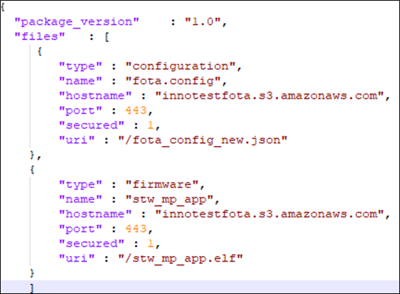
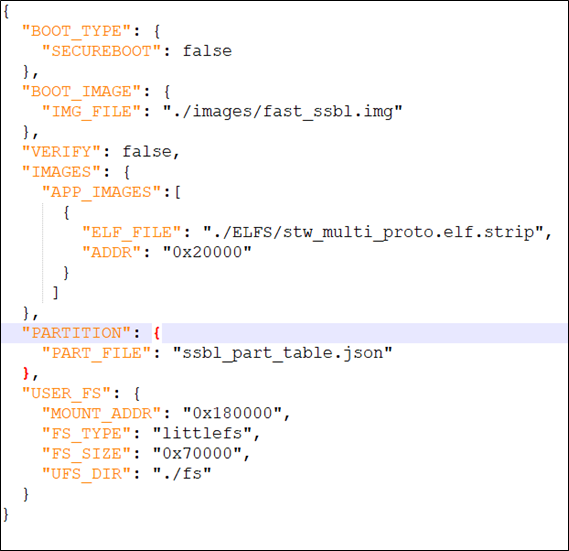
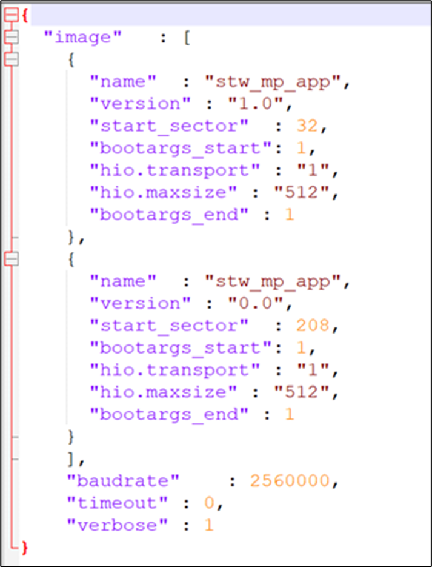

.. _st l4 setup and usage:

Set-up & Usage
``````````````

Pre-set-up on Talaria TWO (without SSBL)
----------------------------------------

*This is applicable to both L433RC-P and L4A6ZG Host platforms.*

Program the Talaria TWO EVB with the stw_multi_proto application using
the Download Tool.

Talaria TWO binary and Download Tool is available at the following
location of the release package:

1. stw_multi_proto.elf\ *:
   I-CUBE-T2-STW-lib\\STM32CubeExpansion_T2-HostAPI-lib_vx.y\\Utilities\\PC_Software\\TalariaTwo_Binaries*.

**Note**: There are two variants of ELFs available in
*I-CUBE-T2-STW-lib\\STM32CubeExpansion_T2-HostAPI-lib_vx.y\\Utilities\\PC_Software\\TalariaTwo_Binaries*:

a. stw_multi_proto.elf.strip: Stripped ELF is built with strip flag
   which discards debug symbols and hence reduces its size on the disk.
   Stripped version is always used as the final or production binary.

b. stw_multi_proto.elf: Non-stripped ELF has debug symbol information
   which is used for debugging purpose during development.

2. Download Tool:
   I\ *-CUBE-T2-STW-lib\\STM32CubeExpansion_T2-HostAPI-lib_vx.y\\Utilities\\PC_Software\\TalariaTwo_DownloadTool*.

Boot Arguments 
~~~~~~~~~~~~~~~

For SPI interface, use the following boot arguments to program the image
using Download Tool as described in section: *Programming Talaria TWO
Application*:

.. code:: shell

      hio.transport=1, hio.irq_min_gap=1000   


For UART interface, use the following boot arguments to program the
image using Download Tool as described in section: *Programming Talaria
TWO Application*:

.. code:: shell

      hio.transport=0, hio.baudrate=<baud rate> 


where,

1. hio.transport: To select host interface protocol (UART/SPI).

2. hio.irq_min_gap: To introduce microseconds delay between the notify
   events passed from Talaria TWO to the host. Increase the delay in
   case the host is unable to capture the back-to-back events sent from
   Talaria TWO.

3. hio.baudrate: To select host interface baud rate (applicable for
   UART).

4. <baud rate>:

   a. Maximum supported baud rate for STM NUCELO-L4A6ZG+T2 is 115200.

   b. Maximum supported baud rate for STM NUCELO-L433RCP+T2 is 921600.

**Note**: Under default configuration settings, maximum value which can
be assigned to hio.maxsize (maximum size of a Host interface message
sent to Talaria TWO) is 2048.

The following table provides list of baud rates supported for STM
NUCELO-L4A6ZG+T2:

+-----------------------------------+-----------------------------------+
| **UART Baud rate both on T2 and   | **STM NUCLEO-L4A6ZG +T2 UART**    |
| STM**                             |                                   |
+===================================+===================================+
| 9600                              | **Supported**                     |
+-----------------------------------+-----------------------------------+
| 14400                             | **Supported**                     |
+-----------------------------------+-----------------------------------+
| 19200                             | **Supported**                     |
+-----------------------------------+-----------------------------------+
| 38400                             | **Supported**                     |
+-----------------------------------+-----------------------------------+
| 57600                             | **Supported**                     |
+-----------------------------------+-----------------------------------+
| 115200                            | **Supported**                     |
+-----------------------------------+-----------------------------------+
| 230400                            | Not Supported                     |
+-----------------------------------+-----------------------------------+
| 460800                            | Not Supported                     |
+-----------------------------------+-----------------------------------+
| 921600                            | Not Supported                     |
+-----------------------------------+-----------------------------------+
| 2457600                           | Not Supported                     |
+-----------------------------------+-----------------------------------+

Table 1: Supported baud rates for L4A6ZG


The following table provides list of baud rates supported for STM
NUCELO-L433RC-P+T2:

+-----------------------------------+-----------------------------------+
| **UART Baud rate both on T2 and   | **STM NUCLEO-L433RC-P + T2 UART** |
| STM**                             |                                   |
+===================================+===================================+
| 9600                              | **Supported**                     |
+-----------------------------------+-----------------------------------+
| 14400                             | **Supported**                     |
+-----------------------------------+-----------------------------------+
| 19200                             | **Supported**                     |
+-----------------------------------+-----------------------------------+
| 38400                             | **Supported**                     |
+-----------------------------------+-----------------------------------+
| 57600                             | **Supported**                     |
+-----------------------------------+-----------------------------------+
| 115200                            | **Supported**                     |
+-----------------------------------+-----------------------------------+
| 230400                            | **Supported**                     |
+-----------------------------------+-----------------------------------+
| 460800                            | **Supported**                     |
+-----------------------------------+-----------------------------------+
| 921600                            | **Supported**                     |
+-----------------------------------+-----------------------------------+
| 2457600                           | Not Supported                     |
+-----------------------------------+-----------------------------------+

Table 2: Supported baud rates for L433RC-P


Programming Talaria TWO Application
~~~~~~~~~~~~~~~~~~~~~~~~~~~~~~~~~~~

Program stw_multi_proto.elf
(*I-CUBE-T2-STW-lib\\STM32CubeExpansion_T2-HostAPI-lib_vx.y\\Utilities\\PC_Software\\TalariaTwo_Binaries*)
using the Download Tool
(*I-CUBE-T2-STW-lib\\STM32CubeExpansion_T2-HostAPI-lib_vx.y\\Utilities\\PC_Software\\TalariaTwo_DownloadTool*):

1. Launch the Download tool provided with InnoPhase Talaria TWO SDK.

2. In the GUI window:

   a. Boot Target: Select the appropriate EVK from the drop-down.

   b. ELF Input: Load the stw_multi_proto.elf by clicking on Select ELF
      File.

   c. Boot Arguments: Pass the boot arguments from section: *Boot
      Arguments*.

   d. Programming: Program Talaria TWO’s ELF to Flash by clicking on
      PROG Flash.

For details on using the Download tool, refer to document:
User_Guide_for_Talaria_TWO_Download_Tool.pdf
*(I-CUBE-T2-STW-lib\\STM32CubeExpansion_T2-HostAPI-lib_vx.y\\*
*Documentation\\Download_Tool_UG)*.

Console output:

.. code:: shell

      4 DWT comparators, range 0x8000
      Build $Id: git-878d28d6f $
      hio.baudrate=921600
      flash: Gordon ready!
      
      Y-BOOT 208ef13 2019-07-22 12:26:54 -0500 790da1-b-7
      ROM yoda-h0-rom-16-0-gd5a8e586
      FLASH:PNWWWWWWWAE
      Build $Id: git-019c45c $
      Flash detected. flash.hw.uuid: 39483937-3207-0014-00ae-ffffffffffff
      Bootargs: hio.transport=0 hio.baudrate=115200
      [APP]Data fs mounted, rval = 0
      APP ver 1.2
      [0.026,557] mqtt_ping_interval=60
      Calibrating......................................................[3.701,457] Calibration file "room" saved (T=25).
      Done
      Registering unassoc apis
      Registering custom_msg_exchange apis
      $App:git-c1f5ef0
      SDK Ver: FREERTOS_SDK_1.0
      Stw With hio, wcm, sock, mdns, mqtt, tls, bt, http, demo, nw_misc_apps, FOTA, FOS, UNASSOC, PROV, file


Programming Host board with SPI Interface
~~~~~~~~~~~~~~~~~~~~~~~~~~~~~~~~~~~~~~~~~

STM32L4A6ZG
^^^^^^^^^^^

After programing Talaria TWO as mentioned in section: *Programming
Talaria TWO Application*, mount the Talaria TWO EVB on the STM32 board
on Arduino connector, and the change the power selection switch U3 (on
Talaria TWO) to V33_ARD position.

STM32L433RC-P
^^^^^^^^^^^^^

After programing Talaria TWO as mentioned in section: *Programming
Talaria TWO Application*, mount the Talaria TWO EVB on the STM32 board
on Arduino connector, and the change the power selection switch U3 (on
Talaria TWO) to V33_ARD position.

Programming Host board with UART Interface
~~~~~~~~~~~~~~~~~~~~~~~~~~~~~~~~~~~~~~~~~~

.. _stm32l4a6zg-1:

STM32L4A6ZG
^^^^^^^^^^^

After programing Talaria TWO as mentioned in section: *Programming
Talaria TWO Application*, establish UART connection between Talaria TWO
EVB and STM32 board (refer section: *UART Interface*, PIN configuration
table: Table 1 ).

**Note**: Ensure to remove Rx and Tx PIN connections on STM to program
Talaria TWO using UART interface from the Download Tool.

.. _stm32l433rc-p-1:

STM32L433RC-P
^^^^^^^^^^^^^

After programing Talaria TWO as mentioned in section: *Programming
Talaria TWO Application*, establish UART connection between Talaria TWO
EVB and STM32 board (refer section: *Connection Setup*, PIN
configuration table in Table 2).

**Note**: Ensure to remove Rx and Tx PIN connections on STM to program
Talaria TWO using UART interface from the Download Tool.

Pre-set-up on Talaria TWO with SSBL
-----------------------------------

This is applicable to only L433RC-P Host platform.

1. Place stw_multi_proto.elf.strip in
   *factory_loader\\factory_loader_script\\ELFS*.

2. Place part.json, boot.json and fota_config.json in the UFS Directory:
   *factory_loader\\factory_loader_script\\fs*.

3. Place stwmultiproto.json in *factory_loader\\factory_loader_script*
   which specifies the ELF file path and UFS Directory.

Example for boot.json, fota.config.json , stwmultiproto.json and
part.json are as follows:

**boot.json**:

.. code:: shell

      {
      "image":0
      }


**fota.config.json**:

|image7|

Figure 1: Example for fota_config.json file

**stwmultiproto.json**:

|image8|

Figure 2: Example for stwmultiproto.json

**part.json**:

|image9|

Figure 3: Example for part.json file

.. _boot-arguments-1:

Boot Arguments
~~~~~~~~~~~~~~

Boot arguments are specified in the part.json file as:

1. "hio.transport" : "1" and

2. "hio.maxsize" : "512"

Running Talaria TWO Application
~~~~~~~~~~~~~~~~~~~~~~~~~~~~~~~

Run the following command from *factory_loader/factory_loader_script*
directory on the terminal. Ensure Talaria TWO switch is on 3.3V:

a. Windows:

.. code:: shell

      python .\script\factory_loader.py ftdi_serial stwmultiproto.json --mode=qa


b. Linux:

.. code:: shell

      python3 ./script/factory_loader.py ftdi_serial stwmultiproto.json --mode=qa





