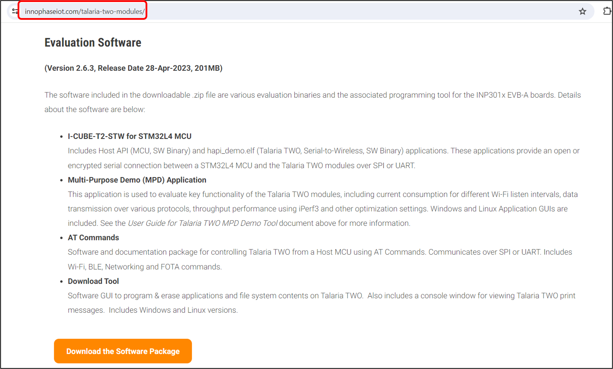
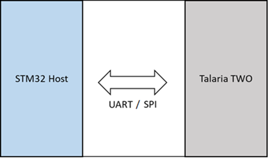
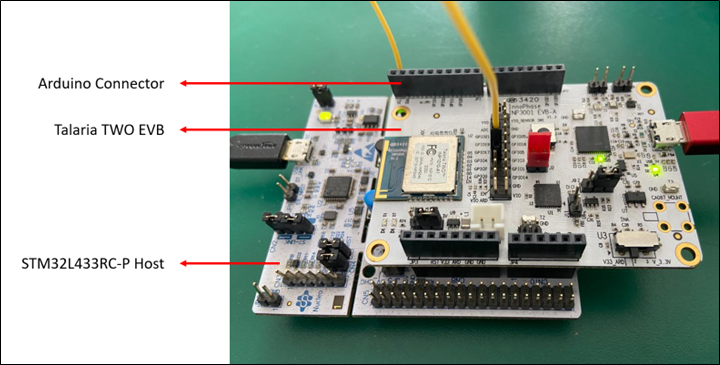
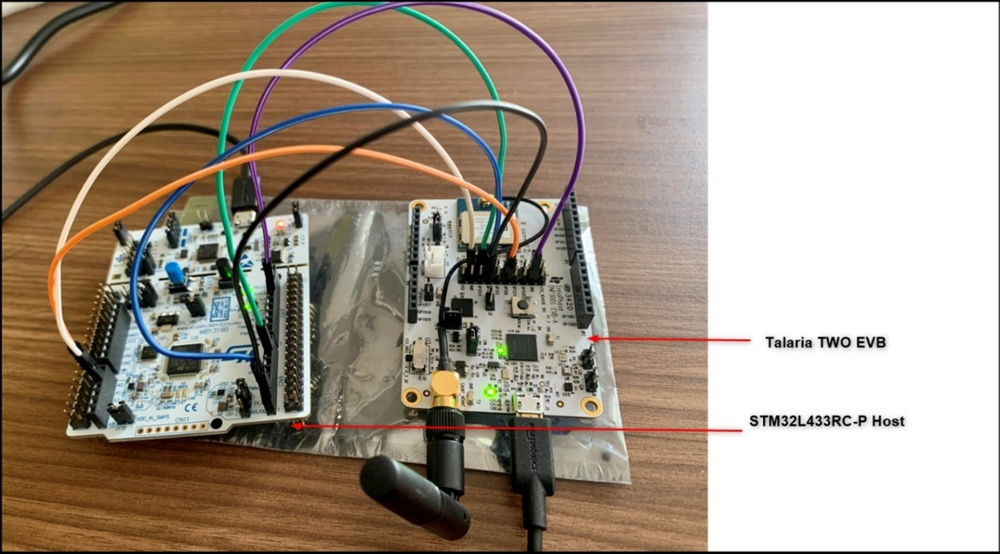
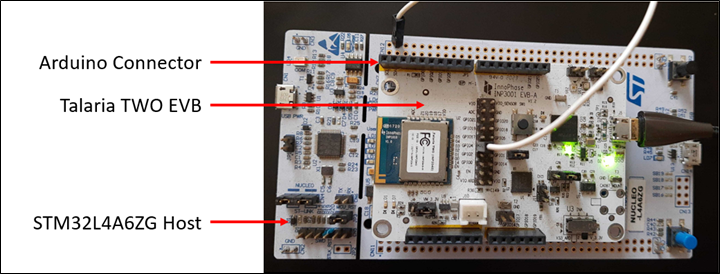
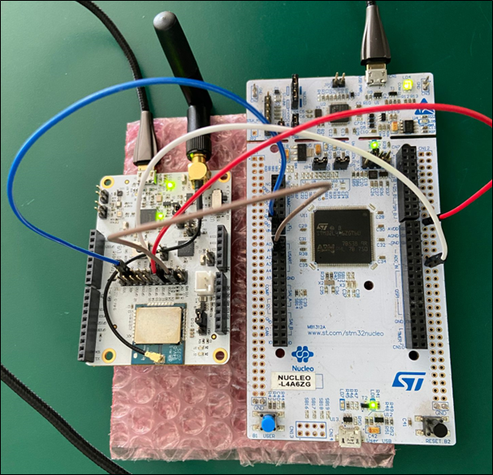

Testing Basic Operations on Set-up
==================================

Testing the Basic Operation on setup with SPI interface
-------------------------------------------------------

Use Case 1: T2-HAN001-V01-Wi-Fi Demo Application
~~~~~~~~~~~~~~~~~~~~~~~~~~~~~~~~~~~~~~~~~~~~~~~~

Open STM32CubeIDE and select Open Projects from the file system from
file.

1. Load the InnoPhase_HAPI_Wifidemo from EVK package available at
   location:

*I-CUBE-T2-STW-src_x.y\\STM32CubeExpansion_T2-HostAPI-src_vx.y\\Projects\\NUCLEO-L433RC-P\\Applications\\InnoPhase_HAPI\\T2-HAN-001\\SW4STM32*.

|image1|

Figure 8: Steps to load the package

2. Click and open app.c by navigating Core->Src->HAPI.

3. Configure network details (SSID and Passphrase) and save the file, as
   shown in Figure 9.

4. Select Project and choose Build Project in the dropdown menu.

5. Click on debug to load the application on to the STM32 board.

|A screenshot of a computer Description automatically generated|

Figure 9: Steps to configure CubeIDE

6. Once the loading of the application is complete, open Tera term (or
   any preferred serial terminal) and configure the serial port.

|image2|

Figure 10: Configuring serial port

|image3|

Figure 11: Tera Term Setup

7. Reset STM32 and check the console logs on Tera term. STM32 will boot
   and the Wi-Fi connection will be established. It starts the TCP
   server and waits for a connection on port 9000. The serial prints on
   the STM32 are as shown in Figure 12:

|image4|

Figure 12: Expected Output

Testing the Basic Operation on Setup with UART interface
--------------------------------------------------------

.. _use-case-1-t2-han001-v01-wi-fi-demo-application-1:

Use Case 1: T2-HAN001-V01-Wi-Fi Demo Application
~~~~~~~~~~~~~~~~~~~~~~~~~~~~~~~~~~~~~~~~~~~~~~~~

Open STM32CubeIDE and select Open Projects from the file system from
file.

1. Load the InnoPhase_HAPI_Wifidemo from EVK package available at
   location:

*I-CUBE-T2-STW-src_x.y\\STM32CubeExpansion_T2-HostAPI-src_vx.y\\Projects\\NUCLEO-L433RC-P\\Applications\\InnoPhase_HAPI\\T2-HAN-001\\SW4STM32*

|image5|

Figure 13: Steps to load the package

2. Click and open app.c by navigating Core->Src->HAPI.

3. Configure network details (SSID and Passphrase) as shown in Figure
   15.

4. Comment out the macro HAPI_INTERFACE_SPI_ENABLED in app.c and
   uncomment HAPI_INTERFACE_UART_ENABLED to enable the UART interface.

5. Select the AP security type and update the macro connect_mode. The
   possible connection modes are PERSONAL_OPEN, ENTERPRISE_TLS,
   ENTERPRISE_PSK, PERSONAL_WPA23, and ENTERPRISE_PEAP.

6. The default baud rate set in the examples host application is 115200.
   User can change this STM host side baud rate to match the baud rate
   configured on Talaria TWO using hio.baudrate=<baud rate>.

   a. For example: If the bootargs on Talaria TWO is set as
      hio.transport=0, hio.baudrate= 230400, make sure to change the
      baud rate on Host (STM) by configuring “huart1.Init.BaudRate”
      value to 230400 from the main.c file (Core->Src->HAPI), as shown
      in Figure 14:

..

   |image6|

Figure 14: Changing the default baud rate

7. Save the file.

8. Select Project and choose Build Project in the dropdown menu.

9. Click on debug to load the application on to the STM32 board.

|image7|

Figure 15: Steps to configure CubeIDE

10. Once the loading of the application completes, open Tera term (or
    any preferred serial terminal) and configure the serial port.

|image8|

Figure 16: Configuring serial port

|image9|

Figure 17: Tera Term Setup

11. Reset both Talaria TWO module and STM32 respectively and check the
    console logs on Tera term. STM32 will boot and the Wi-Fi connection
    will be established. It starts the TCP server and waits for a
    connection on port 9000. The serial prints on the STM32 are as shown
    in Figure 18:

**Note**: Ensure to reset Talaria TWO first followed by STM reset as
resetting STM will not automatically ensure Talaria TWO reset.

|image10|

Figure 18: Expected Output

