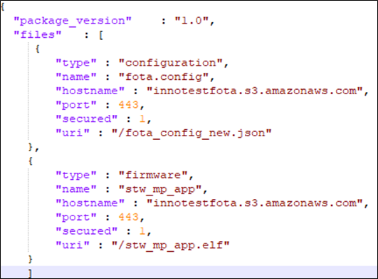

.. _st u5 setup and usage:

Set-up & Usage
==============

Pre-set-up without SSBL
-----------------------

Pre-set-up on Talaria TWO
~~~~~~~~~~~~~~~~~~~~~~~~~

Program the Talaria TWO EVB with the stw_multi_proto application using
the Download Tool.

Talaria TWO binary and Download Tool is available at the following
location of the release package:

1. stw_multi_proto.elf:
   *I-CUBE-T2-U5-Alpha-lib/Utilities/PC_Software/TalariaTwo_Binaries*

**Note**: There are two variants of ELFs available in
*I-CUBE-T2-U5-Alpha-lib/Utilities/PC_Software/TalariaTwo_Binaries*:

a. stw_multi_proto.elf.strip: Stripped ELF is built with strip flag
   which discards debug symbols and hence reduces its size on the disk.
   Stripped version is always used as the final or production binary.

b. stw_multi_proto.elf: Non-stripped ELF has debug symbol information
   which is used for debugging purpose during development.

2. Download Tool:
   *I-CUBE-T2-U5-Alpha-lib/Utilities/PC_Software/TalariaTwo_DownloadTool*.

Boot Arguments 
~~~~~~~~~~~~~~~

For SPI interface, use the following boot arguments to program the image
using Download Tool as described in section: *Programming Talaria TWO
Application*:

.. code:: shell

    hio.transport=spi, hio.irq_min_gap=1000, krn.gpio=---p

Programming Talaria TWO Application
~~~~~~~~~~~~~~~~~~~~~~~~~~~~~~~~~~~

Program stw_multi_proto.elf
(*I-CUBE-T2-U5-Alpha-lib/Utilities/PC_Software/TalariaTwo_DownloadTool*)
using the Download tool:

1. Launch the Download tool provided with InnoPhase Talaria TWO SDK.

2. In the GUI window:

   a. Boot Target: Select the appropriate EVK from the drop-down.

   b. ELF Input: Load the stw_multi_proto.elf by clicking on Select ELF
      File.

   c. Boot Arguments: Pass the boot arguments from section: *Boot
      Arguments*.

   d. Programming: Program Talaria TWO’s ELF to Flash by clicking on
      PROG Flash.

For details on using the Download tool, refer to document:
User_Guide_for_Talaria_TWO_Download_Tool.pdf (*I-CUBE-T2-U5-Alpha-lib/
Documentation\\Download_Tool_UG*.

Console output:

.. code:: shell

    UART:SNWWWWAE
    4 DWT comparators, range 0x8000
    Build $Id: git-878d28d6f $
    hio.baudrate=921600
    flash: Gordon ready!
    
    Y-BOOT 208ef13 2019-07-22 12:26:54 -0500 790da1-b-7
    ROM yoda-h0-rom-16-0-gd5a8e586
    FLASH:PNWWWWWWWAE
    Build $Id: git-019c45c $
    Flash detected. flash.hw.uuid: 39483937-3207-0014-00ae-ffffffffffff
    Bootargs: hio.transport=spi hio.irq_min_gap=1000 krn.gpio=---p
    [APP]Data fs mounted, rval = 0
    APP ver 1.2
    [0.026,871] mqtt_ping_interval=60
    [0.041,385] Calibration file "room" found and used (T=26).
    Registering unassoc apis
    Registering custom_msg_exchange apis
    $App:git-c1f5ef0
    SDK Ver: FREERTOS_SDK_1.0
    Stw With hio, wcm, sock, mdns, mqtt, tls, bt, http, demo, nw_misc_apps, FOTA, FOS, UNASSOC, PROV, file

Pre-set-up with SSBL
--------------------

.. _pre-set-up-on-talaria-two-1:

Pre-set-up on Talaria TWO
~~~~~~~~~~~~~~~~~~~~~~~~~

1. Place stw_multi_proto.elf.strip in
   *factory_loader\\factory_loader_script\\ELFS*.

2. Place part.json, boot.json and fota_config.json in the UFS Directory:
   *factory_loader\\factory_loader_script\\fs*.

3. Place stwmultiproto.json in *factory_loader\\factory_loader_script*
   which specifies the ELF file path and UFS Directory.

Example for boot.json, fota.config.json, stwmultiproto.json and
part.json are as follows:

**boot.json**:

.. code:: shell

    {
    "image":0
    }

**fota.config.json**:

|image3|

Figure 1: Example for fota_config.json file

**stwmultiproto.json**:

|image4|

Figure 2: Example for stwmultiproto.json

**part.json**:

|image5|

Figure 3: Example for part.json file

.. _boot-arguments-1:

Boot Arguments
~~~~~~~~~~~~~~

Boot arguments are specified in the part.json file as:

1. "hio.transport" : "spi"

2. "hio.maxsize" : "512"

3. “krn.gpio”: “---p”

Running Talaria TWO Application
~~~~~~~~~~~~~~~~~~~~~~~~~~~~~~~

Run the following command from *factory_loader/factory_loader_script*
directory on the terminal. Ensure Talaria TWO switch is on 3.3V:

a. Windows:

.. code:: shell

    python .\script\factory_loader.py ftdi_serial stwmultiproto.json --mode=qa

b. Linux:

.. code:: shell

    python3 ./script/factory_loader.py ftdi_serial stwmultiproto.json --mode=qa

Programming NUCLEO-U575ZI-Q Host Board with SPI Interface
---------------------------------------------------------

After programing Talaria TWO as mentioned in section: `Programming
Talaria TWO Application <#programming-talaria-two-application>`__, mount
the Talaria TWO EVB on the STM32 board on Arduino connector, and then
change the power selection switch U3 (on Talaria TWO) to V33_ARD
position.

.. |image4| image:: media/image4.png
   :width: 5.51181in
   :height: 5.33401in
.. |image5| image:: media/image5.png
   :width: 4.72441in
   :height: 6.20767in
