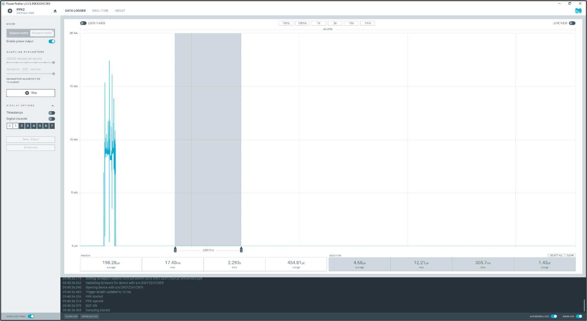

.. _st u5 current consumption:

Measuring Current Consumption of NUCLEO-U575ZI-Q
------------------------------------------------

1. Remove jumper at JP5.

2. Measure current at JP5.

|image6|

Figure 1: Measuring current consumption of Nucleo-U575ZI-Q

