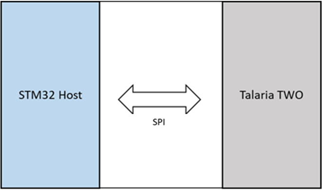

Measuring Current Consumption of NUCLEO-U575ZI-Q
------------------------------------------------

1. Remove jumper at JP5.

2. Measure current at JP5.

|A screenshot of a computer Description automatically generated|

Figure 10: Measuring current consumption of Nucleo-U575ZI-Q

