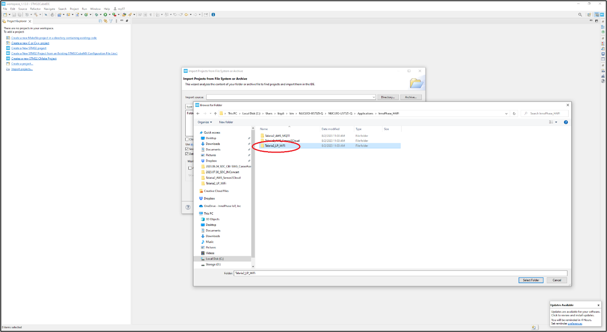
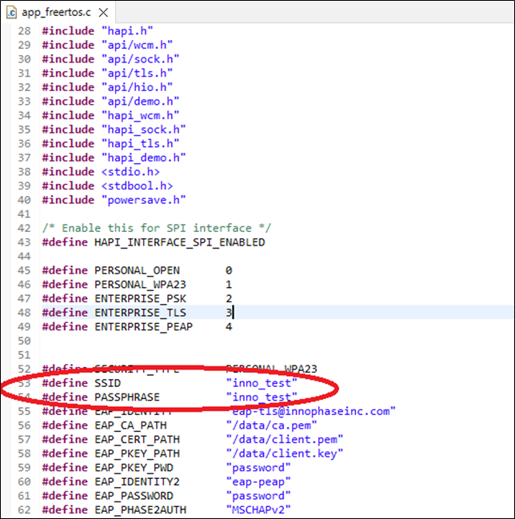
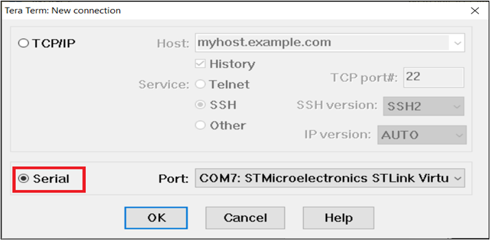
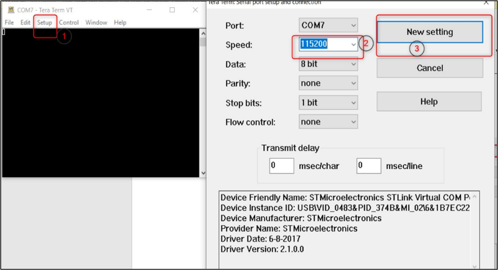
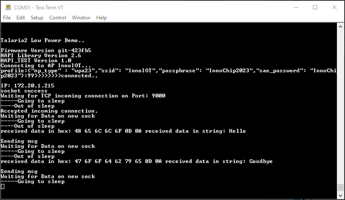

.. _st u5 testing basic operations:

Testing the Basic Operation on setup with SPI interface
=======================================================

Use Case 1: Talaria2 Low Power WiFi Demo Application
~~~~~~~~~~~~~~~~~~~~~~~~~~~~~~~~~~~~~~~~~~~~~~~~~~~~

Open STM32CubeIDE and select Open Projects from the file system from
file.

1. Open the Talaria2_LP_WiFi project from EVK package available at
   location:

*I-CUBE-T2-U5-Alpha-lib/Application/Talaria2_LP_WiFi with the
STM32CubeIDE.*

|image7|

Figure 1: Loading Talaria2_LP_WiFi project

2. Click and open app_freertos.c by navigating to Core->Src.

3. Configure network details (SSID and Passphrase) and save the file.

4. Select Project and choose Build Project in the dropdown menu.

5. Click on debug to load the application on to the STM32 board.

|image8|

Figure 2: Modifying SSID and PASSPHRASE

6. Once the loading of the application is complete, open Tera term (or
   any preferred serial terminal) and configure the serial port.

|image9|

Figure 3: Configuring serial port

|image10|

Figure 4: Tera Term Setup

7. Reset STM32 and check the console logs on Tera term. STM32 will boot
   and the Wi-Fi connection will be established. It starts the TCP
   server and waits for a connection on port 9000.

|image11|

Figure 5: Expected Output

