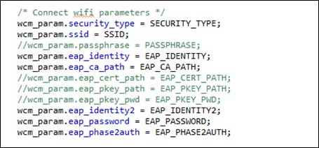
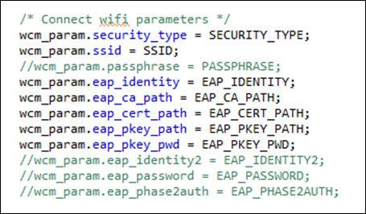
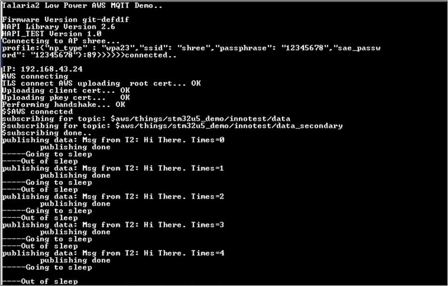

AWS Sensor2Cloud Demo Application
=================================

The HAPI APIs residing in the host microcontroller (STM32) connects to
Talaria TWO module via SPI. Using these HAPI APIs, users can write
applications to perform multiple functions with Talaria TWO. This series
of Host Application Notes discusses more on using these APIs to perform
specific functions.

This document provides details on how to use the HAPI APIs to create the
AWS Sensor2Cloud demo application to:

1. Initialize the HAPI interface

2. Enable/Disable sleep mode in configuration

3. Check HAPI communication with the Talaria TWO EVB

4. Create a Wi-Fi network and register link status callback

5. Connect to the network

6. Create an AWS connection

7. Create a shadow connection

Connection Set-up
=================

Host processor communicates with Talaria TWO via a SPI interface. The
connection set-up used to test the application is as shown in Figure 1.

|A diagram of a cost and cost Description automatically generated with
medium confidence|

Figure 1: Connection set-up for application testing

STM32U575ZI-Q as Host Controller
--------------------------------

STM32U575ZI-Q is the hHst controller which will have the AWS
Sensor2Cloud demo application running on it. This Host is in-turn
connected to the InnoPhase Talaria TWO board through SPI interface. The
serial to Wi-Fi application (stw_multi_proto) firmware should be run on
the Talaria TWO board.

SPI Interface
~~~~~~~~~~~~~

Refer section: *SPI Interface* of the document:
QSG_T2_Nucleo_U575ZI-Q.pdf
*(Documentation\\STM32CubeU5_Getting_Started*) for more details on the
Hardware setup and connections for testing the application using SPI
interface.

Set-up & Usage
==============

Pre-set-up on Talaria TWO
-------------------------

Refer section: *Setup & Usage* of the document:
QSG_T2_Nucleo_U575ZI-Q.pdf
*(Documentation\\STM32CubeU5_Getting_Started*) for details on Pre-set-up
on Talaria TWO.

Boot Arguments 
---------------

Refer section: *Boot Arguments* of the document:
QSG_T2_Nucleo_U575ZI-Q.pdf
*(Documentation\\STM32CubeU5_Getting_Started*) for details on the boot
arguments to be passed for SPI interface.

Testing
=======

Sample Application
------------------

The sample application discussed in this application note runs
specifically on STM32U575ZI-Q device. This example has been tested with
NUCLEO-U575ZI-Q board and can be easily tailored to any other supported
device and development board.

For details on testing the application with SPI interface, refer
section: *Testing the Basic Operation on setup with SPI interface* of
the document: QSG_T2_Nucleo_U575ZI-Q.pdf
*(Documentation\\STM32CubeU5_Getting_Started*).

For details on testing the application with SPI interface, refer
section: *Testing the Basic Operation on setup with SPI interface* of
the document: QSG_T2_Nucleo_U575ZI-Q.pdf
*(Documentation\\STM32CubeU5_Getting_Started*).

**Note**:

To make certain appropriate HAL operation, the application must ensure
that the HAL time base is always set to 1 millisecond. The FreeRTOS heap
size configTOTAL_HEAP_SIZE as defined in FreeRTOSConfig.h is set as per
the OS resources’ memory requirements of the application with a +10%
margin and rounded to the upper Kbyte boundary.

For more details on the FreeRTOS implementation on STM32Cube, please
refer to UM1722 - Developing Applications on STM32Cube with RTOS.

AWS Sensor2Cloud Application
============================

This section describes the application along with code snippets. The
application uses HAPI APIs to achieve the functionality. HAPI APIs
presumes that the platform related initialization and clock settings are
completed by default.

1. 

2. 

3. 

4. 

5. 

6. 

7. 

HAPI Interface Initialization
-----------------------------

+-----------------------------------------------------------------------+
| struct hapi \*hapi;                                                   |
|                                                                       |
| #ifdef HAPI_INTERFACE_SPI_ENABLED                                     |
|                                                                       |
| /\* Register the SPI \*/                                              |
|                                                                       |
| hapi = hapi_spi_init(hapi_spi, hapi_spi_cs_high, hapi_spi_cs_low,     |
| hapi_spi_tx, hapi_spi_rx);                                            |
|                                                                       |
| #endif                                                                |
+=======================================================================+
+-----------------------------------------------------------------------+

Enable/Disable Sleep Mode in Configuration
------------------------------------------

+-----------------------------------------------------------------------+
| hapi_start(hapi);                                                     |
|                                                                       |
| hapi_config(hapi, (bool)PS_ENABLED, wakeup_pin, wakeup_level,         |
| irq_pin, irq_mode);                                                   |
+=======================================================================+
+-----------------------------------------------------------------------+

Check HAPI Communication with Talaria TWO EVB
---------------------------------------------

+-----------------------------------------------------------------------+
| hapi_hio_query(hapi,&hio_query_rsp);                                  |
+=======================================================================+
+-----------------------------------------------------------------------+

Create a Wi-Fi Network Interface and Register Link Status Callback 
-------------------------------------------------------------------

+-----------------------------------------------------------------------+
| struct hapi_wcm \* hapi_wcm = hapi_wcm_create(hapi);                  |
|                                                                       |
| hapi_wcm_set_link_cb(hapi_wcm, wcm_link_cb, hapi_wcm);                |
+=======================================================================+
+-----------------------------------------------------------------------+

Connect to a Wi-Fi Network
--------------------------

The application uses different parameters which can be modified as per
user AP settings. The SECURITY_TYPE macro must be updated with the WPA
security type, which can be chosen from one of following depending on
the AP settings.

|A close-up of a white background Description automatically generated|

Figure 2: Security types

The SSID, passphrase and other parameters can be modified as per the
security type selected as shown in Figure 3.

|A screenshot of a computer code Description automatically generated|

Figure 3: Modifying parameters as per AP settings

**Enterprise_PEAP**

Write only the CA certificate on Talaria TWO data partition using the
Download Tool and edit the app.c to include the following parameters:

|A screenshot of a computer Description automatically generated|

Figure 4: Modifying parameters for Enterprise PEAP

|Text Description automatically generated|

Figure 5: Connecting Wi-Fi parameters - Enterprise PEAP

**Enterprise_TLS**

Write the CA certificate, Client certificate & Client key on Talaria TWO
data partition using the Download Tool and edit app.c to include the
following parameters:

|image1|

Figure 6: Modifying parameters for Enterprise TLS

|image2|

Figure 7: Connecting Wi-Fi parameters - Enterprise TLS

**Enterprise_PSK**

Edit the app.c to include the following parameters:

|image3|

Figure 8: Modifying parameters for Enterprise PSK

|A screenshot of a computer screen Description automatically generated|

Figure 9: Connecting Wi-Fi parameters - Enterprise PSK

Create an AWS Connection
------------------------

+-----------------------------------------------------------------------+
| if(init_and_connect_aws_iot()) {                                      |
|                                                                       |
| printf("init_and_connect_aws_iot failed. *ret*:\\r\\n");              |
|                                                                       |
| printf("...will retry connecting again after some time..\\r\\n");     |
|                                                                       |
| vTaskDelay(60000);                                                    |
|                                                                       |
| continue;                                                             |
|                                                                       |
| }                                                                     |
+=======================================================================+
+-----------------------------------------------------------------------+

Create a Shadow Connection
--------------------------

+-----------------------------------------------------------------------+
| rc = aws_iot_shadow_init(gpclient, sp);                               |
|                                                                       |
| if (SUCCESS != rc) {                                                  |
|                                                                       |
| hapi_free(sp);                                                        |
|                                                                       |
| hapi_free(gpclient);                                                  |
|                                                                       |
| printf("Shadow Connection Error *ret*:%d\\n", rc);                    |
|                                                                       |
| return rc; }                                                          |
+=======================================================================+
+-----------------------------------------------------------------------+

Expected Output
===============

The MCU will connect to the AP specified by the SSID and passphrase and
creates the AWS IoT connection with the certificate and URL. It then
creates a shadow service and prepares a JSON document to update the
device's sensor value every 5 seconds.

On successful execution, the following console output can be observed as
shown in Figure 10:

|image4|

Figure 10: Expected output

Application Files and Functions
===============================

+----------------------------------------+-----------------------------+
|    File                                |    Function                 |
+========================================+=============================+
|    InnoPhase_HAPI/                     |    Main Program             |
|    Talaria2_AWS_MQTT/Src/main.c        |                             |
+----------------------------------------+-----------------------------+
|    InnoPhase_HAPI/                     |    HAL time-base file       |
|    Talaria2_AWS                        |                             |
| _MQTT/Src/stm32u5xx_hal_timebase_tim.c |                             |
+----------------------------------------+-----------------------------+
|    InnoPhase_HAP                       |    Interrupt handlers       |
| I/Talaria2_AWS_MQTT/Src/stm32u5xx_it.c |                             |
+----------------------------------------+-----------------------------+
|    InnoPhase_HAPI/Ta                   |    STM32L4xx system clock   |
| laria2_AWS_MQTT/Src/system_stm32u5xx.c |    configuration file       |
+----------------------------------------+-----------------------------+
|    InnoPhase                           |    Code for free RTOS       |
| _HAPI/Talaria2_AWS_MQTT/Src/freertos.c |    application              |
+----------------------------------------+-----------------------------+
|    InnoPhase_HAPI/                     |    Code for MSP             |
|    Tal                                 |    init                     |
| aria2_AWS_MQTT/Src/stm32u5xx_hal_msp.c | ialization/deinitialization |
+----------------------------------------+-----------------------------+
|    InnoPhase                           |    System calls file        |
| _HAPI/Talaria2_AWS_MQTT/Src/syscalls.c |                             |
+----------------------------------------+-----------------------------+
|    InnoPha                             |    System memory calls file |
| se_HAPI/Talaria2_AWS_MQTT/Src/sysmem.c |                             |
+----------------------------------------+-----------------------------+
|                                        |    System startup file      |
|  InnoPhase_HAPI/Talaria2_AWS_MQTT/Src/ |                             |
|    startup_stm32u575zitxq.s            |                             |
+----------------------------------------+-----------------------------+
|    InnoP                               |    Main program header file |
| hase_HAPI/Talaria2_AWS_MQTT/Inc/main.h |                             |
+----------------------------------------+-----------------------------+
|    InnoPhase_HAPI/Tala                 |    HAL Library              |
| ria2_AWS_MQTT/Inc/stm32l4xx_hal_conf.h |    Configuration file       |
+----------------------------------------+-----------------------------+
|    InnoPhase_HAP                       |    Interrupt handler’s      |
| I/Talaria2_AWS_MQTT/Inc/stm32l4xx_it.h |    header file              |
+----------------------------------------+-----------------------------+
|    InnoPhase_HAPI/                     |    FreeRTOS Configuration   |
| Talaria2_AWS_MQTT/Inc/FreeRTOSConfig.h |    file                     |
+----------------------------------------+-----------------------------+

Table 1: Application files and functions

.. |A diagram of a cost and cost Description automatically generated with medium confidence| image:: media/image1.png
   :width: 4.72441in
   :height: 2.65052in
.. |A close-up of a white background Description automatically generated| image:: media/image2.png
   :width: 4.725in
   :height: 1.75833in
.. |A screenshot of a computer code Description automatically generated| image:: media/image3.png
   :width: 4.725in
   :height: 1.8in

.. |Text Description automatically generated| image:: media/image5.png
   :width: 4.725in
   :height: 2.19167in

.. |image2| image:: media/image7.png
   :width: 4.725in
   :height: 2.75in
.. |image3| image:: media/image8.png
   :width: 4.725in
   :height: 1.91667in

.. |image4| image:: media/image10.png
   :width: 7.48031in
   :height: 3.74342in
