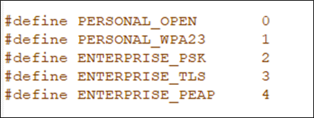
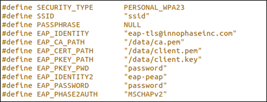
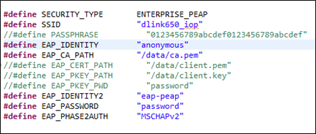
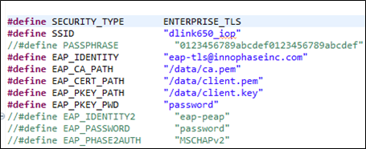
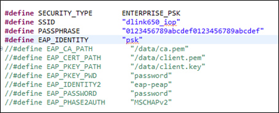
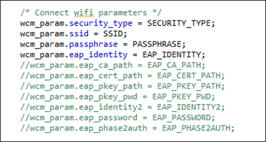
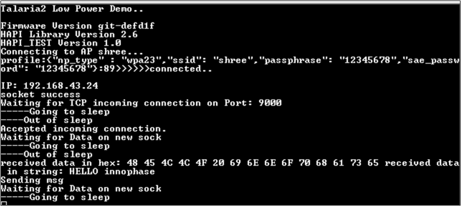

.. _st u5 han wifi:

Wi-Fi Demo Application
======================

The HAPI APIs residing in the host microcontroller (STM32) connects to
Talaria TWO module via UART/SPI. Using these HAPI APIs, users can write
applications to perform multiple functions with Talaria TWO. This series
of Host Application Notes discusses more on using these APIs to perform
specific functions.

This document provides details on how to use the HAPI APIs to create the
low power Wi-Fi demo application to:

1. Initialize the HAPI interface

2. Enable/Disable sleep mode in configuration

3. Check HAPI communication with the Talaria TWO EVB

4. Create a Wi-Fi network and register link status callback

5. Connect to the network

6. Create a server socket

7. Register the incoming socket connection

8. Check available socket data

9. Receive and send data on the socket

STM32U575ZI-Q as Host Controller
--------------------------------

STM32U575ZI-Q is the host controller which will have the Wi-Fi demo
application running on it. This host is in-turn connected to the
InnoPhase Talaria TWO board through SPI interface. The serial to Wi-Fi
application (stw_multi_proto) firmware should be run on the Talaria TWO
board.

SPI Interface
~~~~~~~~~~~~~

Refer section: *SPI Interface* of the document:
QSG_T2_Nucleo_U575ZI-Q.pdf
*(Documentation\\STM32CubeU5_Getting_Started*) for more details on the
Hardware setup and connections for testing the application using SPI
interface.

Set-up & Usage
==============

Pre-set-up on Talaria TWO
-------------------------

Refer section: *Setup & Usage* of the document:
QSG_T2_Nucleo_U575ZI-Q.pdf
*(Documentation\\STM32CubeU5_Getting_Started*) for details on Pre-set-up
on Talaria TWO.

Boot Arguments 
---------------

Refer section: *Boot Arguments* of the document:
QSG_T2_Nucleo_U575ZI-Q.pdf
*(Documentation\\STM32CubeU5_Getting_Started*) for details on the boot
arguments to be passed for SPI and UART interface.

Testing
=======

Sample Application
------------------

The sample application discussed in this application note runs
specifically on STM32U575ZI-Q device. This example has been tested with
NUCLEO-U575ZI-Q board and can be easily tailored to any other supported
device and development board.

1. Start TCP client on a PC that connects to the same network, with
   server IP as the IP printed on the STM32 serial console and port as
   9000

For example, TCP client: netcat on PC

.. code:: shell

      #nc <ip address of T2> 9000 

2. Send any data from the TCP client. The same data is received on the
   client from ST32-Talaria TWO device.

For details on testing the application with SPI and UART interface,
refer sections: *Testing the Basic Operation on setup with SPI
interface* and *Testing the Basic Operation on setup with UART
interface* of the document: QSG_T2_STM32CubeL4_U575ZI-Q.pdf
*(Documentation\\STM32CubeU5_Getting_Started*).

**Note**:

To make certain appropriate HAL operation, the application must ensure
that the HAL time base is always set to 1 millisecond. The FreeRTOS heap
size configTOTAL_HEAP_SIZE as defined in FreeRTOSConfig.h is set as per
the OS resources’ memory requirements of the application with a +10%
margin and rounded to the upper Kbyte boundary.

For more details on the FreeRTOS implementation on STM32Cube, please
refer to UM1722 - Developing Applications on STM32Cube with RTOS.

.. _wi-fi-demo-application-1:

Wi-Fi Demo Application
======================

This section describes the application details along with code snippets.
The application uses HAPI APIs to achieve the functionality. HAPI APIs
presumes that the platform related initialization and clock settings are
completed by default.

HAPI Interface Initialization
-----------------------------

.. code:: shell

      struct hapi *hapi;
      #ifdef HAPI_INTERFACE_SPI_ENABLED
          /* Register the SPI */
          hapi = hapi_spi_init(hapi_spi, hapi_spi_cs_high, hapi_spi_cs_low, hapi_spi_tx, hapi_spi_rx);
      #endif

Enable/Disable Sleep Mode in Configuration
------------------------------------------

.. code:: shell

      hapi_start(hapi);
      hapi_config(hapi,(bool)PS_ENABLED, wakeup_pin, wakeup_level, irq_pin, irq_mode);

Check HAPI Communication with Talaria TWO EVB
---------------------------------------------

.. code:: shell

      hapi_hio_query(hapi,&hio_query_rsp); 

Create a Wi-Fi Network Interface and Register Link Status Callback 
-------------------------------------------------------------------

.. code:: shell

      struct hapi_wcm * hapi_wcm = hapi_wcm_create(hapi);
      hapi_wcm_set_link_cb(hapi_wcm, wcm_link_cb, NULL);

Connect to a Wi-Fi Network
--------------------------

The application uses different parameters which can be modified as per
user AP settings. The SECURITY_TYPE macro must be updated with the WPA
security type, which can be chosen from one of following depending on
the AP settings.

|image19|

Figure 1: Security types

The SSID, passphrase and other parameters can be modified as per the
security type selected as shown in Figure 2.

|image20|

Figure 2: Modifying parameters as per AP settings

**Enterprise_PEAP**

Write only the CA certificate on Talaria TWO data partition using the
Download Tool and edit the app.c to include the following parameters:

|image21|

Figure 3: Modifying parameters for Enterprise PEAP

|image22|

Figure 4: Connecting Wi-Fi parameters - Enterprise PEAP

**Enterprise_TLS**

Write the CA certificate, Client certificate & Client key on Talaria TWO
data partition using the Download Tool and edit app.c to include the
following parameters:

|image23|

Figure 5: Modifying parameters for Enterprise TLS

|image24|

Figure 6: Connecting Wi-Fi parameters - Enterprise TLS

**Enterprise_TLS**

Edit the app.c to include the following parameters:

|image25|

Figure 7: Modifying parameters for Enterprise PSK

|image26|

Figure 8: Connecting Wi-Fi parameters - Enterprise PSK

Create a Server Socket
----------------------

The application creates a TCP server socket on port 9000 and waits for
client connection.

.. code:: shell

      uint32_t listen_sock;
      listen_sock = socket_create(hapi, HIO_SOCK_TCP_SERVER, "255.255.255.255", "9000")

Incoming Socket Connection Registration
---------------------------------------

The code registers a handler that gets called when the server receives a
client connection .

.. code:: shell

      /* Register indication handlers */
      hapi_add_ind_handler(hapi, HIO_GROUP_SOCK,
              SOCK_CONNECTION_IND, client_connected_ind_handler, NULL);
      hapi_add_ind_handler(hapi, HIO_GROUP_SOCK,
              SOCK_CLOSE_IND, socket_close_ind_handler, NULL);

Available Socket Data
---------------------

.. code:: shell

      int available;
      available = hapi_sock_getavailable(hapi, socket);

Receive Data on the Socket 
---------------------------

.. code:: shell

      char rx_data[50];
      hapi_sock_receive(hapi, socket, rx_data, available);

Send Data on the Socket
-----------------------

.. code:: shell

      const char teststring[] = "Hello world!";
      hapi_sock_send_tcp(hapi, socket, teststring, available);

Expected Output
===============

The MCU will connect to the AP specified by the SSID and passphrase. On
successful connection, it creates the TCP server socket and waits for
client connection. Once the client gets connected, it waits for data
from the client and sends the received data after changing the case
(upper to lower or lower to upper).

The serial prints on the MCU are as shown in Figure 9:

|image27|

Figure 9: Expected output

Application Files and Functions
===============================

+----------------------------------------+-----------------------------+
|    File                                |    Function                 |
+========================================+=============================+
|    InnoPhase_HAPI/ Talaria2_LP_WiFi    |    Main Program             |
|    /Src/main.c                         |                             |
+----------------------------------------+-----------------------------+
|    InnoPhase_HAPI/ Talaria2_LP_WiFi    |    HAL time-base file       |
|    /Src/stm32u5xx_hal_timebase_tim.c   |                             |
+----------------------------------------+-----------------------------+
|    InnoPhase_HAPI/Talaria2_LP_WiFi     |    Interrupt handlers       |
|    /Src/stm32u5xx_it.c                 |                             |
+----------------------------------------+-----------------------------+
|    InnoPhase_HAPI/ Talaria2_LP_WiFi    |    STM32L4xx system clock   |
|    /Src/system_stm32u5xx.c             |    configuration file       |
+----------------------------------------+-----------------------------+
|    InnoPhase_HAPI/ Talaria2_LP_WiFi    |    Code for free RTOS       |
|    /Src/freertos.c                     |    application              |
+----------------------------------------+-----------------------------+
|    InnoPhase_HAPI/ Talaria2_LP_WiFi    |    Code for MSP             |
|    /Src/stm32u5xx_hal_msp.c            |    init                     |
|                                        | ialization/deinitialization |
+----------------------------------------+-----------------------------+
|    InnoPhase_HAPI/Talaria2_LP_WiFi     |    System calls file        |
|    /Src/syscalls.c                     |                             |
+----------------------------------------+-----------------------------+
|    InnoPhase_HAPI/Talaria2_LP_WiFi     |    System memory calls file |
|    /Src/sysmem.c                       |                             |
+----------------------------------------+-----------------------------+
|    InnoPhase_HAPI/ Talaria2_LP_WiFi    |    System startup file      |
|    /Src/ startup_stm32u575zitxq.s      |                             |
+----------------------------------------+-----------------------------+
|    InnoPhase_HAPI/Talaria2_LP_WiFi     |    Main program header file |
|    /Inc/main.h                         |                             |
+----------------------------------------+-----------------------------+
|    InnoPhase_HAPI/Talaria2_LP_WiFi     |    HAL Library              |
|    /Inc/stm32l4xx_hal_conf.h           |    Configuration file       |
+----------------------------------------+-----------------------------+
|    InnoPhase_HAPI/Talaria2_LP_WiFi     |    Interrupt handler’s      |
|    /Inc/stm32l4xx_it.h                 |    header file              |
+----------------------------------------+-----------------------------+
|    InnoPhase_HAPI/Talaria2_LP_WiFi     |    FreeRTOS Configuration   |
|    /Inc/FreeRTOSConfig.h               |    file                     |
+----------------------------------------+-----------------------------+

Table 1: Application files and functions

.. |image22| image:: media/image22.png
   :width: 4.72441in
   :height: 1.98658in

.. |image24| image:: media/image24.png
   :width: 4.72441in
   :height: 1.91978in

