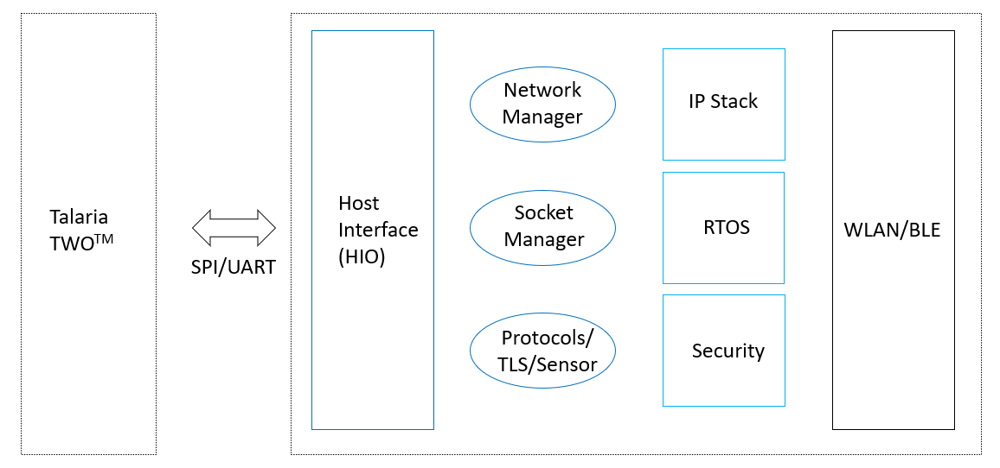
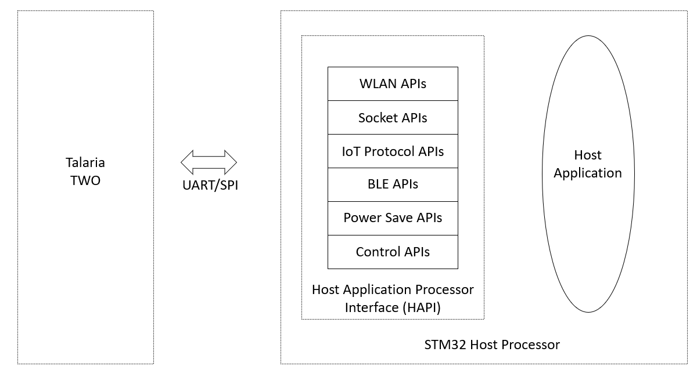

.. _hostapi_landing:

Host API Reference Guide
=======================

The InnoPhase IoT Talaria TWO Multi-Protocol Platform is a highly
integrated, single-chip wireless solution offering ultimate size, power,
and cost advantages for a wide range of low-power IoT designs. The
Talaria TWO system was designed for power efficiency and intelligent
integration from the beginning for the unique demands of IoT
applications.

**Talaria TWO System on Chip (SoC)**

Talaria TWO performs the following based on commands from the Host
processor.

1. Provides wireless (802.11b/g/n) link between the Host processor and
   AP or Hotspot

2. Scan and Connect to the AP specified by the Host

3. Performs WPA2 security handshake

4. Enables IP supports like TCP, UDP and DHCP

5. Adds network protocols like MQTT and HTTP

6. Supports transport protocols like SSL and TLS

7. Supports data scrambles on Serial interface

8. Provides BLE connectivity for provisioning

The major components in Talaria TWO are shown in Figure 1.

|image1|

Figure 1: Major components in Talaria TWO

**Wi-Fi Connection Manager**

This is the network connection manager which handles all the Wi-Fi connection/disconnection.

**Socket Manager**

HIO handles all socket operations. It supports TCP, UDP, and raw sockets.

**RTOS**

Highly efficient, low footprint, real-time OS for low power
applications.

**IPSTACK**

1.  IPv4

2.  ICMP

3.  UDP

4.  TCP

5.  DHCP

6.  DNS Resolver

7.  BSD Sockets Interface

8.  TLS

9.  MQTT

10. IPv6

**Host Processor**

Host processor consists of the Host Application Processor (HAPI)
Interface Layer and Host Applications. Host Applications may vary and
will interact with Talaria TWO via APIs in the interface layer. HAPI
provides APIs for Host Application to facilitate communication with the
Talaria TWO.

|image2|

Figure 2: Communication between Host and Talaria TWO via UART/SPI

**Talaria TWO – Host Processor Interface**

Host processor communicates with Talaria TWO via a SPI or UART and
follows a protocol to exchange command and data. This protocol is
implemented on the host side and are provided as APIs. The host
application can then use these APIs to access and control Talaria TWO.

APIs are grouped into:

1.  WLAN APIs

2.  Socket APIs

3.  BLE APIs

4.  IoT Protocols

5.  Interface Port APIs

6.  SPI Interface APIs

7.  UART Interface APIs

8.  Unassociation APIs

9.  Dual-Stack APIs

10. Common APIs

Host applications use HAPI WLAN and Socket APIs, which internally use
interface port APIs to transfer data between the wireless network and
host processor.

APIs
---

.. toctree::
    :maxdepth: 1

    APIs/AWS APIs.rst
    APIs/BLE APIs.rst
    APIs/Chip Monitor APIs.rst
    APIs/Common APIs.rst
    APIs/Dual-Stack APIs.rst
    APIs/FOS APIs.rst
    APIs/FOTA APIs.rst
    APIs/GPIO APIs.rst
    APIs/HAPI Configuration APIs.rst
    APIs/HTTP Client APIs.rst
    APIs/MDNS APIs.rst
    APIs/MQTT APIs.rst
    APIs/Port APIs.rst
    APIs/Power Save APIs.rst
    APIs/Socket APIs.rst
    APIs/SPI Interface APIs.rst
    APIs/TLS APIs.rst
    APIs/UART Interface APIs.rst
    APIs/Unassoc APIs.rst
    APIs/WLAN APIs.rst

