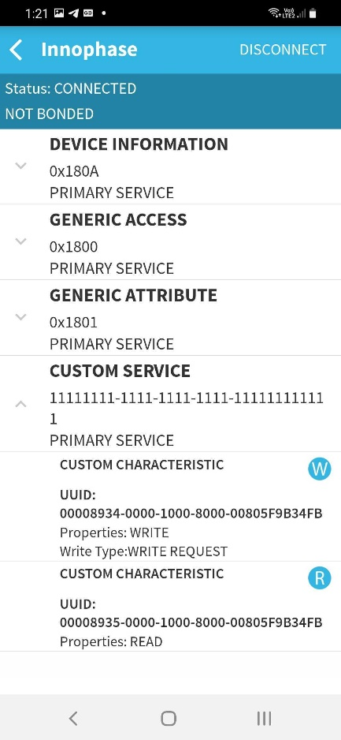
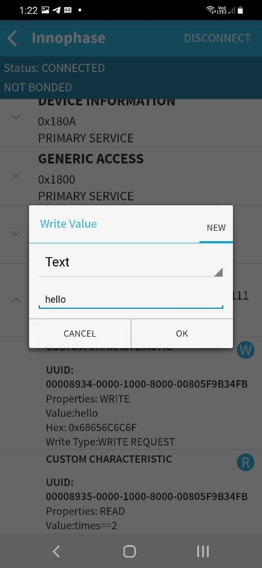
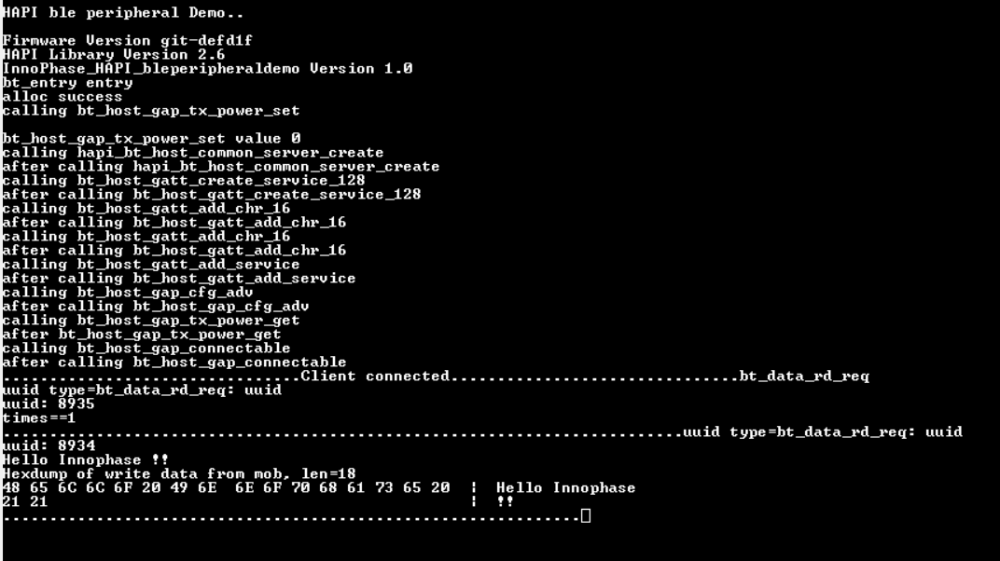

BLE Peripheral Demo
===================

The HAPI APIs residing in the host microcontroller (STM32) connects to
Talaria TWO module via UART/SPI. Using these HAPI APIs, users can write
applications to perform multiple functions with Talaria TWO. This series
of Host Application Notes discusses more on using these APIs to perform
specific functions.

This document provides details on how to use the HAPI APIs to create the
BLE peripheral demo application to:

1.  Initialize the HAPI interface

2.  Select the interface

3.  Enable/disable scramble on the interface

4.  Create/destroy BLE interface

5.  Create GATT server

6.  Create custom service and characteristics

7.  Add services to the GATT server

8.  Configure the BLE advertisement parameters

9.  Start the BLE advertisement with discovery/connectable mode and wait
    for the connection request from the BLE central device

10. Handle read and write characteristics request from the central
    device

**Connection Set-up**

Host processor communicates with Talaria TWO via a SPI or UART
interface. The connection set-up used to test the application is as
shown in Figure 1.

|image1|

Figure 1: Connection set-up for application testing

STM32L433RC-P as Host Controller
--------------------------------

STM32L433RC-P is the host controller which will have the BLE peripheral
demo application running on it. This host is in-turn connected to the
InnoPhase Talaria TWO board through SPI/UART interface. The serial to
Wi-Fi application (stw_multi_proto) firmware should be run on the
Talaria TWO board.

SPI Interface
~~~~~~~~~~~~~

Refer section: *SPI Interface* of the document:
QSG_T2_STM32CubeL4_L433RC-P.pdf
*(Documentation\\STM32CubeL4_Getting_Started*) for more details on the
Hardware setup and connections for testing the application using SPI
interface.

UART Interface
~~~~~~~~~~~~~~

Refer section: *UART Interface* of the document:
QSG_T2_STM32CubeL4_L433RC-P.pdf
*(Documentation\\STM32CubeL4_Getting_Started*) for more details on the
Hardware setup and connections for testing the application using UART
interface.

**Set-up & Usage**

Pre-set-up on Talaria TWO
-------------------------

Refer section: *Setup & Usage* of the document:
QSG_T2_STM32CubeL4_L433RC-P.pdf
*(Documentation\\STM32CubeL4_Getting_Started*) for details on Pre-set-up
on Talaria TWO.

Boot Arguments 
---------------

Refer section: *Boot Arguments* of the document:
QSG_T2_STM32CubeL4_L433RC-P.pdf
*(Documentation\\STM32CubeL4_Getting_Started*) for details on the boot
arguments to be passed for SPI and UART interface.

**Testing**

Sample Application
------------------

The sample application discussed in this application note runs
specifically on STM32L4A6ZG/STM32L433RC-P devices. This example has been
tested with NUCLEO-L4A6ZG/NUCLEO-L433RC-P board and can be easily
tailored to any other supported device and development board.

For details on testing the application with SPI and UART interface,
refer sections: *Testing the Basic Operation on setup with SPI
interface* and *Testing the Basic Operation on setup with UART
interface* of the document: QSG_T2_STM32CubeL4_L433RC-P.pdf
*(Documentation\\STM32CubeL4_Getting_Started*).

1. Install and open the BLE Scanner app on an Android phone.

2. Open any console (serial terminal) on STM32 MCU with a baud rate of
   115200.

3. Reset the STM32 and check the MCU console. Talaria TWO\ :sup:`TM`
   starts the BLE advertisement in peripheral mode.

4. The mobile app will be able to scan the Talaria TWO\ :sup:`TM` BLE
   device name Innophase will be visible. On connecting, the supported
   custom service and its characteristics values can be noticed.

5. It is possible to read/write the characteristic values from the
   mobile app.

..

   |A picture containing text Description automatically generated|

Figure 2: Scanning the Talaria TWOTM BLE device

   |Graphical user interface, text, application, email Description
   automatically generated|

   Figure 3: Supported Custom Characteristics

To enable extended advertisement in BLE peripheral, enable the following
macros on app_bt_peripheral.c

.. code-block:: shell

    /\*Enable the following macros for extended adv mode*/
    //#define EXTENDED_ADV_SUPPORT
    //#define adv_sec_phy_LE_1M /\*enable for LE 1M*/
    //#define adv_sec_phy_LE_2M /\*enable for LE 2M*/

6. It is now possible to read/write the characteristics values from the
   mobile app. Clicking on R, reads data from STM. Clicking on W, writes
   data which is visible in the STM console.

..

   |Graphical user interface, application Description automatically generated|

   Figure 4: Writing "hello" from mobile app

**Note**:

For BLE peripheral, is it recommended to use BLE scanner mobile
application (BLUEPIXEL TECHNOLOGIES LLP).

To make certain appropriate HAL operation, the application must ensure
that the HAL time base is always set to 1 millisecond. The FreeRTOS heap
size configTOTAL_HEAP_SIZE as defined in FreeRTOSConfig.h is set as per
the OS resources’ memory requirements of the application with a +10%
margin and rounded to the upper Kbyte boundary.

For more details on the FreeRTOS implementation on STM32Cube, please
refer to UM1722 - Developing Applications on STM32Cube with RTOS.

**BLE Peripheral Demo Application**

This section describes the application details along with code snippets.
The application uses HAPI APIs to achieve the functionality. HAPI APIs
presumes that the platform related initialization and clock settings are
completed by default.

HAPI Interface Initialization
-----------------------------

.. code-block:: shell

    struct hapi \*hapi;
    #ifdef HAPI_INTERFACE_UART_ENABLED
    /\* Register the uart, and baud rate to hapi \*/
    hapi = hapi_uart_init(hapi_uart, hapi_uart_tx, hapi_uart_rx);
    #endif
    #ifdef HAPI_INTERFACE_SPI_ENABLED
    /\* Register the SPI \*
    hapi = hapi_spi_init(hapi_spi, hapi_spi_cs_high, hapi_spi_cs_low, hapi_spi_tx, hapi_spi_rx);
    #endif

HAPI Interface Start and Disable Sleep Mode in Configuration
------------------------------------------------------------

.. code-block:: shell

    hapi_start(hapi);
    hapi_config(hapi, 0, 0, 0, 0, 0);

Check HAPI Communication with Talaria TWO EVB
---------------------------------------------

.. code-block:: shell

    hapi_hio_query(hapi,&hio_query_rsp);

Create/Destroy the BLE Interface
--------------------------------

.. code-block:: shell

    struct hapi_bt_host \*hapi_bt_host;
    hapi_bt_host = hapi_bt_host_create(hapi);
    if(hapi_bt_host == NULL)
    {
        console_print("alloc fail\\r\\n");
        goto end;
    }

Set BLE TX Power
----------------

.. code-block:: shell

    hapi_bt_host_gap_tx_power_set(hapi_bt_host, BT_TX_POWER_SET);

Create Common GATT Server
-------------------------

.. code-block:: shell

    hapi_bt_host_common_server_create(hapi_bt_host, "tname", 0, "tmanuf");

Create Custom BLE Service
-------------------------

.. code-block:: shell

    void \*service;
    service = hapi_bt_host_gatt_create_service_128(hapi_bt_host,UUID_CUSTOM_SERVICE);

Add BLE Characteristics
-----------------------

.. code-block:: shell

    hapi_bt_host_gatt_add_chr_16(hapi_bt_host, service, UUID_APP_STATUS_WRITE, GATT_PERM_WRITE, GATT_CHAR_PROP_BIT_WRITE);
    hapi_bt_host_gatt_add_chr_16(hapi_bt_host, service, UUID_APP_STATUS_READ, GATT_PERM_READ, GATT_CHAR_PROP_BIT_READ);

Add BLE Service
---------------

.. code-block:: shell

    hapi_bt_host_gatt_add_service(hapi_bt_host, service)

Configure BLE Advertisement
---------------------------

.. code-block:: shell

    hapi_bt_host_gap_cfg_adv(hapi_bt_host, 10240, 0, 160, 480, BT_TX_POWER_SET0, 7);

Get BLE TX Power
----------------

.. code-block:: shell

    *hapi_bt_host_gap_tx_power_get(hapi_bt_host, bt_tx_power);*

Configure BLE Extended Advertisement LE 1M
------------------------------------------

.. code-block:: shell

    hapi_bt_host_gap_cfg_ext(hapi_bt_host, 2, 1, 1, 1, 1, 251);

Configure BLE Extended Advertisement LE 2M
------------------------------------------

.. code-block:: shell

    hapi_bt_host_gap_cfg_ext(hapi_bt_host, 2, 1, 2, 1, 1, 251);

Configure BLE Extended Advertisement Data
-----------------------------------------

.. code-block:: shell

    hapi_bt_host_gap_set_adv_data(hapi_bt_host, adv_length_1, adv_buf_1);

Add BLE Indication Handler for Read/Write Characteristics
---------------------------------------------------------

.. code-block:: shell

    hapi_add_ind_handler(hapi, HIO_GROUP_BT_HOST, BT_HOST_GATT_CHAR_RD_IND, bt_data_rd_req, hapi_bt_host);
    hapi_add_ind_handler(hapi, HIO_GROUP_BT_HOST, BT_HOST_GATT_CHAR_WR_IND, bt_data_wr_req, hapi_bt_host);

Start BLE Advertisement
-----------------------

.. code-block:: shell

    hapi_bt_host_gap_connectable(hapi_bt_host, GAP_CONNECTABLE_MODE_UNDIRECT, bt_hci_addr_type_random, addr_type_zero, address_zero);

**Expected Output**

The provided android application should be able to connect to the BLE
device on Talaria TWO and read/write the characteristics.

|image2|

Figure 5: STM Console Output

**Application Files and Functions**

.. table:: Table 1: Application files and functions

    +------------------------------------------+---------------------------+
    | **File**                                 | **Function**              |
    +==========================================+===========================+
    | /T2-HAN-008 /Src/main.c                  | Main Program              |
    +------------------------------------------+---------------------------+
    | /T2-HAN-008                              | HAL time-base file        |
    | /Src/stm32l4xx_hal_timebase_tim.c        |                           |
    +------------------------------------------+---------------------------+
    | /T2-HAN-008 /Src/stm32l4xx_it.c          | Interrupt handlers        |
    +------------------------------------------+---------------------------+
    | /T2-HAN-008 /Src/system_stm32l4xx.c      | STM32L4xx system clock    |
    |                                          | configuration file        |
    +------------------------------------------+---------------------------+
    | /T2-HAN-008 /Src/freertose.c             | Code for free RTOS        |
    |                                          | application               |
    +------------------------------------------+---------------------------+
    | /T2-HAN-008 /Src/stm32l4xx_hal_msp.c     | Code for MSP              |
    |                                          | initia                    |
    |                                          | lization/deinitialization |
    +------------------------------------------+---------------------------+
    | /T2-HAN-008 /Src/syscalls.c              | System calls file         |
    +------------------------------------------+---------------------------+
    | /T2-HAN-008 /Src/sysmem.c                | System Memory calls file  |
    +------------------------------------------+---------------------------+
    | /T2-HAN-008 /Src/                        | System startup file       |
    | startup_stm32l433rctxp.s                 |                           |
    +------------------------------------------+---------------------------+
    | /T2-HAN-008 /Inc/main.h                  | Main program header file  |
    +------------------------------------------+---------------------------+
    | /T2-HAN-008 /Inc/stm32l4xx_hal_conf.h    | HAL Library Configuration |
    |                                          | file                      |
    +------------------------------------------+---------------------------+
    | /T2-HAN-008 /Inc/stm32l4xx_it.h          | Interrupt handler’s       |
    |                                          | header file               |
    +------------------------------------------+---------------------------+
    | /T2-HAN-008 /Inc/FreeRTOSConfig.h        | FreeRTOS Configuration    |
    |                                          | file                      |
    +------------------------------------------+---------------------------+
    | /T2-HAN-008/Src/HAPI/app.c               | Application file          |
    +------------------------------------------+---------------------------+
    | /T2-HAN-008/Src/HAPI/app_bt.c            | BLE application file      |
    +------------------------------------------+---------------------------+
    | /T2-HAN-008/Src/HAPI/app_bt_peripheral.c | BLE peripheral            |
    |                                          | application file          |
    +------------------------------------------+---------------------------+
    | /T2-HAN-008/Src/HAPI/bt_att.h,           | Application header files  |
    | /T2-HAN-008/Src/HAPI/bt_gatt.h ,         |                           |
    | /T2-HAN-008/Src/HAPI/bt_uuid.h           |                           |
    +------------------------------------------+---------------------------+

.. |image1| image:: media/image1.png
.. |A picture containing text Description automatically generated| image:: media/image2.jpeg
   :width: 2.3622in
   :height: 4.91112in

