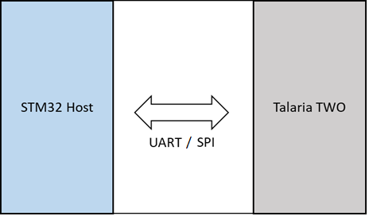
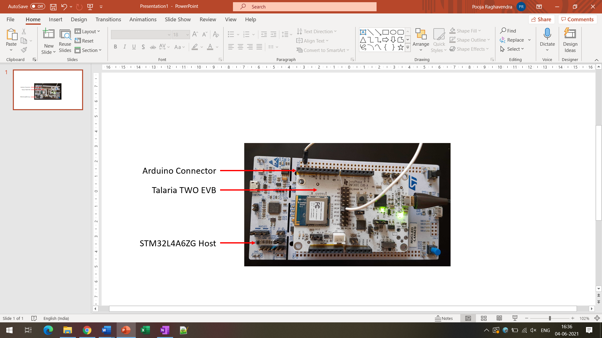

HTTP-Demo Application
=====================

The HAPI APIs residing in the host microcontroller (STM32) connects to
Talaria TWO module via UART/SPI. Using these HAPI APIs, users can write
applications to perform multiple functions with Talaria TWO. This series
of Host Application Notes discusses more on using these APIs to perform
specific functions.

This document provides details on how to use the HAPI APIs to create the
HTTP demo application to:

1. Initialize the HAPI interface

2. Select the interface

3. Enable/disable the scramble on the interface

4. Create/destroy a Wi-Fi network interface

5. Scan for Wi-Fi networks

6. Connect to a Wi-Fi network

7. Create the HTTP interface

8. Get and Put data

9. Execute the operation in a loop

**Connection Set-up**

Host processor communicates with Talaria TWO via a SPI or UART
interface. The connection set-up used to test the application is as
shown in Figure 1.

|image1|

Figure 1: Connection set-up for application testing

STM32L433RC-P as Host Controller
--------------------------------

STM32L433RC-P is the host controller which will have the Wi-Fi demo
application running on it. This host is in-turn connected to the
InnoPhase Talaria TWO board through SPI/UART interface. The serial to
Wi-Fi application (stw_multi_proto) firmware should be run on the
Talaria TWO board.

SPI Interface
~~~~~~~~~~~~~

Refer section: *SPI Interface* of the document:
QSG_T2_STM32CubeL4_L433RC-P.pdf
*(Documentation\\STM32CubeL4_Getting_Started*) for more details on the
Hardware setup and connections for testing the application using SPI
interface.

UART Interface
~~~~~~~~~~~~~~

Refer section: *UART Interface* of the document:
QSG_T2_STM32CubeL4_L433RC-P.pdf
*(Documentation\\STM32CubeL4_Getting_Started*) for more details on the
Hardware setup and connections for testing the application using UART
interface.

**Set-up & Usage**

Pre-set-up on Talaria TWO
-------------------------

Refer section: *Setup & Usage* of the document:
QSG_T2_STM32CubeL4_L433RC-P.pdf
*(Documentation\\STM32CubeL4_Getting_Started*) for details on Pre-set-up
on Talaria TWO.

Boot Arguments 
---------------

Refer section: *Boot Arguments* of the document:
QSG_T2_STM32CubeL4_L433RC-P.pdf
*(Documentation\\STM32CubeL4_Getting_Started*) for details on the boot
arguments to be passed for SPI and UART interface.

**Testing**

Sample Application
------------------

The sample application discussed in this application note runs
specifically on STM32L4A6ZG/STM32L433RC-P devices. This example has been
tested with NUCLEO-L4A6ZG/NUCLEO-L433RC-P board and can be easily
tailored to any other supported device and development board.

For details on testing the application with SPI and UART interface,
refer sections: *Testing the Basic Operation on setup with SPI
interface* and *Testing the Basic Operation on setup with UART
interface* of the document: QSG_T2_STM32CubeL4_L433RC-P.pdf
*(Documentation\\STM32CubeL4_Getting_Started*).

1. Open any console (serial terminal) on STM32 MCU with a baud rate of
   115200.

2. Reset the STM32 and check the MCU console. MCU will boot, the Wi-Fi
   connection is established and starts the HTTP connection with the
   HTTP server mentioned in the code.

3. Application performs HTTP Connect, GET and PUT operation and
   disconnects from the server.

**Note**:

This application use default SSID and password for the Wi-Fi connection.
User has to modify these as per their settings. Details are mentioned in
the section 7.5

To make certain appropriate HAL operation, the application must ensure
that the HAL time base is always set to 1 millisecond. The FreeRTOS heap
size configTOTAL_HEAP_SIZE as defined in FreeRTOSConfig.h is set as per
the OS resources’ memory requirements of the application with a +10%
margin and rounded to the upper Kbyte boundary.

For more details on the FreeRTOS implementation on STM32Cube, please
refer to UM1722 - Developing Applications on STM32Cube with RTOS.

.. _http-demo-application-1:

**HTTP Demo Application**

This section describes the application details along with code snippets.
The application uses HAPI APIs to achieve the functionality. HAPI APIs
presumes that the platform related initialization and clock settings are
completed by default.

HAPI Interface Initialization
-----------------------------

.. code-block:: shell

    struct hapi *hapi;
    #ifdef HAPI_INTERFACE_UART_ENABLED
    /* Register the uart, and baud rate to hapi */
    hapi = hapi_uart_init(hapi_uart, hapi_uart_tx, hapi_uart_rx);
    #endif
    #ifdef HAPI_INTERFACE_SPI_ENABLED
    /* Register the SPI */
    hapi = hapi_spi_init(hapi_spi, hapi_spi_cs_high, hapi_spi_cs_low, hapi_spi_tx, hapi_spi_rx);
    #endif

HAPI Interface Start and Disable Sleep Mode in Configuration
------------------------------------------------------------

.. code-block:: shell

    hapi_start(hapi);
    hapi_config(hapi, 0, 0, 0, 0, 0);

Check HAPI Communication with Talaria TWO EVB
---------------------------------------------
.. code-block:: shell

    hapi_hio_query(hapi,&hio_query_rsp);

Create a Wi-Fi Network Interface and Register Link Status Callback 
-------------------------------------------------------------------

.. code-block:: shell

    struct hapi_wcm * hapi_wcm = hapi_wcm_create(hapi);
    hapi_wcm_set_link_cb(hapi_wcm, wcm_link_cb, NULL);

Connecting to a Wi-Fi Network
-----------------------------

The application uses the default SSID and passphrase. These can be
modified as per user AP settings.

.. code-block:: shell

    /* Connect wifi */
    char* ssid = "innotest";
    char* passphrase = "innophase123";
    if(true == hapi_wcm_network_profile_add(hapi_wcm, ssid, NULL,
    passphrase, NULL))
    {
        if(false == hapi_wcm_autoconnect(hapi_wcm, 1))
        {
            banner="hapi_wcm_autoconnect : failed..\r\n";
        }
    }

HTTP Connection
---------------

User needs to change the port in case of UNSECURED and SECURED HTTP. It
is currently set to HTTP_UNSECURED_PORT as follows:

.. code-block:: shell

    int httpPort = HTTP_UNSECURED_PORT;

**Note**: For secured mode 2 and port no 443, load the http_ca.cert
certificate onto Talaria TWO before programing the HTTP demo application
onto STM (Certificate is available in the SDK release package here:
*sdk_x.y\\examples\\http_client\\cert*)

The HTTP client application connects to the HTPP server as follows:

.. code-block:: shell

    /* User need to configure the following parameters
    * before testing the http application
    */
    char *data = "aaaaaaaaaaaaaaaaaaaa";
    char datalenStr[5];
    char *certName = "sslTlsCert1";
    int header_id = 1;
    int httpPort = HTTP_UNSECURED_PORT;
    hapi_http_client_setup(hapi_p, http_client_resp_cb, NULL);
    if (HTTP_SECURED_PORT_443 == httpPort) {
        status = hapi_http_cert_store(hapi_p, certName,
        http_test_cas_pem_auth_len, http_test_cas_pem_auth);
    }
    /*Connect/start*/
    status = hapi_http_client_start(hapi_p, HTTP_SERVER, httpPort,
    NULL, &connId);
    /*send GET request*/
    status = hapi_http_client_send_req(hapi_p, connId, 1, URI, 0, NULL);
    sprintf(datalenStr, "%d", strlen(data));
    status = hapi_http_client_hdr_set(hapi_p, 5, datalenStr);
    /*send POST request*/
    if(strlen(data) > 1024) {
        sprintf(print_arr, "\n Error: data too large. Max 1024 bytes
        \r\n");
        console_print(print_arr);
    }
    status = hapi_http_client_send_req(hapi_p, connId, 2, "/anything",
    strlen(data), data);
    /*send delete request header*/
    status = hapi_http_client_hdr_delete(hapi_p, header_id);
    /*send close connection*/
    status = hapi_http_close(hapi_p, connId);
    /*send delete cert*/
    if (HTTP_SECURED_PORT_443 == httpPort) {
        status = hapi_http_cert_delete (hapi_p, "sslTlsCert1");
    }
    hapi_wcm_disconnect(hapi_wcm);

**Expected Output**

The MCU will connect to the AP specified by the SSID and passphrase. On
successful connection, MCU will connect to the HTTP server specified in
the code and data GET and PUT operation is completed as follows:

|A screenshot of a computer program Description automatically generated|

Figure 2: Expected Output

**Application Files and Functions**

.. table:: Table 1: Application files and functions

    +---------------------------------------------------+------------------+
    | **File**                                          | **Function**     |
    +===================================================+==================+
    | InnoPhase_HAPI/T2-HAN-013/Src/HAPI/app.c          | Main Program     |
    +---------------------------------------------------+------------------+
    | InnoPhase_HAPI/T2-HAN-013/Src/HAPI/app_http.c     | Code for         |
    |                                                   | configuring the  |
    |                                                   | http client      |
    |                                                   | module           |
    +---------------------------------------------------+------------------+
    | Middlewares/                                      | HAPI module for  |
    | Third_Party/InnoPhase_HAPI/Src/hapi_http_client.c | http client      |
    +---------------------------------------------------+------------------+
    | InnoPhase_HAPI\\T2-HAN-013\\Src\\HAPI\\include\\  | HTTP header file |
    | hapi_http_client.h                                |                  |
    +---------------------------------------------------+------------------+

