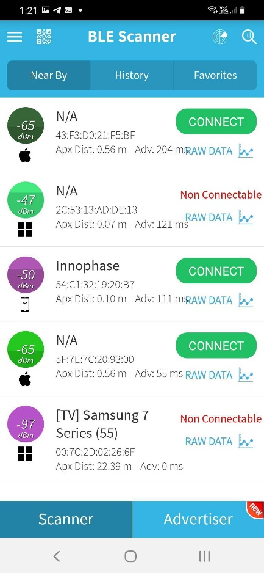

Low Power Demo Application
==========================

The HAPI APIs residing in the host microcontroller (STM32) connects to
Talaria TWO module via UART/SPI. Using these HAPI APIs, users can write
sample applications to perform multiple functions with Talaria TWO. This
series of Host Application Notes discusses more on using these APIs to
perform specific functions.

This document provides details on how to use the HAPI APIs to create the
low power application to:

1. Initialize the HAPI interface

2. Select the interface

3. Enable/disable scramble on the interface

4. Enable a GPIO to trigger the Talaria TWO wakeup

5. Enable sleep mode on Talaria TWO

6. Trigger the above GPIO to wake Talaria TWO from sleep

**Connection Set-up**

The connection set-up used to test the application is as shown in Figure
1.

**Note**: Connect Talaria TWO and STM using jumper wires (do **not** use
mounting Arduino connection) for low power application.

|Graphical user interface Description automatically generated with
medium confidence|

Figure 1: Connection set-up for application testing

STM32L433RC-P as Host Controller 
---------------------------------

STM32L433RC-P is the host controller which will have the low power demo
application running on it. This host is in-turn connected to the
InnoPhase Talaria TWO board through SPI/UART interface. The serial to
Wi-Fi application (stw_multi_proto) firmware should be run on the
Talaria TWO board.

SPI Interface
~~~~~~~~~~~~~

Refer section: *SPI Interface* of the document:
QSG_T2_STM32CubeL4_L433RC-P.pdf
*(Documentation\\STM32CubeL4_Getting_Started*) for more details on the
Hardware setup and connections for testing the application using SPI
interface.

UART Interface
~~~~~~~~~~~~~~

Refer section: *UART Interface* of the document:
QSG_T2_STM32CubeL4_L433RC-P.pdf
*(Documentation\\STM32CubeL4_Getting_Started*) for more details on the
Hardware setup and connections for testing the application using UART
interface.

Testing
-------

The sample application discussed in this application note runs
specifically on STM32L433RC-P device only. This example has been tested
with NUCLEO-L433RC-P (144 pins) board only and can be easily tailored to
any other supported device and development board.

1. Start TCP client on a PC that connects to the same network, with
   server IP as the IP printed on the STM32 serial console and port as
   9000.

For example, TCP client: netcat on PC.

.. code-block:: shell

    #nc <ip address of T2> 9000

2. Send any data from TCP client. The same data is received on the
   client from STM32-Talaria TWO device.

3. However, when there is no activity, both STM and Talaria TWO go to
   sleep.

For details on testing the application with SPI and UART interface,
refer the following sections of the document:
QSG_T2_STM32CubeL4_L433RC-P.pdf *(*\ path:
*Documentation\\STM32CubeL4_Getting_Started*)

-  Testing the Basic Operation on setup with SPI interface

-  Testing the Basic Operation on setup with UART interface

**Note**:

1. After programming Talaria TWO, ensure the power selection switch U3
   (on Talaria TWO) is in the V33_ARD position for both SPI and UART
   interfaces.

2. For SPI interface, Talaria TWO should be programmed with the
   following boot arguments:

.. code-block:: shell

+-----------------------------------------------------------------------+
| hio.transport=spi, krn.gpio=---p                                      |
+-----------------------------------------------------------------------+

3. For UART interface, Talaria TWO should be programmed with the
   following boot arguments:

.. code-block:: shell

+-----------------------------------------------------------------------+
| hio.transport=uart, hio.baudrate=115200, krn.gpio=---p                |
+-----------------------------------------------------------------------+

To make certain appropriate HAL operation, the application must ensure
that the HAL time base is always set to 1 millisecond. The FreeRTOS heap
size configTOTAL_HEAP_SIZE as defined in FreeRTOSConfig.h is set as per
the OS resources’ memory requirements of the application with a +10%
margin and rounded to the upper Kbyte boundary.

For more details on the FreeRTOS implementation on STM32Cube, please
refer to UM1722 - Developing Applications on STM32Cube with RTOS.

**Low Power Application**

This section describes the application details along with code snippets.
The application uses HAPI APIs to achieve the functionality. HAPI APIs
presumes that the platform related initialization and clock settings are
completed by default.

HAPI interface initialization
-----------------------------

.. code-block:: shell

    struct hapi \*hapi;
    hapi = hapi_init(console_uart);

Interface selection
-------------------

.. code-block:: shell

    hapi_uart_init(hapi, hapi_uart, T2_UART_BAUD);
    hapi_spi_init(hapi, hapi_spi);
    hapi_set_default_interface(hapi,HAPI_INTERFACE_UART);

Enable/Disable scramble on interface 
-------------------------------------

.. code-block:: shell

    hapi_set_hio_scrambling (hapi, enc_enabled, enc_ctx, key, NULL, NULL);

HAPI interface start
--------------------

.. code-block:: shell

    struct hapi \*hapi
    hapi_start(hapi);

Add Interrupt handler on Talaria TWO for a GPIO
-----------------------------------------------

.. code-block:: shell

    hapi_add_ind_handler(hapi, HIO_GROUP_HIO, HIO_WAKEUP_IND, t2_woken_up_ind_handler, NULL);

Configure a GPIO for signaling on Talaria TWO
---------------------------------------------

.. code-block:: shell

    hapi_config_rsp = hapi_config(hapi,wakeup_pin,wakeup_level,irq_pin,irq_mode);

Enable Sleep on Talaria TWO
---------------------------

.. code-block:: shell

    hapi_send_sleep(hapi);

**Expected Output**

The MCU will configure the sleep wakeup mechanism on Talaria TWO and
does so using the sleep command and GPIO.

|Text Description automatically generated|

Figure 2: Expected Output

**Application Files and Functions**

.. table:: Table 1: Application files and functions

    +--------------------------------------------------+-------------------+
    |    File                                          |    Function       |
    +==================================================+===================+
    |    InnoPh                                        |    Main Program   |
    | ase_HAPI/InnoPhase_HAPI_lowpower_demo/Src/main.c |                   |
    +--------------------------------------------------+-------------------+
    |    InnoPhase_HAPI/InnoPhase_HAP                  |    HAL time-base  |
    | I_lowpower_demo/Src/stm32l4xx_hal_timebase_tim.c |    file           |
    +--------------------------------------------------+-------------------+
    |    InnoPhase_HAPI                                |    Interrupt      |
    | /InnoPhase_HAPI_lowpower_demo/Src/stm32l4xx_it.c |    handlers       |
    +--------------------------------------------------+-------------------+
    |    InnoPhase_HAPI/Inn                            |    STM32L4xx      |
    | oPhase_HAPI_lowpower_demo/Src/system_stm32l4xx.c |    system clock   |
    |                                                  |    configuration  |
    |                                                  |    file           |
    +--------------------------------------------------+-------------------+
    |    InnoPhase_H                                   |    Code for free  |
    | API/InnoPhase_HAPI_lowpower_demo/Src/freertose.c |    RTOS           |
    |                                                  |    application    |
    +--------------------------------------------------+-------------------+
    |    InnoPhase_HAPI/Inno                           |    Code for MSP   |
    | Phase_HAPI_lowpower_demo/Src/stm32l4xx_hal_msp.c |    initialization |
    |                                                  | /deinitialization |
    +--------------------------------------------------+-------------------+
    |    InnoPhase_HAPI/InnoPhase_HAPI_lowpower_demo   |    System calls   |
    |    /Src/syscalls.c                               |    file           |
    +--------------------------------------------------+-------------------+
    |    InnoPhas                                      |    System Memory  |
    | e_HAPI/InnoPhase_HAPI_lowpower_demo/Src/sysmem.c |    calls file     |
    +--------------------------------------------------+-------------------+
    |    InnoPhase_HAPI/InnoPh                         |    System startup |
    | ase_HAPI_lowpower_demo/Src/startup_stm32l4a6xx.s |    file           |
    +--------------------------------------------------+-------------------+
    |    InnoPh                                        |    Main program   |
    | ase_HAPI/InnoPhase_HAPI_lowpower_demo/Inc/main.h |    header file    |
    +--------------------------------------------------+-------------------+
    |    InnoPhase_HAPI/InnoP                          |    HAL Library    |
    | hase_HAPI_lowpower_demo/Inc/stm32l4xx_hal_conf.h |    Configuration  |
    |                                                  |    file           |
    +--------------------------------------------------+-------------------+
    |    InnoPhase_HAPI                                |    Interrupt      |
    | /InnoPhase_HAPI_lowpower_demo/Inc/stm32l4xx_it.h |    handler’s      |
    |                                                  |    header file    |
    +--------------------------------------------------+-------------------+
    |    InnoPhase_HAPI/I                              |    FreeRTOS       |
    | nnoPhase_HAPI_lowpower_demo/Inc/FreeRTOSConfig.h |    Configuration  |
    |                                                  |    file           |
    +--------------------------------------------------+-------------------+

.. |Graphical user interface Description automatically generated with medium confidence| image:: media/image1.png
   :width: 4.80694in
   :height: 2.81389in

