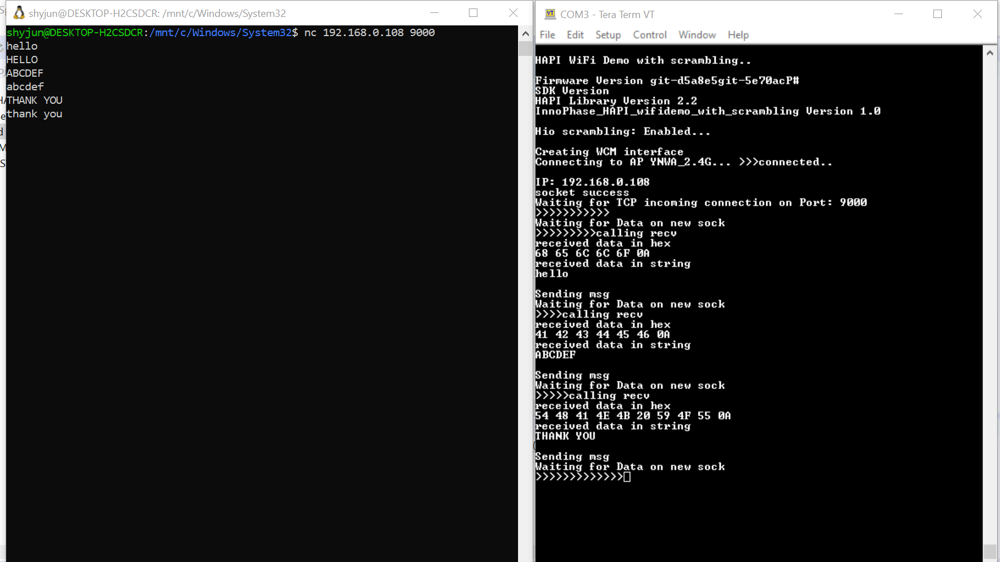

Wi-Fi Demo Application with Scramble Enable
===========================================

The HAPI APIs residing in the host microcontroller (STM32) connects to
Talaria TWO module via UART/SPI. Using these HAPI APIs, users can write
sample applications to perform multiple functions with Talaria TWO. This
series of Host Application Notes discusses more on using these APIs to
perform specific functions.

This document provides details on how to use the HAPI APIs to create the
Wi-Fi demo application with serial scramble to:

1. Initialize the HAPI interface

2. Select the interface

3. Enable/Disable scramble on the interface

4. Create/destroy a Wi-Fi network interface

5. Scan for Wi-Fi networks

6. Connect to a Wi-Fi network

7. Create a TCP server socket and wait for client connection and data

8. Send and receive data on the socket

Connection Set-up
=================

The connection set-up used to test the application is as shown in Figure
1.

|image1|

Figure 1: Connection set-up for application testing

STM32L4A6ZG is the host controller which will have the Wi-Fi demo
application with scrambling running on it. This host is in-turn
connected to the InnoPhase Talaria TWO board through SPI/UART interface.
The serial to Wi-Fi application firmware should be run on the Talaria
TWO board.

Connect GPIO4 of Talaria TWO (J1 Connector) to Pin4 of CN12 connector.
Talaria TWO uses this GPIO4 pin to interrupt ST when Talaria TWO wants
to send data/notification to ST.

The following picture shows the hardware setup for testing the
application.

|Graphical user interface, application, PowerPoint Description
automatically generated|

Figure 2: Hardware Set-up for Testing

Testing
=======

Sample Application
------------------

The sample application discussed in this application note runs
specifically on STM32L4A6ZG device only. This example has been tested
with NUCLEO-L4A6ZG (144 pins) board only and can be easily tailored to
any other supported device and development board.

1. Start TCP client on a PC that connects to the same network, with
   server IP as the IP printed on the STM32 serial console and port as
   9000

For example, TCP client: netcat on PC

+-----------------------------------------------------------------------+
| #nc <ip address of T2> 9000                                           |
+=======================================================================+
+-----------------------------------------------------------------------+

2. Send any data from the TCP client. The same data is received on the
   client from ST32-Talaria TWO device.

For details on testing the application with SPI and UART interface,
refer sections: *Testing the Basic Operation on setup with SPI
interface* and *Testing the Basic Operation on setup with UART
interface* of the document: QSG_T2_STM32CubeL4_L4A6ZG.pdf
*(Documentation\\STM32CubeL4_Getting_Started*).

**Note**:

To make certain appropriate HAL operation, the application must ensure
that the HAL time base is always set to 1 millisecond. The FreeRTOS heap
size configTOTAL_HEAP_SIZE as defined in FreeRTOSConfig.h is set as per
the OS resources’ memory requirements of the application with a +10%
margin and rounded to the upper Kbyte boundary.

For more details on the FreeRTOS implementation on STM32Cube, please
refer to UM1722 - Developing Applications on STM32Cube with RTOS.

Wi-Fi Demo Application with Scrambling
======================================

This section describes the application details along with code snippets.
The application uses HAPI APIs to achieve the functionality. HAPI APIs
presumes that the platform related initialization and clock settings are
completed by default.

HAPI Interface Initialization
-----------------------------

+-----------------------------------------------------------------------+
| struct hapi \*hapi;                                                   |
|                                                                       |
| hapi = hapi_init(console_uart);                                       |
+=======================================================================+
+-----------------------------------------------------------------------+

Interface Selection
-------------------

+-----------------------------------------------------------------------+
| hapi_uart_init(hapi, hapi_uart, T2_UART_BAUD);                        |
|                                                                       |
| hapi_spi_init(hapi, hapi_spi);                                        |
|                                                                       |
| hapi_set_default_interface(hapi,HAPI_INTERFACE_UART);                 |
+=======================================================================+
+-----------------------------------------------------------------------+

Enable/Disable Scramble on the interface
----------------------------------------

+-----------------------------------------------------------------------+
| hapi_set_hio_scrambling (hapi, enc_enabled, enc_ctx, key,             |
| cipher_ecb_128, decipher_ecb_128);                                    |
+=======================================================================+
+-----------------------------------------------------------------------+

HAPI Interface Start 
---------------------

+-----------------------------------------------------------------------+
| struct hapi \*hapi;                                                   |
|                                                                       |
| hapi_start(hapi);                                                     |
+=======================================================================+
+-----------------------------------------------------------------------+

Create/Destroy a Wi-Fi Network Interface
----------------------------------------

+-----------------------------------------------------------------------+
| struct hapi_wcm \* hapi_wcm = hapi_wcm_create(hapi);                  |
+=======================================================================+
+-----------------------------------------------------------------------+

**
**

Connecting to/Disconnecting from a Wi-Fi Network
------------------------------------------------

Uses the default SSID and passphrase. These can be modified as per user
AP settings.

+-----------------------------------------------------------------------+
| /\* Connect wifi \*/                                                  |
|                                                                       |
| char\* ssid = "innotest";                                             |
|                                                                       |
| char\* passphrase = "innophase123";                                   |
+=======================================================================+
+-----------------------------------------------------------------------+

+-----------------------------------------------------------------------+
| if(true != hapi_wcm_autoconnect(hapi_wcm, 1, ssid, passphrase)) {     |
|                                                                       |
| banner="hapi_wcm_autoconnect : failed..\\r\\n";                       |
|                                                                       |
| }                                                                     |
+=======================================================================+
+-----------------------------------------------------------------------+

**Create a Server Socket**

Creates a TCP server socket on port 9000 and wait for client connection.

+-----------------------------------------------------------------------+
| uint32_t listen_sock;                                                 |
|                                                                       |
| listen_sock = socket_create(hapi, HIO_SOCK_TCP_SERVER,                |
| "255.255.255.255", "9000")                                            |
+=======================================================================+
+-----------------------------------------------------------------------+

Incoming Socket Connection Registration
---------------------------------------

Registers a handler which gets called when the server receives a client
connection.

+-----------------------------------------------------------------------+
| /\* Register indication handlers \*/                                  |
|                                                                       |
| hapi_add_ind_handler(hapi, HIO_GROUP_SOCK,                            |
|                                                                       |
| SOCK_CONNECTION_IND, client_connected_ind_handler, NULL);             |
+=======================================================================+
+-----------------------------------------------------------------------+

Available Data on the Socket
----------------------------

+-----------------------------------------------------------------------+
| int available;                                                        |
|                                                                       |
| available = socket_getavailable(hapi,socket);                         |
+=======================================================================+
+-----------------------------------------------------------------------+

Receive Data on the Socket
--------------------------

+-----------------------------------------------------------------------+
| char rx_data[256];                                                    |
|                                                                       |
| socket_receive(hapi,socket,rx_data,available);                        |
+=======================================================================+
+-----------------------------------------------------------------------+

Expected Output
===============

The MCU will connect the AP specified by the SSID and passphrase. On
successful connection, it creates the TCP server socket wait for client
connection. Once the client gets connected, it waits for the data from
client and sends the received data after changing the case (upper to
lower or lower to upper).

Following are the serial prints on the MCU:

|Text Description automatically generated|

Figure 3: Expected output

Application Files and Functions
===============================

+----------------------------------------+-----------------------------+
|    File                                |    Function                 |
+========================================+=============================+
|    InnoPhase_HAPI/InnoPhase_HA         |    Main Program             |
| PI_wifidemo_with_scrambling/Src/main.c |                             |
+----------------------------------------+-----------------------------+
|    InnoPhase_H                         |    HAL time-base file       |
| API/InnoPhase_HAPI_wifidemo_with_scram |                             |
| bling/Src/stm32l4xx_hal_timebase_tim.c |                             |
+----------------------------------------+-----------------------------+
|    InnoPhase_HAPI/InnoPhase_HAPI_wifid |    Interrupt handlers       |
| emo_with_scrambling/Src/stm32l4xx_it.c |                             |
+----------------------------------------+-----------------------------+
|    I                                   |    STM32L4xx system clock   |
| nnoPhase_HAPI/InnoPhase_HAPI_wifidemo_ |    configuration file       |
| with_scrambling/Src/system_stm32l4xx.c |                             |
+----------------------------------------+-----------------------------+
|    InnoPhase_HAPI/InnoPhase_HAPI_wi    |    code for free RTOS       |
| fidemo_with_scrambling/Src/freertose.c |    application              |
+----------------------------------------+-----------------------------+
|    In                                  |    code for MSP             |
| noPhase_HAPI/InnoPhase_HAPI_wifidemo_w |    init                     |
| ith_scrambling/Src/stm32l4xx_hal_msp.c | ialization/deinitialization |
+----------------------------------------+-----------------------------+
|    InnoPhase_HAPI/InnoPhase_HAPI_w     |    System calls file        |
| ifidemo_with_scrambling/Src/syscalls.c |                             |
+----------------------------------------+-----------------------------+
|    InnoPhase_HAPI/InnoPhase_HAPI       |    System Memory calls file |
| _wifidemo_with_scrambling/Src/sysmem.c |                             |
+----------------------------------------+-----------------------------+
|    Inno                                |    System startup file      |
| Phase_HAPI/InnoPhase_HAPI_wifidemo_wit |                             |
| h_scrambling/Src/startup_stm32l4a6xx.s |                             |
+----------------------------------------+-----------------------------+
|    InnoPhase_HAPI/InnoPhase_HA         |    Main program header file |
| PI_wifidemo_with_scrambling/Inc/main.h |                             |
+----------------------------------------+-----------------------------+
|    Inn                                 |    HAL Library              |
| oPhase_HAPI/InnoPhase_HAPI_wifidemo_wi |    Configuration file       |
| th_scrambling/Inc/stm32l4xx_hal_conf.h |                             |
+----------------------------------------+-----------------------------+
|    InnoPhase_HAPI/InnoPhase_HAPI_wifid |    Interrupt handler’s      |
| emo_with_scrambling/Inc/stm32l4xx_it.h |    header file              |
+----------------------------------------+-----------------------------+
|                                        |    FreeRTOS Configuration   |
|  InnoPhase_HAPI/InnoPhase_HAPI_wifidem |    file                     |
| o_with_scrambling/Inc/FreeRTOSConfig.h |                             |
+----------------------------------------+-----------------------------+

Table 1: Application files and functions

.. |image1| image:: media/image1.png
.. |Graphical user interface, application, PowerPoint Description automatically generated| image:: media/image2.png
   :width: 5.90551in
   :height: 2.24011in

