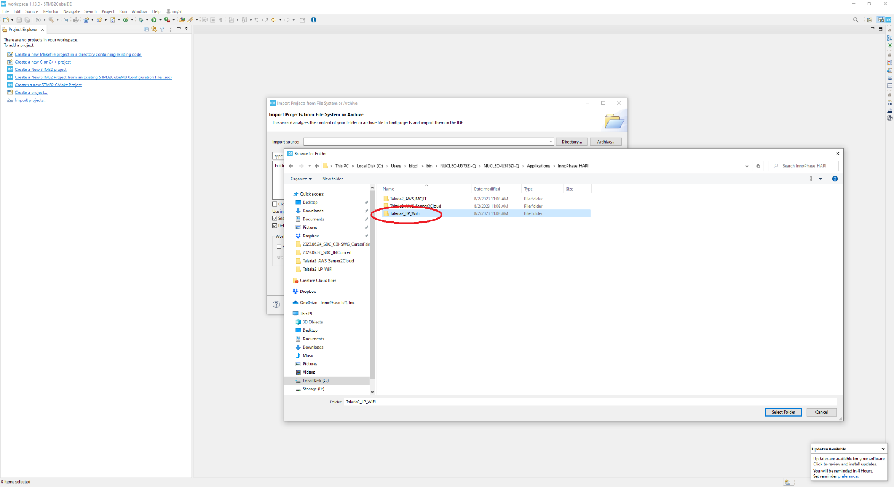

.. _stm32U5:

STM32U5
========

**STM32U575ZIQ Host Controller**

This section provides a detailed walkthrough of the steps to set-up
Talaria TWO hosted solution demo using STM32 NUCLEO-U575ZI-Q.

STM32U575ZI is the Host controller which has the HAPI APIs running on
it. HAPI is a portable library of “c” functions which wraps HIO data
structs and resides on the Host processor. Using these HAPI APIs, users
can write applications to perform multiple functions with Talaria TWO.

**Prerequisites**

1. Talaria TWO Evaluation Board

2. Serial Cable (USB to Micro-USB)

3. Windows/Linux PC

4. Wi-Fi Access Point

5. Minicom/Tera Term VT Utility installed on PC

6. STM3 NUCLEO-U575ZI-Q board

7. EVK package

8. STM32CubeIDE

Download the Necessary Packages
-------------------------------

Download the Evaluation Software Package (EVK) 
~~~~~~~~~~~~~~~~~~~~~~~~~~~~~~~~~~~~~~~~~~~~~~~

Download the software package from the InnoPhase website:
https://innophaseiot.com/talaria-two-modules/#product-availability.

|image1|

Figure 1: Download the Software Package

Package Contents
================

I-CUBE-T2-STW software package provides software APIs running on STM32
for STM's NUCLEO-STM32L4A6ZG, NUCLEO-STM32L433RC-P, and NUCLEO-U575ZI-Q.

It provides ready-to-run firmware examples to support quick evaluation
and development of MQTT/HTTP/AWS/AZURE and HTTPS IoT Cloud applications
on STM32L4/U5 Nucleo boards with InnoPhase Talaria TWO Wi-Fi add-on
boards.

Folder details are as follows:

1. Documentation: This folder includes all applications related to
   Talaria TWO and STMCubeL4/U5.

2. Drivers: This folder includes BSP files for STM32L4/U5 Nucleo boards.
    Refer to release notes for further details.

3. Middleware: This folder includes Middleware FreeRTOS and third-Party
   Middleware InnoPhase-HAPI to act as a host interface for Talaria TWO
   Modules (INP101X) Wi-Fi devices.

4. Projects: This folder includes the applications to demonstrate the
   INP101X features such as Wi-Fi, BLE, cloud apps on modules
   NUCLEO-L4A6ZG, NUCLEO-32L433RC-P, and NUCLEO-U575ZI-Q. Refer to
   release notes for further details.

5. Path to access the applications:
   *I-CUBE-T2-STW-src_2.x\\STM32CubeExpansion_T2-HostAPI-src_v1.x\\Projects\\NUCLEO-U575ZI-Q\\Applications\\InnoPhase_HAPI*.

6. Utilities: This folder includes Download tool GUI and the firmware
   binary for Talaria TWO EVB (INP301x).

.. toctree::
    :hidden:
    :maxdepth: 1

    Hardware Setup and PIN Configuration.rst
    Measuring Current Consumption .rst
    Set-up & Usage.rst
    Setting-up the Host Machine .rst
    Testing Basic Operations on Set-up.rst

