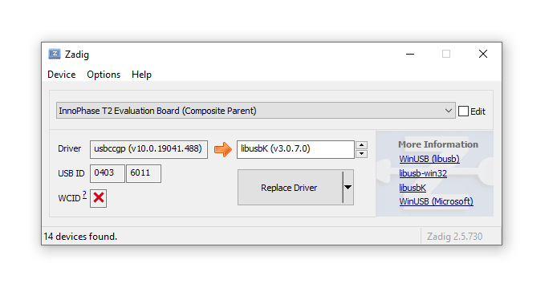
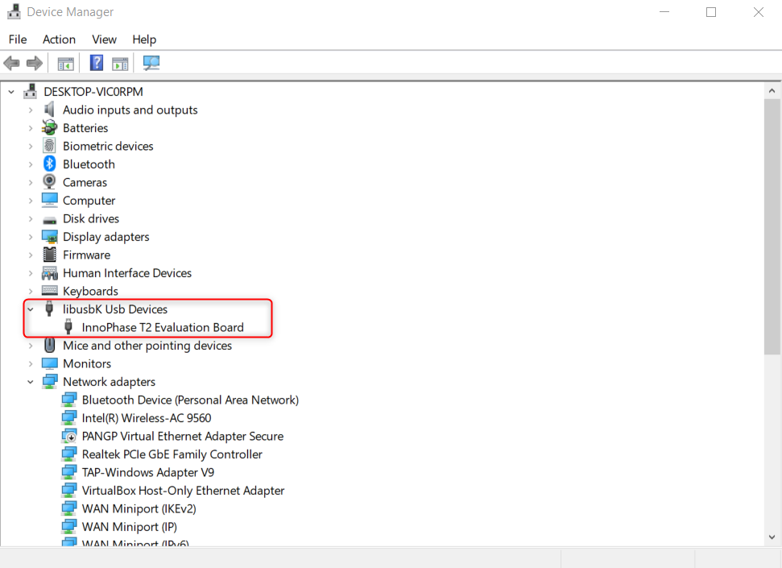
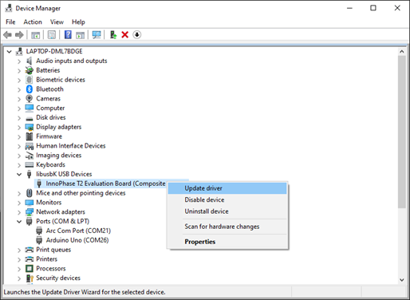
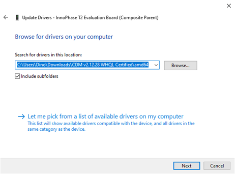
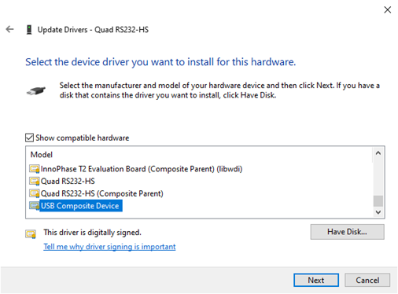

.. _Software_Reference/Prerequisites/libusbK_driver-Zadig:
 
Software Reference
=================

Prerequisites
-------------

Install Instructions
++++++++++++++++++++

Download the free software Zadig, available in the following link:
https://zadig.akeo.ie/.

1. Connect Windows PC/Laptop to the evaluation board using the provided
   USB cable.

2. Open Zadig and click on Options

3. Check the option List All Devices from the drop-down

4. Uncheck Ignore Hubs or Composite Parents as shown in Figure 1.

|image1|

Figure 1: Listing devices in Zadig

To establish communication with Talaria TWO module via the FTDI device
on the InnoPhase Evaluation Board, the Talaria TWO USB driver must be
libusbK. In case the current driver is not libusbK, use the drop-down
menu to select libusbK and click on Replace Driver which will update the
drivers to libusbK.

|Graphical user interface, text, application, Word Description
automatically generated|

Figure 2: Updating Talaria TWO USB driver to libusbK

To check if the libusbK driver is successfully installed, Go to Device
Manager. Expand the libusbK USB Devices and the InnoPhase T2 Evaluation
Board (Composite Parent) gets listed.

|image2|

Figure 3: Device Manager-libusbK USB Devices

Uninstall Instructions
++++++++++++++++++++

To uninstall libusbK and retrieve COM ports, follow the following steps:

1. Go to Device Manager. Expand the libusbK USB Devices and right click
   on the InnoPhase T2 Evaluation Board (Composite Parent). Click on
   Update Driver as shown in Figure 22.

|A screenshot of a social media post Description automatically
generated|

Figure 22: Device Manager

2. On the new window, click on Let me pick from a list of available
   drivers on my computer option and click on Next.

|image3|

Figure 23: Update Devices

3. Select USB Composite Device and install the same for reinstalling COM
   posts.

|image4|

Figure 24: Select the device driver

.. |image1| image:: media/image1.png
   :width: 4.72441in
   :height: 2.08666in

