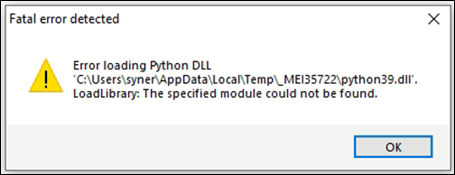

Prerequisites 
---------------

Each release of the Demo Tool is equipped with binaries for Windows and
Linux operating systems, and signed firmware images (ELFs) for MPD and
iPerf3 applications. Though this document specifically describes the use
of the GUI on a Windows platform, the procedure is similar for Linux OS
as well. The content of the release is shown in Figure 1

Application INP_T2_Demo_Windows.exe is for Windows platform while
INP_T2_Demo_Linux is for the Linux OS.

|A screenshot of a computer Description automatically generated|

Figure 1: Folder Contents

.. toctree::
   :maxdepth: 2

   Prerequisites.rst
   2. Using MPD Tool in Linux.rst
   3. Microsoft Visual C plus plus Redistributable Software Package.rst
