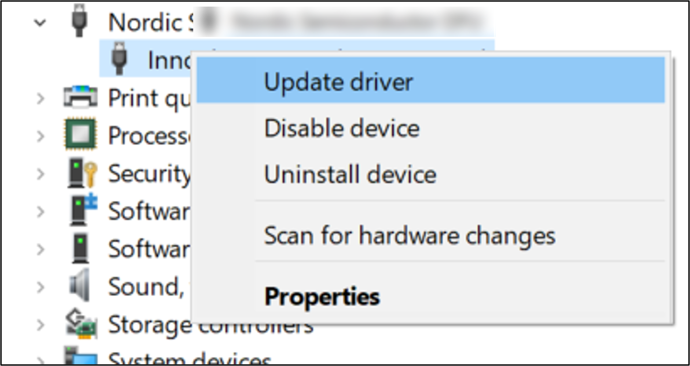
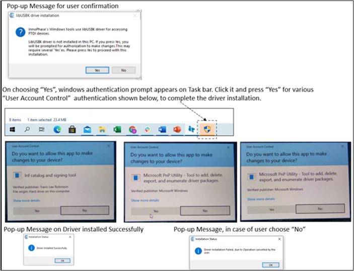
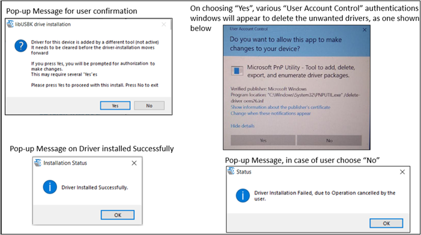

.. _dl prerequisites:

Prequisites
***********

EVB-A
-----

User must have procured the InnoPhase Talaria TWO evaluation board, and
a USB cable to connect the evaluation board to the PC. Though this
document specifically describes the use of the GUI on a Windows
platform, the procedure is similar for Linux OS as well.

Application T2DownloadTool_Windows.exe is for Windows platform while
T2DownloadTool_Linux is for the Linux OS.

**Using Download Tool in Linux**

There are two ways in which the T2DownloadTool_Linux can be used in
Linux:

1. Run the T2DownloadTool_Linux tool from terminal with sudo command.
   For example:

.. code:: shell

    sudo /freertos_sdk_x.y/pc_tools/Download_Tool/bin/T2DownloadTool_Linux

**Note**: x and y in freertos_sdk_x.y refers to the SDK release version.
Replace x and y with the appropriate SDK release version.

2. Double click on T2DownloadTool_Linux.
   Add udev rules and folder access permission to enable double click
   feature. Execute the following steps:

   Step 1: Create Libusb_T2.rules file in */etc/udev/rules.d* directory.

   Step 2: Add the following rules to Libusb_T2.rules file.

   **Libusb_T2.rules:**

.. code:: shell

    SUBSYSTEMS==”usb”, ATTRS{idVendor}==”0403”, ATTRS{idProduct}==”6011”,GROUP=”users”, MODE=”0666”

In case of Permission Denied error, execute the following step (Step 3)
to extend folder access permission.

   Step 3: Run the following command in the terminal to extend
   permissions to the selected folder and its files.

.. code:: shell

    sudo chmod -R a+rwxRWX /Path/to/sdk folder

**Microsoft Visual C++ Redistributable Software Package**

Microsoft Visual C++ Redistributable software package is a prerequisite
for Windows platform to run the application T2DownloadTool_Windows.exe
successfully. Incase this software package is not installed on the
Windows platform, application will not launch, leading to a fatal error
message as shown in Figure 1. In such a scenario, install the Microsoft
Visual C++ Redistributable software package and relaunch the
application.

|image1|

.. rst-class:: imagefiguesclass
Figure 1: Error message for missing Microsoft Visual C++ Redistributable
Software Package

**Driver Installation for Windows OS**

On Windows OS, libusbK driver needs to be installed to communicate and
control the Talaria TWO module via the FTDI device on the evaluation
board. The tools/applications provided by InnoPhase will communicate
using this driver.

Download tool comes with an option of One-Click Installation of libusbk
driver. In case the driver is not installed, the tool will ask for user
confirmation to install this driver. If the user selects yes, various
User Account Control authentication screens will appear to complete the
driver installation (as shown in Figure 4).

**Note**:

1. In case of any other unwanted libusbk drivers that are already
   installed, tool will automatically uninstall the unwanted drivers.
   This action needs User Account Control authentication screens shown
   in Figure 5, in addition to Figure 4. Each unwanted drives will
   require a separate User Account Control authentication for
   uninstallation.

2. Talaria TWO Evaluation Board may get detected under any already
   installed device driver (using libusbk driver). In this case, the
   tool will follow the procedure of One-Click Installation of libusbk
   driver (as shown in Figure 4), and might get completed with a pop-up
   message “Driver Installation Failed”. This will result in any one of
   the following two conditions:

   a. Device found: EVK serial number field in the download tool GUI is
      populated with appropriated EVK serial number. In this case,
      ignore the error message “Driver Installation Failed” and continue
      using the tool. To avoid this from happening repeatedly, update
      the driver for Talaria TWO Evaluation Board to “InnoPhase T2
      Evaluation Board” driver, from device manager (as shown in Figure
      2). Then, ensure the Talaria TWO Evaluation Board is detected
      under “libusbK USB Devices” in device manager (as shown in Figure
      3).

|image2|

.. rst-class:: imagefiguesclass
Figure 2: Update device driver for Talaria TWO Evaluation Board

b. No device found: Manually install the driver using instructions from
   section: `Installation instructions for libusbK
   driver <#installation-instructions-for-libusbk-driver>`__ and ensure
   that Talaria TWO Evaluation Board is detected under libusbK USB
   Devices driver (as shown in Figure 3).

|image3|

.. rst-class:: imagefiguesclass
Figure 3: Talaria TWO Evaluation board under "libusbk USB Devices”
driver

3. Even after successful installation of the driver, there might be
   possibility of the device not being identified for the first time. In
   this case, close the tool and re-open it. The user is notified of the
   same through a pop-up message: “No Device Connected. Please close and
   reopen the Tool.”.

|image4|

.. rst-class:: imagefiguesclass
Figure 4: User Account Control authentication to complete driver
installation

|image5|

.. rst-class:: imagefiguesclass
Figure 5: User Account Control authentication to delete the unwanted
Libusbk drivers

In case the driver installation using the Download Tool is not
successful, the user can manually install the driver by following the
instructions provided in section: `Installation instructions for libusbK
driver <#installation-instructions-for-libusbk-driver>`__. Instructions
to change driver is available in section: `Update Driver from libusbK to
COM Port <#_Uninstall_Instructions_for>`__.

**Installation instructions for libusbK driver**

.. |image1| image:: media/image1.png
   :width: 8in

