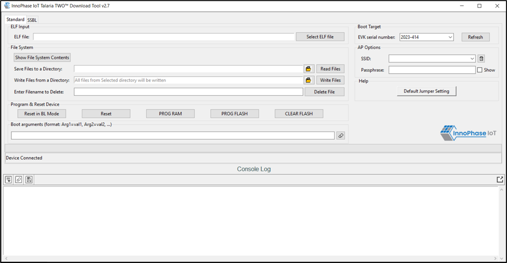
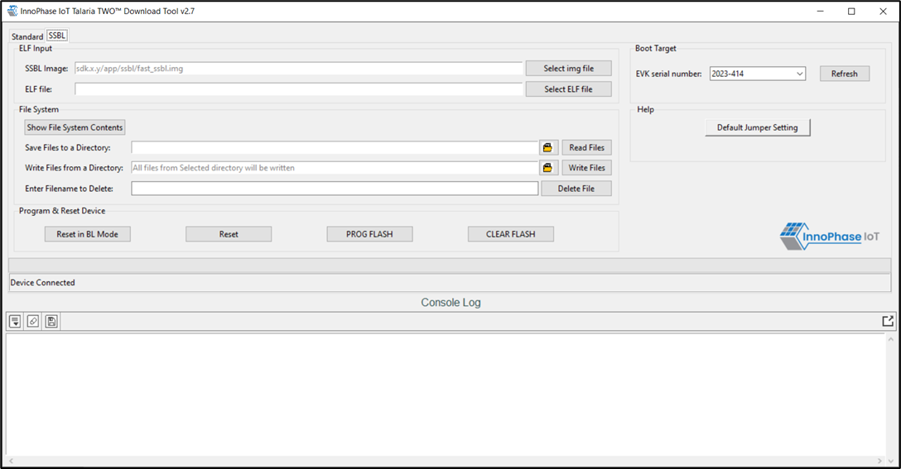
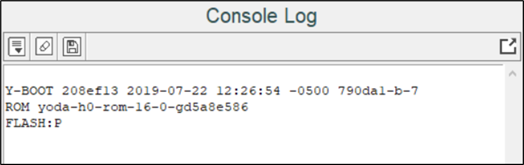

.. dl gui overview:

GUI Overview
============

Download Tool supports two types of programming:
    - Standard
    - SSBL

On launching the Download Tool application, the following come into view:
    - GUI window on top for Standard (default) and SSBL programming, represented by two different tabs as shown in Figure 1 and Figure 2
    - Console window at the bottom for monitoring Talaria TWO module console output as shown in Figure 3

**Note**: In case of Windows display setting, if the Scale and Layout is more than 125%, GUI window might go out of screen.

|image1|

.. rst-class:: imagefiguesclass
Figure 1: Download Tool GUI – Standard Programming

|image2|

.. rst-class:: imagefiguesclass
Figure 2: Download Tool GUI – SSBL Programming

|image3|

.. rst-class:: imagefiguesclass
Figure 3: Download Tool Console

The console window has the following icons (with Hover Text):

1. **Auto Scroll** |A black and white sign with a down arrow Description
   automatically generated|: Enables scrolling of console content till
   the end (default mode).

2. **Pause Scroll**: Turns OFF Auto Scroll mode.

3. **Clear Console**: Clears console window content.

4. **Save Logs**: Opens a file dialog with Console_Output.log as the default file name to save the logs.

Note: Only upcoming data after starting the Save Logs is saved in the file.

5. **Stop Save Logs**: Stops saving console logs to the file. This icon appears after Save Logs is started successfully.

6. **Pop Out**: Pops out the console window separate from the GUI window.

7. **Pop In**: Embeds the console and GUI window together.

**Note**:

1. While loading the ELF using this tool, the existing Partition table
   is validated as mentioned in section: `Checking and Validating the
   Partition Table <#_Checking_and_Validating>`.

2. Keeping this tool idle for a while (around 2 to 3 hours), may lead to
   loss of communication to the EVK device. This is indicated in the
   console as “Error communicating with FTDI device”, as show in Figure
   12. Workaround for this is as follows:

   a. Close the tool

   b. Unplug & re-plug the EVK

   c. Re-open the tool again

|image4|

.. rst-class:: imagefiguesclass
Figure 4: Error communicating with FTDI device

