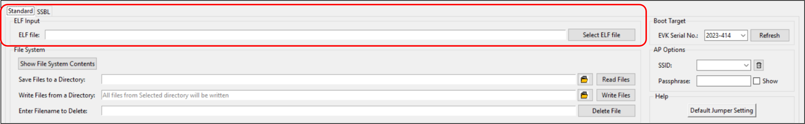

.. _dl elf inputs:

ELF Input
---------

Standard Programming
~~~~~~~~~~~~~~~~~~~~

Load the application as per requirement by selecting an appropriate ELF.

|image3|

Figure 1: ELF input - Standard programming

SSBL Programming
~~~~~~~~~~~~~~~~

1. SSBL Image: Select the appropriate SSBL image file to be loaded onto
   boot partition.

2. ELF File: Load the application as per requirement by selecting an
   appropriate ELF.

For more information on SSBL programming, refer:
Application_for_using_SSBL.pdf (*freertos_sdk_x.y/apps/ssbl/doc*).

Before SSBL programming, write the necessary files onto Talaria TWO. For
more details on writing files onto Talaria TWO, refer section: `Write
Files <#_Write_Files>`.

|image4|

Figure 2: ELF input - SSBL programming

