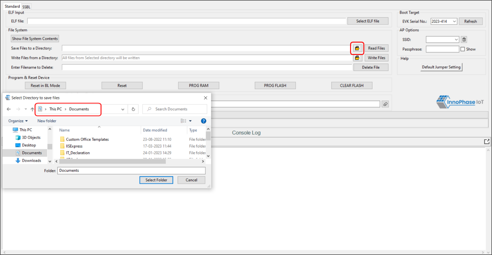
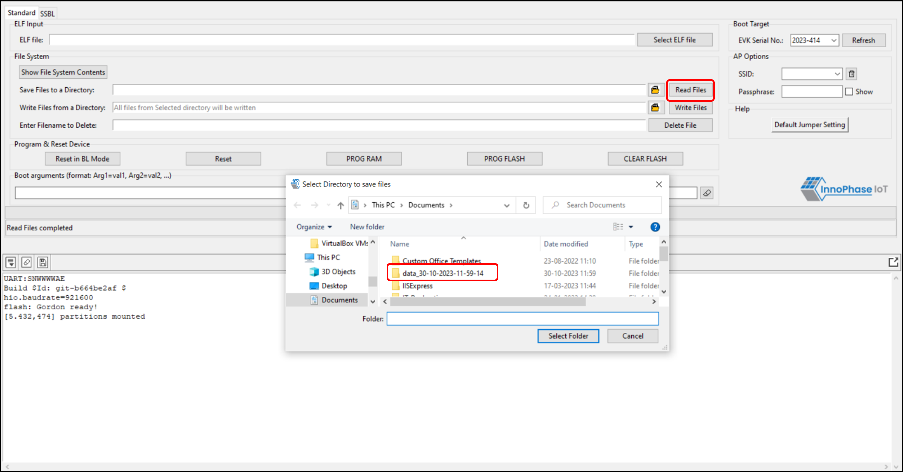

.. _dl fs:

File System 
------------

Show File System Contents 
~~~~~~~~~~~~~~~~~~~~~~~~~~

The Show File System Contents displays the current available files in
the file system. On clicking the Show File System Contents, a new window
opens displaying the files present. The file path, name and size are
displayed.

In case there are no files previously mounted on Talaria TWO, a new
window opens displaying: No files mounted, please write some files using
Write Files button.

Refer section: `Write Files <#write-files>` for writing files to
Talaria TWO.

|image5|

Figure 1: Show File System Contents

Read Files
^^^^^^^^^^

To save files to a directory, click on folder icon before Read Files
button. This opens a new window where the appropriate folder can be
selected. Once the path to read files is selected, click on Read Files.

|image6|

Figure 2: Select path to Read Files

Before using the Write Files, user can read the file system with Read
Files to retain a copy of the Talaria TWO file system contents.

|image7|

Figure 3: Read Files

Write Files
^^^^^^^^^^^

To write files, click on the folder icon before Write Files button and
select the folder from the where the files can be written. Click on
Write Files. Once done, the file system contents can be confirmed by
clicking on Show File System Contents, where the said files will be
displayed.

To write files into Talaria TWO, user must create a folder with the name
data and place all certificates either directly into data or they can
create multiple subfolders (for example:
*freertos_sdk_x.y/examples/mqtt/certs/data*) and place the certificates
inside the sub-directory and update the path as per the file system in
the .c file.

Any number of files/folders inside data will be written.

On clicking the Folder icon before Write Files button option, a window
to browse the files opens. Select the folder where the appropriate
files/certificates are present and click on Select Folder. Though the
GUI window does not display the files present in the selected folder,
all the files present in selected folder will be written to Talaria TWO.

|image8|

Figure 4: Write Files

**Note**:

1. The maximum size limit of the directory selected using Write Files is
   equal to the size of DATA partition (in EVB partition table).

If the default partition table is used, the maximum limit is 120 Kbytes.

2. In case the user needs the existing files, the user will have to Read
   Files to retrieve the existing files before initiating Write Files.
   On taking a back-up, click Yes as shown in Figure 21.

|image9|

Figure 5: Overwriting old files

Delete File
^^^^^^^^^^^

To delete a file from Talaria TWO, enter the name of the file in the
field Enter File Name to Delete and click on Delete File. Files can be
deleted one at a time.

After deleting, the file system contents can be confirmed by clicking on
Show File System Contents, where the said file will be deleted from the
list.

|image10|

Figure 6: Delete File

**Note**: Clicking on Clear Flash will only clear the application but
not the file system contents.

