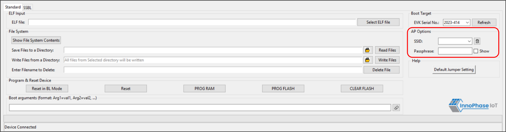

.. _dl ap options:

AP Options
----------

AP Options are used for connecting to an Access Point. Basic parameters
are SSID and Passphrase. If SSID and Passphrase are entered, then these
parameters are used while loading the ELF using PROG Ram/ PROG Flash.

**Note**: Tool will internally generate the network profile as JSON
file, stores it in the Talaria TWO file system and passes this JSON file
path as a boot argument, while loading the application.

|image11|

Figure 1: AP Options

