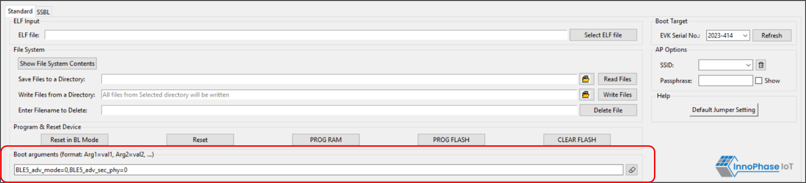

.. _dl bootargs:

Boot Arguments
--------------

Talaria TWO’s software allows the user to pass boot time arguments which
might be useful during the execution of the software. Users can pass
boot time arguments to configure the firmware. In the current use case,
the following boot arguments are passed:

.. code:: shell

      BLE5_adv_mode=0,BLE5_adv_sec_phy=0  

|image12|

Figure 1: Passing Boot Arguments

