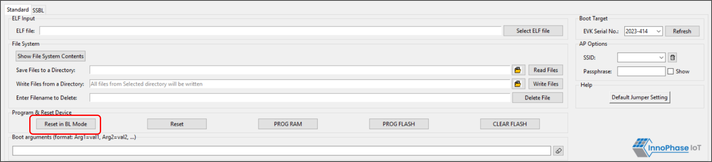

.. _dl reset evb:

Program and Reset
-----------------

Resetting the EVB-A in BL Mode
~~~~~~~~~~~~~~~~~~~~~~~~~~~~~~

To reset the EVB-A in Boot Loader mode, click on Reset in BL Mode.

When the EVB-A is reset in the Boot Loader mode, though no changes are
observed in the console for this command, the board is reset.

|image1|

.. rst-class:: imagefiguesclass
Figure 1: Reset in BL mode

