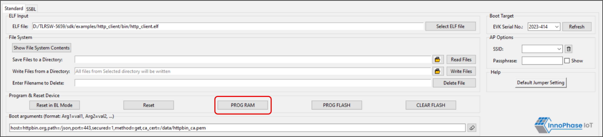

.. _dl prog ram:

Programming to RAM
~~~~~~~~~~~~~~~~~~

Program Talaria TWO’s ELF to RAM by clicking on PROG RAM.

|image2|

.. rst-class:: imagefiguesclass
Figure 1: Programming to RAM

|image3|

.. rst-class:: imagefiguesclass
Figure 2: Console Output – PROG RAM

PROG RAM will clear the application from Flash. The user is alerted of
the same during PROG RAM through a pop-up message as shown in Figure 28.
User can select the Do not show again checkbox to stop the pop-up
message from appearing the next time.

|image4|

.. rst-class:: imagefiguesclass
Figure 3: PROG RAM alert message

