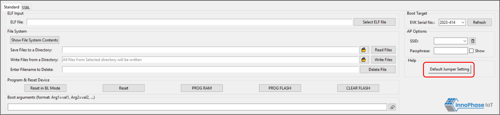
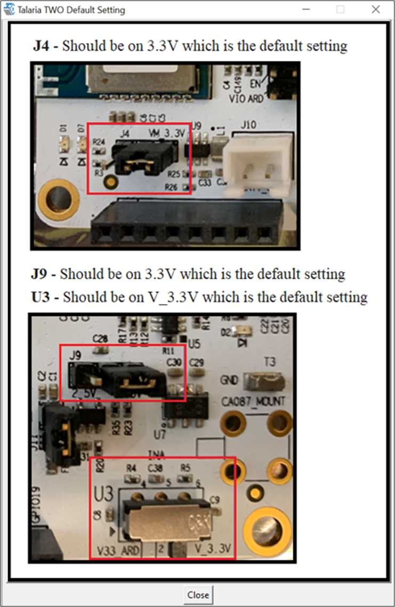
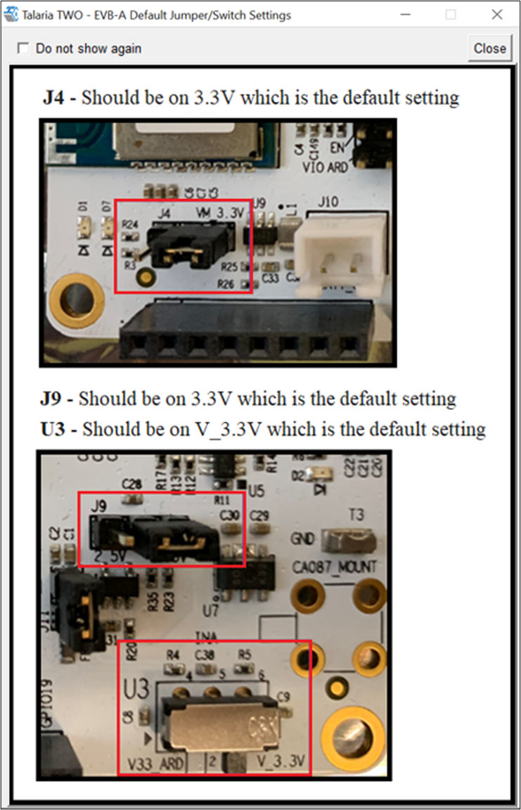

.. _dl help:

DL Help
--------

Help provides information about the default jumper/switch setting.
Clicking on Default Jumper Setting as shown in Figure 31 will pop-up a
new window with default jumper/switch setting information as shown in
Figure 2.

|image13|

.. rst-class:: imagefiguesclass
Figure 1: Help Frame

|image14|

.. rst-class:: imagefiguesclass
Figure 2: Default Jumper/Switch setting Window

**Note**: As shown in Figure 3, default Jumper/Switch setting window
will appear every time the tool is launched. To turn this feature OFF
permanently, check the Do not show again box and close the window.

|image15|

.. rst-class:: imagefiguesclass
Figure 3: Default Jumper/Switch setting Window during Tool Launch

