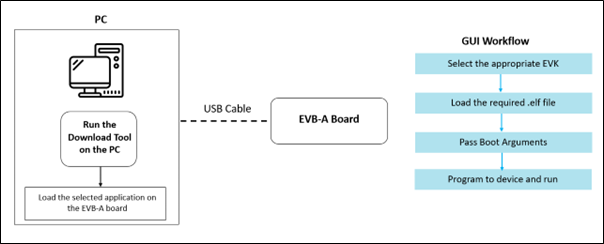

.. _tools dl:

Download Tool
~~~~~~~~~~~~~~

The download tool is provided as a binary (for both Windows & Linux
platforms) in the InnoPhase IoT EVK and SDK packages. This tool is
primarily used for programming the Talaria TWO module with applications.

Download Tool is a GUI tool provided with the InnoPhase Talaria TWO SDK.
The Download Tool is provided as binaries for Windows and Linux
Operating Systems.

|image1|

.. rst-class:: imagefiguesclass
Figure 1: Block Diagram

.. toctree::
   :hidden:
   :maxdepth: 1

   1. Prerequisites/1. Prerequisites - Landing Page.rst

.. toctree::
   :hidden:
   :maxdepth: 1

   2. GUI Overview/1. GUI Overview - Landing Page.rst

Download Tool Usage
=====================

.. toctree::
   :hidden:
   :maxdepth: 3

   3. Download Tool Usage/1. Boot Target.rst
   3. Download Tool Usage/2. ELF Input.rst
   3. Download Tool Usage/3. File System.rst
   3. Download Tool Usage/4. AP Options.rst
   3. Download Tool Usage/5. Boot Arguments.rst
   3. Download Tool Usage/7. Help.rst
   3. Download Tool Usage/6. Program and Reset/1. Resetting the EVB-A in BL Mode.rst
   3. Download Tool Usage/6. Program and Reset/2. Programming to RAM.rst
   3. Download Tool Usage/6. Program and Reset/3. Programming to Flash.rst
