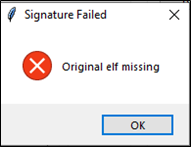
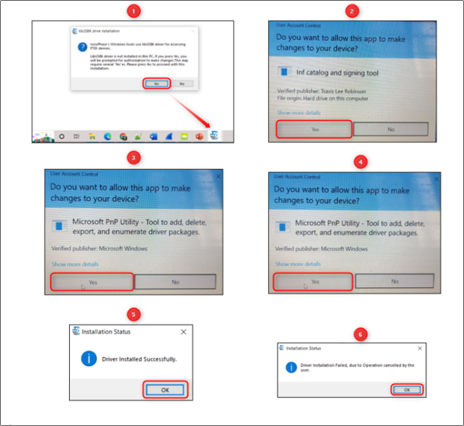

.. _mpd in linux:

Using MPD Tool in Linux
-----------------------

There are two ways in which the INP_T2_Demo_Linux can be used in Linux:

1. Run the INP_T2_Demo_Linux tool from terminal with sudo command. For
   example:

.. code:: shell

      sudo /home/freertos_sdk_x.y/pc_tools/MPD/bin/INP_T2_Demo_Linux  

2. Double click on INP_T2_Demo_Linux.

   Add udev rules and folder access permission to enable double click
   feature. Execute the following steps:

   Step 1: Create Libusb_T2.rules file in */etc/udev/rules.d* directory.

   Step 2: Add the following rules to Libusb_T2.rules file.

   **Libusb_T2.rules:**

.. code:: shell

      SUBSYSTEMS==”usb”, ATTRS{idVendor}==”0403”, ATTRS{idProduct}==”6011”, GROUP=”users”, MODE=”0666”

   In case of Permission Denied error, execute the following step (Step
   3) to extend folder access permission.

   Step 3: Run the following command in the terminal to extend
   permissions to the selected folder and its files.

.. code:: shell

      sudo chmod -R a+rwx /Path/to/sdk folder

The Demo tool verifies the signature of the ELFs prior to downloading it
onto the evaluation board. In case the ELFs are tampered with, an error
message as shown in Figure 1 is printed on the console.

|image2|

Figure 1: Signature failed window

The Talaria TWO evaluation board uses FT4323h, which is a 4-port USB to
UART converter with MPSEE support. By default, these ports enumerate as
COM ports in Windows OS which does not take advantage of the MPSEE
capabilities of the FTDI device. The usage of these ports in the
evaluation board is given in Table 1.

+-------------+--------------------------------------------------------+
| **Port**    | **Usage**                                              |
+=============+========================================================+
| **A**       | Connected to JTAG pins, this enables JTAG debugging    |
|             | using OpenOCD                                          |
+-------------+--------------------------------------------------------+
| **B**       | Connected to EN_CHIP pin, which enables resetting the  |
|             | module                                                 |
+-------------+--------------------------------------------------------+
| **C**       | Connected to UART pins, this is used for programming   |
|             | the module                                             |
+-------------+--------------------------------------------------------+
| **D**       | Connected to GPIO17 pin which is the default debug log |
|             | console port                                           |
+-------------+--------------------------------------------------------+

To utilize these capabilities, on Windows OS, libusbK driver needs to be
installed to communicate and control the Talaria TWO module via the FTDI
device on the evaluation board. The tools/applications provided by
InnoPhase will use this driver.

Talaria TWO Demo Tool comes with an option of One-Click Installation of
libusbk driver. In case the driver is not installed, the tool will ask
for user confirmation to install this driver. If the user selects yes,
various User Account Control authentication screens will appear to
complete the driver installation (as shown in Figure 4).

**Note**:

1. In case of any other unwanted libusbk drivers that are already
   installed, the tool will automatically uninstall the unwanted
   drivers. This action needs User Account Control authentication
   screens shown in Figure 5, in addition to Figure 4. Each unwanted
   drives will require a separate User Account Control authentication
   for uninstallation.

2. Talaria TWO Evaluation Board may get detected under any already
   installed device driver (using libusbk driver). In this case, the
   tool will follow the procedure of One-Click Installation of libusbk
   driver (as shown in Figure 4), and might get completed a with pop-up
   message “Driver Installation Failed”. This will result in any one of
   the following two conditions:

   a. Device found: EVK serial number field in the download tool GUI is
      populated with appropriated EVK serial number. In this case,
      ignore the error message “Driver Installation Failed” and continue
      using the tool. To avoid this from happening repeatedly, update
      the driver for Talaria TWO Evaluation Board to “InnoPhase T2
      Evaluation Board” driver, from device manager (as shown in Figure
      2). Then, ensure the Talaria TWO Evaluation Board is detected
      under “libusbK USB Devices” in device manager (as shown in Figure
      3).

   |image3|

Figure 2: Update device driver for Talaria TWO Evaluation Board

b. No device found: Manually install the driver using instructions from
   section: `Installation Instructions for libusbK
   Driver <#_Installation_Instructions_for>`__ and ensure that the
   Talaria TWO Evaluation Board is detected under libusbK USB Devices
   driver (as shown in Figure 3).

 |image4|

Figure 3: Talaria TWO Evaluation board under "libusbk USB Devices”
driver

3. Even after successful installation of the driver, there might be
   possibility of the device not being identified for the first time. In
   this case, close the tool and re-open it. The user is notified of the
   same through a pop-up message: No Device Connected. Please close and
   reopen the Tool.

|image5|

Figure 4: User Account Control authentication to complete driver
installation

From Figure 4:

Image 1: Pop-up message for user confirmation, where the user chooses
Yes.

Image 2: On clicking Yes, windows authentication prompt appears on Task
bar.

Image 3: Click on Yes in the next window.

Image 4: Click Yes for the subsequent User Account Control
authentication to complete driver installation.

Image 5: Pop-up message indicating successful driver installation.

Image 6: Pop-up message, in case of user chooses No.

|image6|

Figure 5: User Account Control authentication to delete unwanted libusbk
drivers

From Figure 5:

Image 1: Pop-up message for user confirmation, where the user chooses
Yes.

Image 2: Click Yes for the subsequent User Account Control
authentication to delete unwanted drivers.

Image 3: Pop-up message indicating successful driver installation.

Image 4: Pop-up message, in case of user chooses No.

In case the driver installation using Talaria TWO Demo Tool is not
successful, the user can manually install the driver using instructions
in section: `Installation Instructions for libusbK
Driver <#_Installation_Instructions_for>`__. Instructions to change
driver is available in section: `Update Driver from libusK Driver to COM
Port <#_Update_Driver_from>`__.

.. |image4| image:: media/image4.png
   :width: 4.72441in
   :height: 2.50085in

