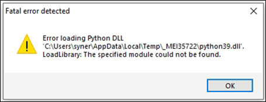

.. _mpd visual c:

Microsoft Visual C++ Redistributable Software Package
-----------------------------------------------------

Microsoft Visual C++ Redistributable software package is a prerequisite
for Windows platform to run the application INP_T2_Demo_Windows.exe
successfully. Incase this software package is not installed on the
Windows platform, application will not launch, leading to a fatal error
message as shown in Figure 1.

In such a scenario, install the Microsoft Visual C++ Redistributable
software package using the link
https://www.microsoft.com/en-in/download/details.aspx?id=48145 and
relaunch the application.

|image7|

.. rst-class:: imagefiguesclass
Figure 1: Error message for missing Microsoft Visual C++ Redistributable Software Package

