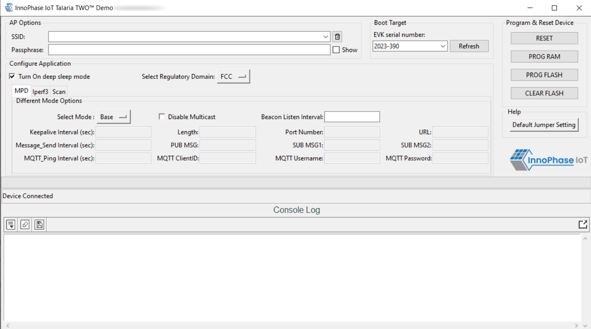
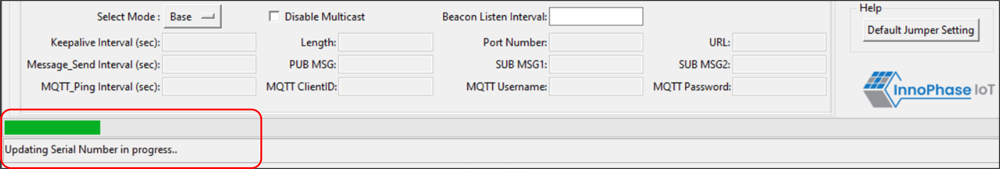
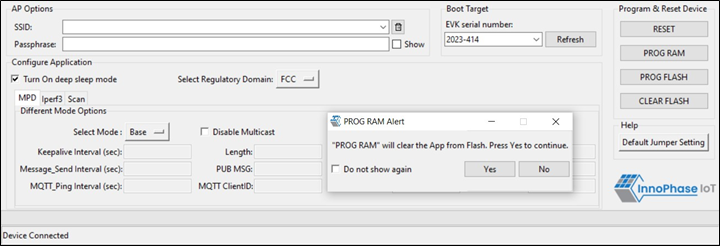
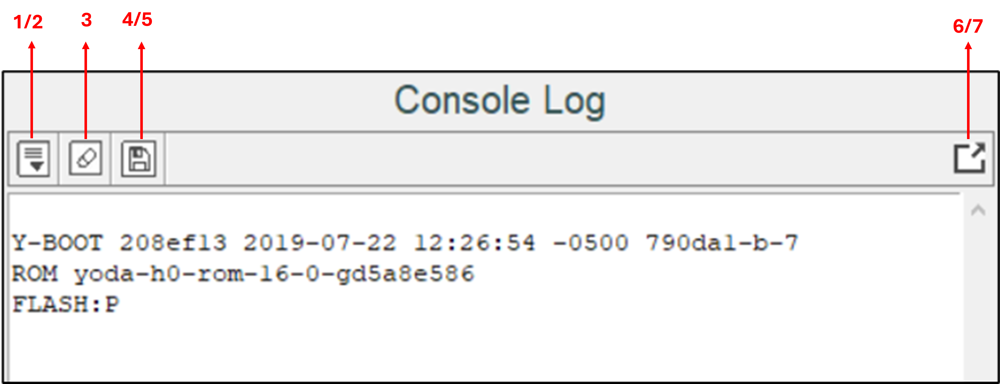
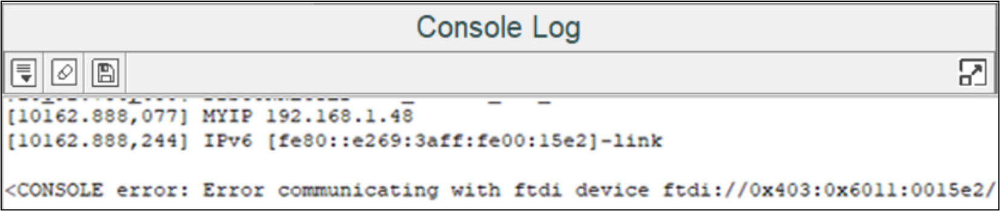

.. _mpd gui overview:

GUI Overview
============

On launching the application, the GUI window as shown in Figure 11 will
come into view.

**Note**: In case of windows display setting Scale and layout is more
than 125%, GUI window might go out of screen.

|image1|

Figure 1: Demo Tool GUI

1. **Boot Target**: Connected EVKs appear in the EVK serial number
   drop-down and the appropriate EVK can be selected.

   **Note**:

   If any connected EVK devices do not have a serial number, the
   Download tool will automatically handle this by generating a new
   serial number and update the same onto the corresponding device.
   During this process, the tool will indicate this in the status bar,
   as shown in Figure 12.

   Format of the new serial number:

.. code:: shell

      <year_stamp>-<integer>  

   where,

   - <year_stamp>: Current year. For example: 2023

   - <integer>: Formed from the sum of last 3 octets (in decimal) of the
   MAC address found in the device.

   |image2|

   Figure 2: Boot target – Serial number update

   Since a new serial number is generated from the MAC address of the
   device, devices with the same MAC address will get updated with the
   same serial number. This is an expected behavior.

   User can manually update the new serial number to the device
   following the instructions mentioned in section: `New Serial Number
   to Device – Manual Method <#_References>`.

2. **AP Options**: The SSID and Passphrase entered in the respective
   fields will connect the EVK board to the Access Point. Once
   connected, as per requirement MPD/iPerf3/Scan applications can be
   loaded by selecting the appropriate tab.

3. **Configure the Application**: Configure the Setup Parameters:

   a. **Turn On deep sleep mode**: When the processor is idle or is
      waiting for an event or data to occur or be received, turning ON
      the Turn On deep sleep mode feature by checking the box adjacent
      to the field will put Talaria TWO in a power saving mode.

   b. **Select Regulatory Domain**: Depending on their region of
      operation, the user can select any one of the following
      appropriate regulatory domains to establish a connection between
      the EVK board and the Access Point:

      i.   FCC

      ii.  ETSI

      iii. TELEC

      iv.  KCC

4. **Program and Reset the Device**:

   a. **RESET**:

   Reload the application in Flash memory

b. **PROG RAM**:

   Program the application to RAM memory

c. **PROG FLASH**:

   Program the application to Flash memory

d. **CLEAR FLASH**:

   Erase the application in Flash memory

**Note**:

PROG RAM will clear the application from Flash. The user is alerted of
the same during PROG RAM through a pop-up message as shown in Figure 13.
User can select the Do not show again checkbox to stop this pop-up
message from appearing next time.

|image3|

Figure 3: PROG RAM alert message

The console window is as shown in Figure 4.

|image4|

Figure 4: Console window

The console window has the following icons (with Hover Text):

1. **Auto Scroll** : Enables scrolling of console content till
   the end (default mode).

2. **Pause Scroll** : Turns OFF Auto Scroll mode.

3. **Clear Console** : Clears console window content.

4. **Save Logs** : Opens a file dialog with Console_Output.log
   as the default file name to save the logs.

Note: Only upcoming data after starting the Save Logs is saved in the
file.

5. **Stop Save Logs** : Stops saving console logs to the file.
   This icon appears after Save Logs is started successfully.

6. **Pop Out** : Pops out the console window separate from the
   GUI window.

7. **Pop In** : Embeds the
   console and GUI window together.

Keeping this tool idle for a while (around 2 to 3 hours), may lead to
loss of communication to the EVK device. This is indicated in the
console as “Error communicating with FTDI device”, as show in Figure 5.
Workaround for this is as follows:

1. Close the tool

2. Unplug & re-plug the EVK

3. Re-open the tool again

|image5|

Figure 5: Error communicating with FTDI device

.. toctree::
   :maxdepth: 2

   2. MPD.rst
   3. iPerf3.rst
   4. Scan.rst
   5. Help.rst
