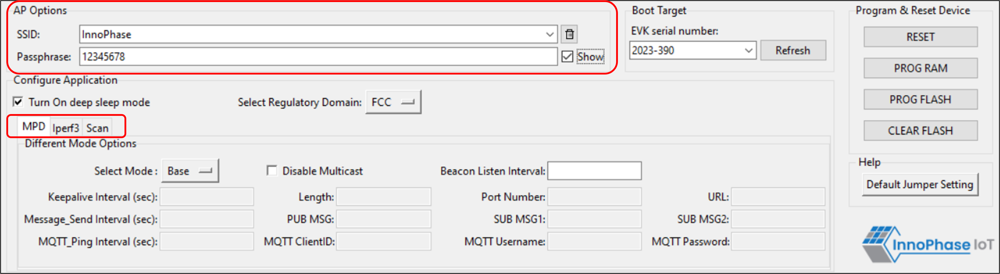

.. _mpd gui mpd:

MPD 
----

1. Enter the SSID and passphrase of the AP where, DTIM in the AP is set
   to 1.

2. To automatically load the signed firmware image for MPD application,
   select the MPD tab as shown in Figure 16.

3. For all the modes, the Keep Alive Wake time is fixed as 2 in the
   application. This time is the time window in milliseconds during
   which Talaria TWO will wait in receive mode before going to sleep.

|image6|

.. rst-class:: imagefiguesclass
Figure 6: MPD tab

**Note**: Check the Show checkbox to see the passphrase value.

