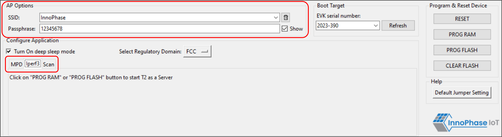

.. _mpd gui iperf:

iPerf3 
-------

The iperf.exe application can be downloaded from the following link:
https://iperf.fr/iperf-download.php

1. Enter the SSID and passphrase.

2. To automatically load the signed firmware image for iPerf3
   application, select the iPerf3 tab

3. It is recommended to click on PROG Flash to start Talaria TWO as a
   Server.

|image7|

.. rst-class:: imagefiguesclass
Figure 7: Selecting iPerf3

**Note**:

1. In case the PROG RAM option does not load the application, click on
   PROG FLASH.

2. Work around for the above limitation is to click Reset before
   clicking on PROG RAM again.

3. Work around for error with CLEAR Flash option: Click Reset before
   clicking on CLEAR Flash again.

