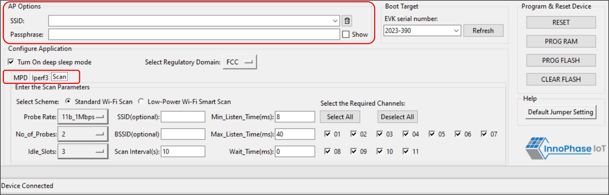

.. _mpd gui scan:

Scan
----

The Scan tab allows the user to actively scan for nearby Access Points.

|image8|

.. rst-class:: imagefiguesclass
Figure 8: Scan tab

**Choose the Scheme**: User can choose Standard Wi-Fi Scan or Low-Power
Wi-Fi Smart Scan for scanning.

1. **Standard Wi-Fi Scan**: In this scan mode, Talaria TWO scans each
   channel with the configured scan time (default being 40ms).

2. **Low Power Wi-Fi Smart Scan**: In this scan mode, Talaria TWO
   reduces the overall current consumption by enabling dynamic dwelling
   and napping features.

The following scan parameters can be configured from the tool:

1. SSID (optional): Providing the SSID helps enable scan for a specific
   AP.

2. BSSID (optional): Providing the BSSID helps enable scan for a
   specific AP.

3. No_of_probes: Maximum number of probes to send in an active scan.

4. Idle slots: Maximum number of idle slots to decide whether the user
   should keep listening or not.

5. Min_Listen_Time(ms): Minimum amount of time (in milliseconds) to
   listen for probe responses on the channel after transmitting the
   probe request.

6. Max_Listen_Time(ms): Maximum amount of time (in milliseconds,
   including listen and probe requests) to stay on the channel.

7. Wait_Time(ms): Idle time between each channel (giving other parties
   access to the media).

8. Scan Interval (ms): Time duration in milliseconds in which Talaria
   TWO scans the vicinity for networks.

9. Probe_rate: The rate as defined by rate_t used to transmit the probe
   request. If this field is set to 0xffff, no probes will be sent and
   the scan will only be passive.

