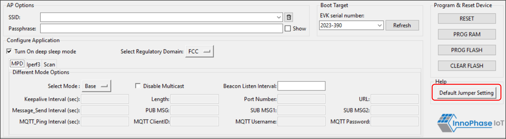
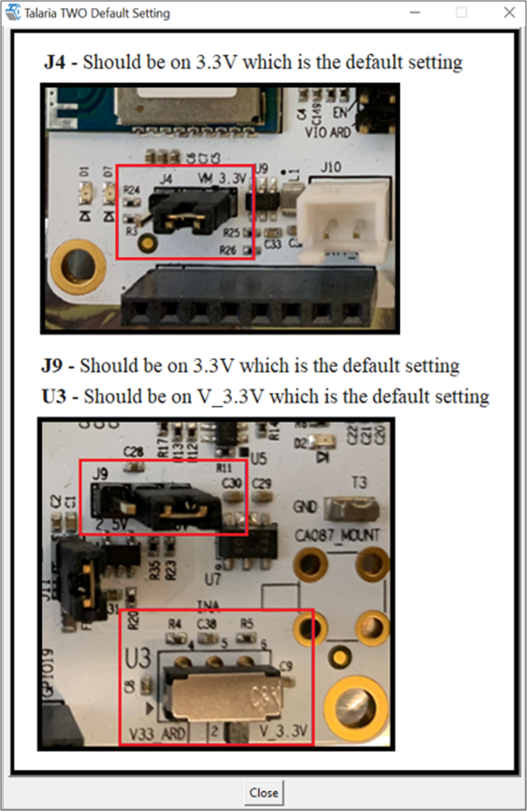
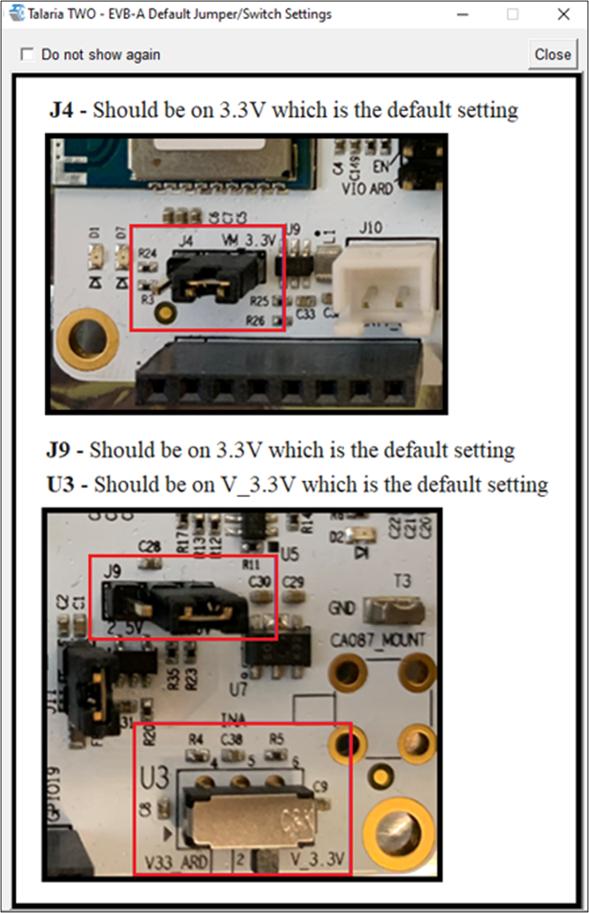

.. _mpd gui help:

Guide Help
----------

Help provides information about default Jumper/Switch settings. Clicking
on Default Jumper Setting as shown in Figure 1 will pop-up new window
with default Jumper/Switch settings information as shown in Figure 2.

|image9|

.. rst-class:: imagefiguesclass
Figure 1: Help Frame

|image10|

.. rst-class:: imagefiguesclass
Figure 2: Default Jumper/Switch setting Window

**Note**: Default Jumper/Switch setting window will appear every time
when tool is launched, as shown in Figure 3. To turn this feature OFF
permanently, check the Do not show again option and close the window.

|image11|

.. rst-class:: imagefiguesclass
Figure 3: Default Jumper/Switch setting Window during Tool Launch

