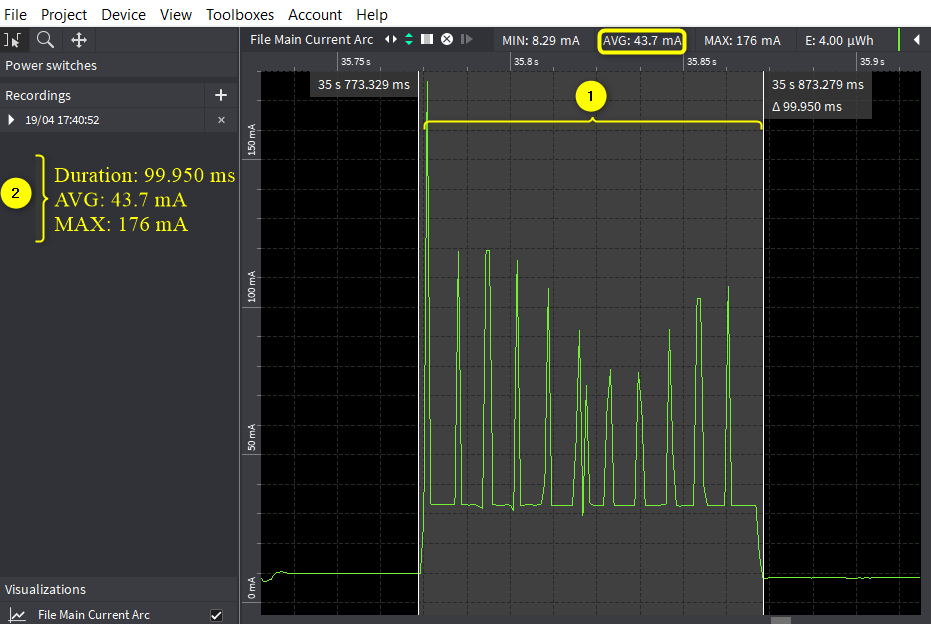
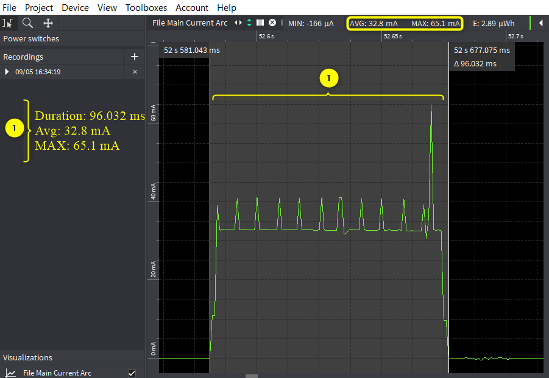

.. _mpd scan:

Scan Modes
==========

Select the Scan tab on the Demo tool GUI to actively scan for nearby
Access Points. The user can choose between the following scan types:

1. Standard Wi-Fi Scan

2. Low Power Wi-Fi Smart Scan

Default values of parameters for Standard Wi-Fi and Low-Power Wi-Fi scan
are shown in Table 1. Depending on the user’s choice of the scanning
scheme, respective default values will be set to corresponding
parameters.

.. table:: Table 1: Default values for Standard Wi-Fi and Low-Power
Wi-Fi Scan

   +---------------------+---------------+---------------+---------------+
   | **Default Value**   |               |               |               |
   +=====================+===============+===============+===============+
   | **Parameters**      | **Standard    | **Low-Power   | **Remark**    |
   |                     | Wi-Fi scan**  | Wi-Fi Scan**  |               |
   +---------------------+---------------+---------------+---------------+
   | **No_of_Probes**    | 2             | 1             | Configurable  |
   +---------------------+---------------+---------------+---------------+
   | **Ide_Slots**       | 3             | 3             | Configurable  |
   +---------------------+---------------+---------------+---------------+
   | **Select the        | 11b_1Mbps     | 11b_6Mbps     | Configurable  |
   | Required Probe      |               |               |               |
   | Rate**              |               |               |               |
   +---------------------+---------------+---------------+---------------+
   | **NAP Enable**      | No            | Yes           | Hard coded    |
   +---------------------+---------------+---------------+---------------+

Case 1: Standard Wi-Fi Scan
---------------------------

1. In this mode of scan, Talaria TWO will dwell 40ms on each channel.

2. Hence, to scan all 2Ghz channels, it will take ~520ms in clean
   environment.

3. In a crowded environment, it will take additional time to complete
   full scan based on the channel condition.

Console output for Standard Scan Scheme:

.. code:: shell

      UART:SNWWWWWAEBuild $Id: git-ba65998b7 $
      mpd.proto=scan wifi.scan_num_probes=2 wifi.scan_idleslots=3 wifi.scan_min_listen_time=8 wifi.scan_max_listen_time=40 
      wifi.scan_wait_time=0 wifi.nap_scan=0 mpd.scan.dt_iterations=10 wifi.probe_rate=0x00 wifi.scan_channel_mask=0x7ff mpd.regdomain=FCC mpd.suspend=1
      $App:git-73e7f910
      SDK Ver: FREERTOS_SDK_1.0
      T2 Multipurpose Demp App Version 0.12
      Suspend Enabled.
      Regdomain=FCC
      addr e0:69:3a:00:13:90
      Applying reg domain: 1-11@20
      MPD scan mode.
      Channels to be scanned=1,2,3,4,5,6,7,8,9,10,11
      Enabling suspend.
      period=10
      Round:1 Found 9 nets:
      00:5f:67:cd:c5:a6 on channel 11 @ -60 'InnoPhase' 'WPA2-PSK'
      b0:a7:b9:73:8e:51 on channel  4 @ -73 'Lakshmi pg 2nd floor 2g' 'WPA2-PSK'
      ba:6b:ad:62:6d:8b on channel 11 @ -79 'DESKTOP-9B1DNVC 1786' 'WPA2-PSK'
      e4:a7:c5:d4:ea:86 on channel  6 @ -82 'Airtel-E5573-EA86' 'WPA2-PSK'
      d8:47:32:2e:e1:e0 on channel 11 @ -83 'GPMH' 'WPA2-PSK'
      3c:1e:04:2d:c1:01 on channel 11 @ -85 'Lakshmi pg 1st floor' 'WPA-PSK/WPA2-PSK Mixed Mode'
      34:e8:94:be:16:9b on channel  1 @ -88 'InfecteD v2.4' 'WPA2-PSK'
      dc:71:37:56:91:b0 on channel  8 @ -90 'Hathway_Raghuram' 'WPA-PSK/WPA2-PSK Mixed Mode'
      50:2b:73:98:0f:51 on channel  9 @ -92 'SharmaShesCheatingonYou' 'WPA-PSK/WPA2-PSK Mixed Mode'
      -------------------------
      Round:2 Found 7 nets:
      00:5f:67:cd:c5:a6 on channel 11 @ -52 'InnoPhase' 'WPA2-PSK'
      34:0a:33:70:f3:a2 on channel  1 @ -78 'Siddusm' 'WPA2-PSK'
      90:8d:78:fa:54:60 on channel 10 @ -79 'LAKSHMI PG 4TH FLOOR' 'WPA2-PSK'
      e4:a7:c5:d4:ea:86 on channel  6 @ -82 'Airtel-E5573-EA86' 'WPA2-PSK'
      70:4f:57:77:7e:d4 on channel  2 @ -84 'Rahul' 'WPA2-PSK'
      dc:71:37:56:91:b0 on channel  8 @ -84 'Hathway_Raghuram' 'WPA-PSK/WPA2-PSK Mixed Mode'
      aa:74:84:e0:c9:a0 on channel  4 @ -94 'SUMAIYA' 'WPA-PSK/WPA2-PSK Mixed Mode'
      -------------------------
      Round:3 Found 2 nets:
      00:5f:67:cd:c5:a6 on channel 11 @ -60 'InnoPhase' 'WPA2-PSK'
      e4:a7:c5:d4:ea:86 on channel  6 @ -79 'Airtel-E5573-EA86' 'WPA2-PSK'
      -------------------------
      Round:4 Found 3 nets:
      34:0a:33:70:f3:a2 on channel  1 @ -80 'Siddusm' 'WPA2-PSK'
      e4:a7:c5:d4:ea:86 on channel  6 @ -80 'Airtel-E5573-EA86' 'WPA2-PSK'
      34:e8:94:be:16:9b on channel  1 @ -90 'InfecteD v2.4' 'WPA2-PSK'

**Expected Result**: Depending on the scan specifications, available
networks are identified and displayed.

**Otii log**: Shows an average current consumption of 43.7mA for
99.950ms scan duration, here the FCC regulatory domain is enabled.

|image1|

Figure 1: Case 1 - Standard scan - Otti log

Case 2: Low Power Wi-Fi Smart Scan
----------------------------------

Overall current consumption can be reduced by one of the following
methods:

1. Dynamic dwelling

   a. Based on the channel condition, Talaria TWO can stay minimum
      channel time or maximum channel time.

   b. Normally, minimum channel time is configured to 8ms, and maximum
      channel time is configured to 24ms.

   c. While scanning, Talaria TWO will decide after every minimum
      channel time, whether to stay on channel or move to next channel.

   d. Staying in the channel is based on channel condition. Talaria TWO
      will identify this by number of idle slots at the end of minimum
      channel time.

2. Napping

   a. After probe, if Talaria TWO receives packet other than the Probe
      response and Beacon, Talaria TWO will take a NAP based on the
      duration of packet received.

Console output for Low Power scan scheme:

.. code:: shell

      UART:SNWWWWWAEBuild $Id: git-ba65998b7 $
      mpd.proto=lpscan wifi.scan_num_probes=1 wifi.scan_idleslots=3 wifi.scan_min_listen_time=8 wifi.scan_max_listen_time=24 
      wifi.nap_scan=1 mpd.lpscan.ap_logging=1 mpd.lpscan.dt_iterations=10 mpd.lpscan.rate=0x100 wifi.scan_channel_mask=0x7ff mpd.regdomain=FCC mpd.suspend=1
      $App:git-73e7f910
      SDK Ver: FREERTOS_SDK_1.0
      T2 Multipurpose Demp App Version 0.12
      Suspend Enabled.
      Multicast reception Disabled.
      Regdomain=FCC
      addr e0:69:3a:00:13:90
      Applying reg domain: 1-11@20
      MPD lpscan mode.
      Enabling suspend.
      [1.718,157] Round:1 Found 3 nets:
      -------------------------
      [1.718,817] 00:5f:67:cd:c5:a6 on channel 11 @ -45 'InnoPhase' 'WPA2-PSK'
      [1.718,929] b0:a7:b9:73:8e:51 on channel  4 @ -70 'Lakshmi pg 2nd floor 2g' 'WPA2-PSK'
      [1.719,042] 34:0a:33:70:f3:a2 on channel  1 @ -77 'Siddusm' 'WPA2-PSK'
      [11.698,197] Round:2 Found 3 nets:
      -------------------------
      [11.698,286] ba:6b:ad:62:6d:8b on channel 11 @ -67 'DESKTOP-9B1DNVC 1786' 'WPA2-PSK'
      [11.698,401] b0:a7:b9:73:8e:51 on channel  4 @ -71 'Lakshmi pg 2nd floor 2g' 'WPA2-PSK'
      [11.698,517] d8:47:32:2e:e1:e0 on channel 11 @ -79 'GPMH' 'WPA2-PSK'
      [21.693,819] Round:3 Found 2 nets:
      -------------------------
      [21.693,903] 34:0a:33:70:f3:a2 on channel  1 @ -78 'Siddusm' 'WPA2-PSK'
      [21.694,019] 30:b6:2d:94:37:a0 on channel  1 @ -86 'JioPrivateNet' 'WPA2/WPA3-Enterprise'
      [31.684,572] Round:4 Found 2 nets:
      -------------------------
      [31.684,656] 00:5f:67:cd:c5:a6 on channel 11 @ -47 'InnoPhase' 'WPA2-PSK'
      [31.684,769] f8:c4:f3:18:2e:08 on channel  2 @ -91 'Shiva_Airtel' 'WPA2-PSK'
      [41.702,628] Round:5 Found 3 nets:
      -------------------------
      [41.702,713] 00:5f:67:cd:c5:a6 on channel 11 @ -57 'InnoPhase' 'WPA2-PSK'
      [41.702,828] ba:6b:ad:62:6d:8b on channel 11 @ -66 'DESKTOP-9B1DNVC 1786' 'WPA2-PSK'
      [41.702,943] 70:4f:57:77:7e:d4 on channel  2 @ -85 'Rahul' 'WPA2-PSK'

**Otii log**: Shows an average current consumption of 32.8mA for
96.032ms scan duration for low power Wi-Fi smart scan, here FCC
regulatory domain is enabled.

**Note**: The capture is taken in a clean environment.

|image2|

.. rst-class:: imagefiguesclass
Figure 2: Low power Wi-Fi smart scan - Otti log

**Note:** Following are some of the use cases that can be configured
manually by the user on the MPD GUI scan tab, which is applicable for
both Standard and Low Power Smart scan:

1. The Scan tab allows the user to actively scan for nearby Access
   Points by default parameters.

2. Regulatory Domain: Depending on the user’s geographical location, any
   one of the listed Regulatory Domains can be selected.

3. Channel_list: Set the Wi-Fi channels to be used.

For example: Set 1-11,13 to use channels 1 to 11 and 13, depending on
the selected Regulatory Domain.

4. Prob_rate: The rate as defined by rate_t is used to transmit the
   probe request. If this field is set to 0xffff, no probes will be sent
   and the scan will only be passive.

5. Setting the SSID.

SSID (Service Set Identifier) is the name of the user’s wireless
network, also known as Network ID. If the SSID of the network is
provided and the BSSID field is kept empty, it scans for the network as
per the provided SSID and gives the following details:

a. BSSID

b. Channel

c. RSSI Range

d. Mode

6. Setting the BSSID.

BSSID recognizes the AP or router as it has a unique address which
creates the wireless network. To set the BSSID of a network, enter the
BSSID in the provided field and click on Start.

