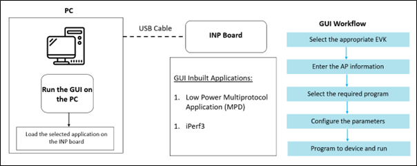

.. _tools mpd:

MPD Tool – Introduction
=======================

Talaria TWO MPD Demo Tool is a GUI tool that enables quick evaluation of
power consumption and throughput performances of Talaria TWO modules.
This tool is bundled with two applications:

-  Multipurpose Demo (MPD) primarily intended to verify power
   consumption under various protocol scenarios (such as TCP, UDP, HTTP
   etc.)

-  iPerf3 application to showcase throughput performance

-  Standard scan and Low power scan, which enables to configure
   different scan feature

This GUI is intended for use with the INP3010 and INP3011 Talaria TWO
evaluation boards to enable easy programming and accelerated
evaluations.

|image1|

**MPD Tool – Prerequisites**

Each release of the Demo Tool is equipped with binaries for Windows and
Linux operating systems, and signed firmware images (ELFs) for MPD and
iPerf3 applications. Though this document specifically describes the use
of the GUI on a Windows platform, the procedure is similar for Linux OS
as well. The content of the release is shown in Figure 1

Application INP_T2_Demo_Windows.exe is for Windows platform while
INP_T2_Demo_Linux is for the Linux OS.

|image1|

Figure 1: Folder Contents

Using MDP Tool
-------------

.. toctree::
   :hidden:
   :maxdepth: 2

   1. Prerequisites/2. Using MPD Tool in Linux.rst

Microsoft Visual C++ Redistributable
------------------------------------

.. toctree::
   :hidden:
   :maxdepth: 2

   1. Prerequisites/3. Microsoft Visual C plus plus Redistributable Software Package.rst

