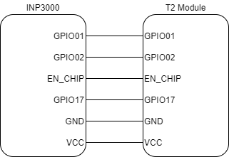
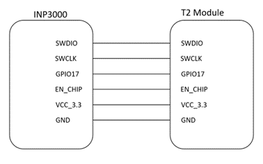

Factory Loader using INP3000 Programmer Board
=============================================

The factory loader supports programming Talaria TWO using the INP3000
programmer board. The INP3000 Programmer Board supports programming via
UART/SPI/SWD interface.

Following is a step-by-step process of how to use the factory loader
using a INP3000 Programmer Board to load SSBL and a simple helloworld
application.

1. Connect INP101x Talaria TWO module to the INP3000 programmer board.
   For more details regarding the INP3000 programmer board, please refer
   to UG_INP3000_Programmer_Board.pdf

|Graphical user interface, text, application, chat or text message
Description automatically generated|

Figure 2: Connecting INP3000 programmer board using UART

|image1|

Figure 3: Connecting INP3000 programmer board using SPI

   |image2|

Figure 4: Connecting INP3000 programmer board using SWD

   To program the Talaria TWO module using SWD, TAG connector available
   in the Programmer board package should be connected between the
   INP3000 V 4.0 SWD (J6) and Talaria TWO module SWD connector.

2. The following command is used to monitor the console output from
   Talaria TWO:

+-----------------------------------------------------------------------+
| miniterm.py /dev/ttyUSB3 2457600                                      |
+=======================================================================+
+-----------------------------------------------------------------------+

..

   |Text Description automatically generated|

Figure 5: Factory loader application output

3. Connect the Talaria TWO module as described in
   UG_INP3000_Programmer_Board.pdf.

4. For UART interface

+-----------------------------------------------------------------------+
| ./script/factory_loader.py ftdi_serial helloworld_config.json         |
+=======================================================================+
+-----------------------------------------------------------------------+

5. For SPI Interface

+-----------------------------------------------------------------------+
| ./script/factory_loader.py ftdi_spi helloworld_config.json            |
+=======================================================================+
+-----------------------------------------------------------------------+

Reset Talaria TWO. It should now boot into SSBL and load the helloworld
application as before.

.. |image1| image:: media/image2.png
   :width: 3.34375in
   :height: 3.03125in

.. |Text Description automatically generated| image:: media/image4.png
   :width: 5.11811in
   :height: 1.42648in
