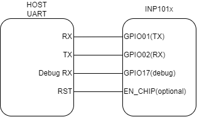

.. _fl uart:

Factory loader using other UART interfaces
==========================================

Connecting INP101x using UART
-----------------------------

|image1|

.. rst-class:: imagefiguesclass
Figure 1: Connecting to other UART interfaces

Programming using UART
----------------------

.. code:: shell

      ./script/factory_loader.py /dev/ttyUSB2 helloworld_config.json  

