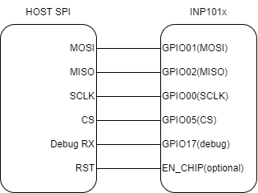

Factory loader using other SPI interfaces
=========================================

Connecting INP101x using SPI
----------------------------

|A diagram of a computer Description automatically generated|

Figure 7 Connecting to other SPI interfaces

Programming using SPI
---------------------

+-----------------------------------------------------------------------+
| ./script/factory_loader.py spidev0.0 helloworld_config.json           |
+=======================================================================+
+-----------------------------------------------------------------------+

