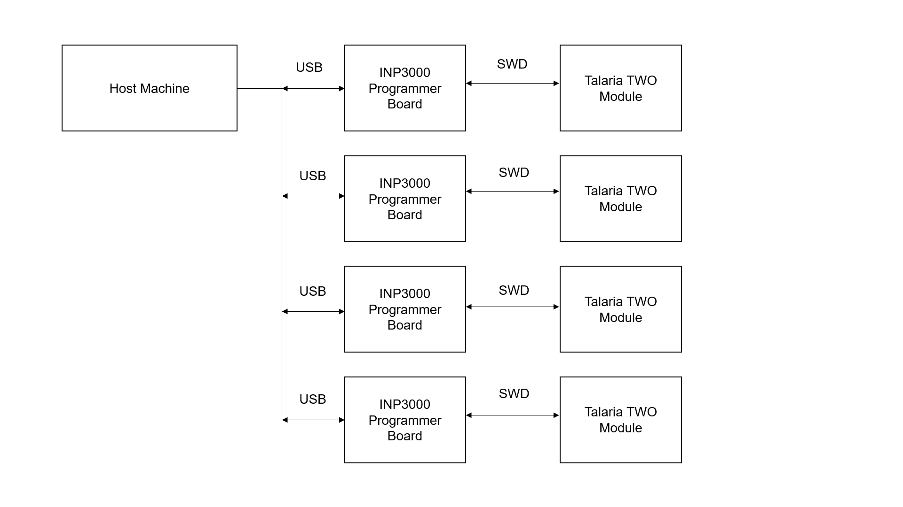

.. _fl jtag swd:

Factory Loader using JTAG/SWD
=============================

Prerequisites
-------------

1. Install Python dependencies such as PyCryptodome, func_timeout module

2. OpenOCD

   a. On windows, execute the following command to install OpenOCD (For
      example: version 0.10.0):

.. code:: shell

      xpm install --global @xpack-dev-tools/openocd@0.10.0-13.1  

b. On Linux, execute the following command to install OpenOCD

.. code:: shell

      sudo apt install openocd -y   

Programming using JTAG/SWD
--------------------------

Factory Loader supports the INP3000, JLink, and InnoPhase BMP board
using JTAG or SWD.

Programming using INP3000 (SWD):

.. code:: shell

      ./script/factory_loader.py inp3000_swd helloworld_config.json  

Programming using INP3000 (JTAG):

.. code:: shell

      ./script/factory_loader.py inp3000_jtag helloworld_config.json  

Programming using InnoPhase BMP:

.. code:: shell

      ./script/factory_loader.py bmp_swd helloworld_config.json   

Programming using JLink:

.. code:: shell

      ./script/factory_loader.py jlink_jtag helloworld_config.json    

Programming Multiple Talaria TWO Modules using SWD
--------------------------------------------------

Factory loader tool supports programming multiple Talaria TWO modules
using SWD interface, where Talaria TWO modules are differentiated with
the FTDI serial number.

|image1|

.. rst-class:: imagefiguesclass
Figure 1: Programming multiple Talaria TWO modules using SWD

**Programming using INP3000(SWD) on Windows**:

.. code:: shell

    .\script\factory_loader.py inp3000_swd_serial helloworld_config.json --adapter_serial=2224-11 --port=10010 --gdbport=3333 --ocdserverport=6666 --bulkerase
    .\script\factory_loader.py inp3000_swd_serial helloworld_config.json --adapter_serial=2224-12 --port=10020 --gdbport=3334 --ocdserverport=6668 --bulkerase
    .\script\factory_loader.py inp3000_swd_serial helloworld_config.json --adapter_serial=2224-16 --port=10030 --gdbport=3335 --ocdserverport=6670 --bulkerase
    .\script\factory_loader.py inp3000_swd_serial helloworld_config.json --adapter_serial=30004025 --port=10040 --gdbport=3336 --ocdserverport=6672 --bulkerase

In the above example,

1. port is the port to listen for HIO commands

2. adapter_serial is the serial number of OCD adapter

3. gdbport is the GDB remote protocol port

4. ocdserverport is the OpenOCD server port

5. bulkerase is to Enable bulk erase

**Note**:

-  Factory loader programming of multiple modules on Windows works only
   if port numbers are specified in sequence as 10010, 10020, 10030,
   10040.

-  Sleep of 1 second between each SWD command execution is recommended

**Programing using INP3000(SWD) on Linux**:

.. code:: shell

    ./script/factory_loader.py inp3000_swd_serial helloworld_config.json --adapter_serial=2224-11 --autoport
    ./script/factory_loader.py inp3000_swd_serial helloworld_config.json --adapter_serial=2224-16 --autoport
    ./script/factory_loader.py inp3000_swd_serial helloworld_config.json --adapter_serial=2224-12 --autoport
    ./script/factory_loader.py inp3000_swd_serial helloworld_config.json --adapter_serial=30004025 --autoport

**Bulkerase using INP3000(SWD) on Windows:**

.. code:: shell

    .\script\factory_loader.py inp3000_swd_serial dual_stack.json --adapter_serial=2224-11 --port=10010 --bulkerase

**Bulkerase using INP3000(SWD) on Linux**:

.. code:: shell

      .\script\factory_loader.py inp3000_swd_serial dual_stack.json --adapter_serial=2224-11 --bulkerase

