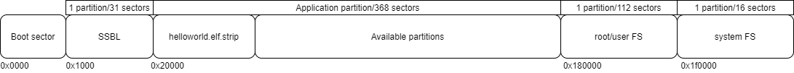

.. _fl sample scenarios:

Available Applications
----------------------

The Talaria TWO SDK includes a variety of sample applications and
application notes. The following sample scenarios describes programming
Talaria TWO. The sample scenarios utilize the SSBL and FOTA application.
It also assumes that the necessary applications and files have already
been built.

.. table:: Table 3: Sample applications with sizes

   +---------------------------------------+------------------------------+
   | **Image/Application**                 | **Size/sectors**             |
   +=======================================+==============================+
   | Fast_ssbl.img                         | 96060, 24                    |
   +---------------------------------------+------------------------------+
   | fota.elf.strip                        | 535292, 129                  |
   +---------------------------------------+------------------------------+
   | helloworld.elf.strip                  | 72196, 18                    |
   +---------------------------------------+------------------------------+

Normal Boot + Single application without backup (demo mode)
-----------------------------------------------------------

|image1|

.. rst-class:: imagefiguesclass
Figure 1: SSBL + User Application

Figure 1 shows the flash layout when using SSBL with a simple
application. In this scenario, the SSBL boot image is flashed at 0x1000
and the stripped application ELF image is flashed at 0x20000. A
filesystem used by SSBL is also flashed at 0x180000.

Following is the sample json config file for this scenario:

.. code:: shell

      {
     "BOOT_TYPE": {
       "SECUREBOOT": false
     },
     "BOOT_IMAGE": {
       "IMG_FILE": "./images/fast_ssbl.img"
     },
     "VERIFY": false,
     "IMAGES": {
       "APP_IMAGES":[
         {
           "ELF_FILE": "./ELFS/helloworld.elf.strip",
           "ADDR": "0x20000"
         }
        ]
     },
     "PARTITION": {
       "PART_FILE": "ssbl_part_table.json"
     },
     "USER_FS": {
       "MOUNT_ADDR": "0x180000",
       "FS_TYPE": "littlefs",
       "FS_SIZE": "0x70000",
       "UFS_DIR": "./root_helloworld"
     }
   }

Normal Boot + FOTA Application + Application + Backup Application
-----------------------------------------------------------------

|image2|

.. rst-class:: imagefiguesclass
Figure 2: Normal Boot + FOTA + User Application

Figure 2 shows the flash layout when using SSBL with FOTA and a
customer application. In this scenario, the SSBL boot image is flashed
at 0x1000, the FOTA application is stored at 0x20000, and the customer
application is stored at the next available sector (0x8f000). A
filesystem used by SSBL and FOTA is flashed at 0x180000.

Following is the sample json config file for this scenario:

.. code:: shell

      {
        "BOOT_TYPE": {
          "SECUREBOOT": false
        },
        "BOOT_IMAGE": {
          "IMG_FILE": "./images/fast_ssbl_legacy.img"
        },
        "VERIFY": false,
        "IMAGES": {
          "APP_IMAGES":[
            {
              "ELF_FILE": "./ELFS/fota_standalone.elf.strip",
              "ADDR": "0x20000"
            },
            {
              "ELF_FILE": "./ELFS/fota_test.elf.strip",
              "ADDR": "0x8f000"
            }
           ]
        },
        "PARTITION": {
          "PART_FILE": "ssbl_part_table.json"
        },
        "USER_FS": {
          "MOUNT_ADDR": "0x180000",
          "FS_TYPE": "littlefs",
          "UFS_DIR": "./UFS_FOTA"
        }
      }

