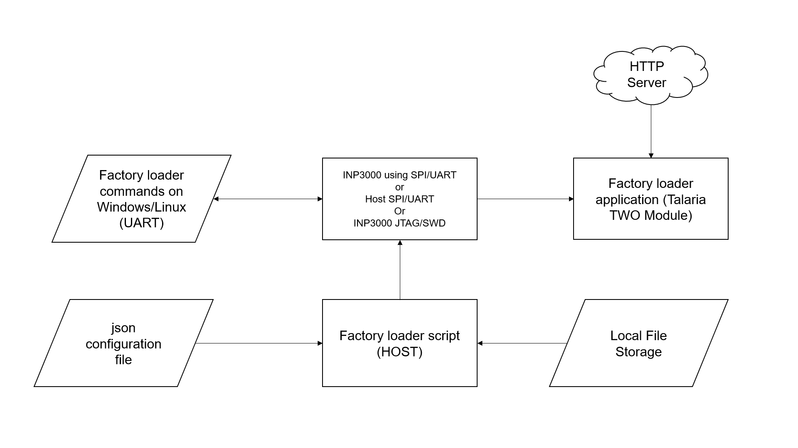
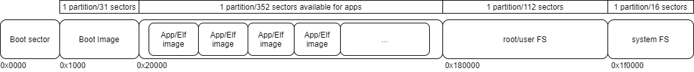

The FL application along with companion scripts are available in
InnoPhase customer portal (https://innophaseiot.com/portal/portal-hub/).
The FL content is described in Table 1:

.. table:: Table 1: FL files with description

   +-----------------------+-------------------------------------------------------+
   | **Filename**          | **Description**                                       |
   +=======================+=======================================================+
   | factory_loader.elf    | Factory loader application in .elf format             |
   +-----------------------+-------------------------------------------------------+
   | factory_loader.img    | Factory loader application in .img format             |
   +-----------------------+-------------------------------------------------------+
   | factory_loader.py     | Companion script for the factory loader application   |
   +-----------------------+-------------------------------------------------------+
   | api/factory_loader.py | Factory loader HIO API                                |
   +-----------------------+-------------------------------------------------------+
   | helloworld_config.json| Simple helloworld application json configuration file |
   +-----------------------+-------------------------------------------------------+
   | fota_config.json      | Advanced FOTA application json configuration file     |
   +-----------------------+-------------------------------------------------------+
   | UFS/\*                | Directory for sample user filesystem                  |
   +-----------------------+-------------------------------------------------------+
   | ELFS/\*               | Directory for sample prebuilt applications            |
   +-----------------------+-------------------------------------------------------+

The entire process of factory loading is configured using a JSON config
file. On Talaria TWO, the factory loader application awaits instructions
from a HOST PC/system running the factory loader script. The factory
loader script takes a JSON config file as an input. This JSON file is
parsed by the factory loader script to automate all programming, such as
building the filesystem and programming the Talaria TWO.

|image1|

Figure 1: Factory Loader block diagram

**Prerequisites:**

    - 1. Develop applications using the evaluation board or an application such as AT-commands offered by InnoPhase IoT.
    - 2. Be familiar with Talaria TWO devices’ flash memory layout and make key decisions such as using secureboot.

Test the factory loading process using the EV boards prior to production deployment.

**Talaria TWO Flash Layout**

|image2|

Figure 9: Flash Layout using SSBL

**Boot Sector**

The Boot Sector contains data such as:

    1. Devices keys
    2. Factory_code
    3. Partition table
    4. Device information

It is recommended that this section be modified only once during the
factory programming process.

**Boot Image**

The Boot Image is the default application image that is loaded with
every boot. It is stored at fixed location in flash at 0x1000. The
factory loader is programmed by default.

**Application Sector**

The application sector is used to store one or more user applications.
Applications should be flashed in a stripped ELF format to conserve
space.

**System Filesystem**

The System Filesystem is reserved for use by the Talaria TWO firmware.

**Note**: Users **should not** modify this location.

**Root/User Filesystem**

The root/user filesystem is available for use by the application to
store application data. The SSBL reads certain files from this
filesystem to determine the application to run from the application
sector.

**InnoPhase ELF Layout**

|Graphical user interface Description automatically generated with
medium confidence|

Figure 10: ELF Layout

Each application in the application sector is stored as shown in Figure
10. In case of a non-VM based application, the .virt section is not
present.

Using INP3000 Programmer Board
+++++++++++++++++++++++++++++++++

.. toctree::
   :hidden:
   :maxdepth: 1

   1. Using INP3000 Programmer Board/Using INP3000 Programmer Board.rst

Using UART Interfaces
++++++++++++++++++++++

.. toctree::
   :hidden:
   :maxdepth: 1

   2. Using UART Interfaces/Factory loader using other UART interfaces.rst

Using SPI Interfaces
++++++++++++++++++++++

.. toctree::
   :hidden:
   :maxdepth: 1

   3. Using SPI Interfaces/Factory loader using other SPI interfaces.rst

Using JTAG and SWD Interfaces
+++++++++++++++++++++++++++++++++

.. toctree::
   :hidden:
   :maxdepth: 1

   4. Using JTAG and SWD Interfaces/Factory Loader using JTAG and SWD.rst

Design
+++++++++++

.. toctree::
   :hidden:
   :maxdepth: 1

   5. Design/Design.rst

Sample Scenarios
++++++++++++++++++++++

.. toctree::
   :hidden:
   :maxdepth: 1

   6. Sample Scenarios/Sample Scenarios.rst

Help
+++++++++++

.. toctree::
   :hidden:
   :maxdepth: 1

   7. Help/Factory Loader Help.rst

